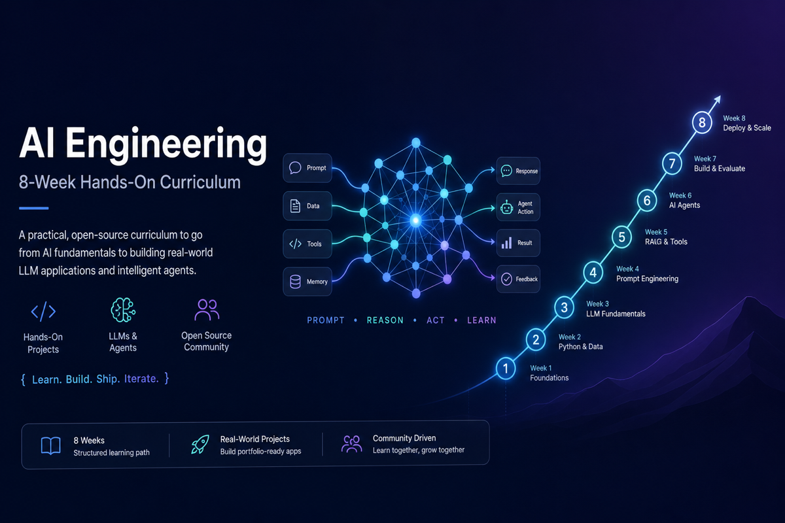

<p align="center">
  
</p>

# AI Engineering — 8-Week Curriculum

An open, hands-on path from **experienced software engineer** to building and shipping **LLM systems, AI agents, and production AI products** — with interview readiness built in.

Fork it, clone it, work through it at your own pace. No course platform required.

---

## Who this is for

- Software engineers comfortable with Python, APIs, and git
- New to (or rusty on) LLMs, RAG, agents, vector databases, and LLMOps
- Prefer **learning by building** over passive video courses
- Targeting **AI Engineer** or **LLM Platform** roles

**Not required:** ML research background, GPU training experience, or prior LangChain usage.

---

## What you will build

Eight weekly projects that stack into a portfolio:

| Week | Topic | Project |
| ---- | ----- | ------- |
| 1 | LLM foundations — tokens, attention, prompts, sampling | **Prompt Playground Lite** |
| 2 | LLM engineering — multi-provider APIs, streaming, tools | **Model Benchmark Studio** |
| 3 | RAG — hybrid search, reranking, evaluation | **Doc Q&A Studio** |
| 4 | AI agents — LangGraph, MCP, human-in-the-loop | **Research Agent Studio** |
| 5 | Production — Docker, Redis, observability, deployment | **Production AI Stack** |
| 6 | Evaluation — RAGAS, DeepEval, Promptfoo, CI gates | **Eval Pipeline Studio** |
| 7 | Advanced — fine-tuning, agentic RAG, MCP at scale | **Advanced AI Studio** |
| 8 | Capstone — full agent + RAG + dashboard + digest | **AI Radar** |

Each week ends with measurable deliverables: labs, a project artifact, a quiz, and exit criteria.

---

## Quick start

```bash
git clone <your-fork-url>
cd Learning/week-01
chmod +x scripts/setup-work.sh
./scripts/setup-work.sh
```

Then open **[week-01/START-HERE.md](week-01/START-HERE.md)** and follow **[week-01/daily/day-01.md](week-01/daily/day-01.md)**.

**Study habit:** open only **today's daily playbook**. Theory, labs, and build steps are linked from there — you do not need to read the whole week upfront.

---

## Two folders: curriculum vs code

| | Curriculum (this repo) | Your work directory |
| --- | --- | --- |
| **Purpose** | Read specs, theory, playbooks | Run labs, write code, save deliverables |
| **Location** | `week-XX/` | `~/ai-learning/week-XX-work/` (created by setup script) |
| **Contains** | Markdown, `requirements.txt`, templates | `.venv`, `.env`, project code, outputs |
| **Git** | Safe to commit | Stays local (gitignored) — secrets never go in the repo |

Every week includes a `scripts/setup-work.sh` that bootstraps the work directory and virtualenv.

---

## Tech stack (modern production focus)

Topics appear when they matter in the build — not as abstract lists:

- **LLMs:** OpenAI, Anthropic, Ollama (local)
- **RAG:** Hybrid BM25 + vector search, RRF fusion, cross-encoder reranking, pgvector, Chroma, RAGAS
- **Agents:** LangGraph, OpenAI Agents SDK, Pydantic AI, Model Context Protocol (MCP)
- **Backend:** FastAPI, SSE streaming, structured outputs, function calling
- **Production:** Docker Compose, Redis, semantic caching, OpenTelemetry, Langfuse
- **Evaluation:** DeepEval, Promptfoo, golden datasets, CI regression gates
- **Frontend (capstone):** Next.js dashboard
- **Cloud (optional):** Azure Container Apps / AKS path in later weeks

---

## Repository layout

```
.
├── README.md
├── assets/                   # README banner and shared images
├── appendix/                 # Optional deep dives (never block progress)
├── job-readiness/            # Resume, portfolio checklist, interview prep
└── week-01/ … week-08/       # One folder per week
    ├── START-HERE.md         # One-time orientation
    ├── daily/                # Day-by-day playbooks (your driver each session)
    ├── theory/               # Concept deep dives
    ├── labs/                 # Hands-on exercises
    ├── project/              # Weekly build spec + acceptance criteria
    ├── interview/            # Questions and cheat sheets
    ├── checkpoints/          # Quiz and exit criteria
    ├── resources/            # Glossary and reading lists
    ├── portfolio/            # Resume bullets and showcase notes
    └── scripts/              # Work-directory bootstrap
```

---

## Week-by-week entry points

| Week | Start | First day |
| ---- | ----- | --------- |
| 1 | [START-HERE](week-01/START-HERE.md) | [Day 1](week-01/daily/day-01.md) |
| 2 | [START-HERE](week-02/START-HERE.md) | [Day 1](week-02/daily/day-01.md) |
| 3 | [START-HERE](week-03/START-HERE.md) | [Day 1](week-03/daily/day-01.md) |
| 4 | [START-HERE](week-04/START-HERE.md) | [Day 1](week-04/daily/day-01.md) |
| 5 | [START-HERE](week-05/START-HERE.md) | [Day 1](week-05/daily/day-01.md) |
| 6 | [START-HERE](week-06/START-HERE.md) | [Day 1](week-06/daily/day-01.md) |
| 7 | [START-HERE](week-07/START-HERE.md) | [Day 1](week-07/daily/day-01.md) |
| 8 | [START-HERE](week-08/START-HERE.md) | [Day 1](week-08/daily/day-01.md) |

Complete each week's [exit criteria](week-01/checkpoints/exit-criteria.md) before moving on. Week 2 builds on Week 1's provider patterns; the capstone in Week 8 integrates everything.

---

## Time commitment

| | Typical |
| --- | --- |
| Per day | 3–5 hours (hard cap 5h — anti-burnout design) |
| Per week | ~25–30 hours |
| Full program | ~8 weeks at part-time pace |

Each daily page includes **catch-up mode**: labs and deliverables first, theory skim if you are behind.

---

## Job readiness

After building the projects, use [job-readiness/](job-readiness/) to package your work for applications:

- [Resume plan](job-readiness/resume-plan.md)
- [Portfolio checklist](job-readiness/portfolio-checklist.md)
- [LinkedIn guide](job-readiness/linkedin-guide.md)
- [30 interview questions](job-readiness/interview-questions-30.md)
- [Mock interview rubric](job-readiness/mock-interview-rubric.md)

Each week also includes `portfolio/` notes tied to that week's deliverable.

---

## Optional depth

[appendix/](appendix/) holds short optional reads (classical ML, RNNs/LSTMs, etc.) for terms that appear in theory but are not required to finish a week.

---

## Principles

- **Build first** — every week ships something demo-able
- **Production-minded** — observability, cost, and evaluation from early weeks
- **Plain language** — theory explains *why* before jargon
- **Measurable outcomes** — quizzes, labs, and acceptance criteria gate each week

---

## Contributing

Improvements welcome: clearer explanations, updated API notes, fixed links, additional optional labs. Keep curriculum markdown in `week-XX/`; learner code belongs in the local work directory, not this repo.

---

## License

Use and adapt freely for personal learning. If you publish a fork, a link back is appreciated but not required.
