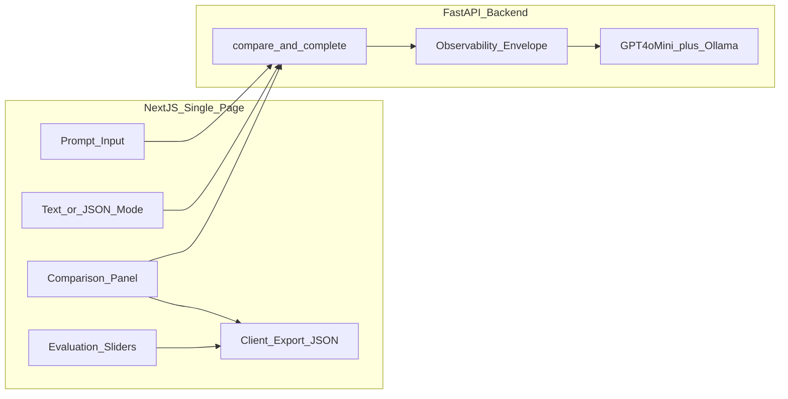

# Architecture

> Week 1 Project · [Overview](overview.md)

> **Work dir:** All implementation code lives in `~/ai-learning/week-01-work/prompt-playground-lite/`



### Folder Structure

```
prompt-playground-lite/
├── frontend/
│   ├── app/
│   │   ├── page.tsx              # Single page — all UI here
│   │   └── layout.tsx
│   ├── components/
│   │   ├── PromptInput.tsx
│   │   ├── ModelSelector.tsx
│   │   ├── ComparisonGrid.tsx
│   │   ├── MetricsBar.tsx        # request_id, tokens, cost, latency, error
│   │   ├── ScorePanel.tsx        # 4-dimension evaluation sliders
│   │   └── ExportButton.tsx      # download JSON client-side
│   ├── lib/api.ts
│   └── package.json
├── backend/
│   ├── app/
│   │   ├── main.py
│   │   ├── config.py             # hardcoded MODELS dict
│   │   ├── observability.py
│   │   ├── providers/
│   │   │   ├── base.py
│   │   │   ├── openai_provider.py
│   │   │   └── ollama.py
│   │   ├── schemas.py
│   │   └── services/
│   │       ├── comparison.py
│   │       └── extraction.py
│   ├── tests/
│   │   ├── test_observability.py
│   │   ├── test_compare_partial_failure.py
│   │   └── test_extraction_ladder.py
│   └── requirements.txt
├── .env.example
├── .gitignore
├── Makefile                      # run, test, lint targets
└── README.md
```
