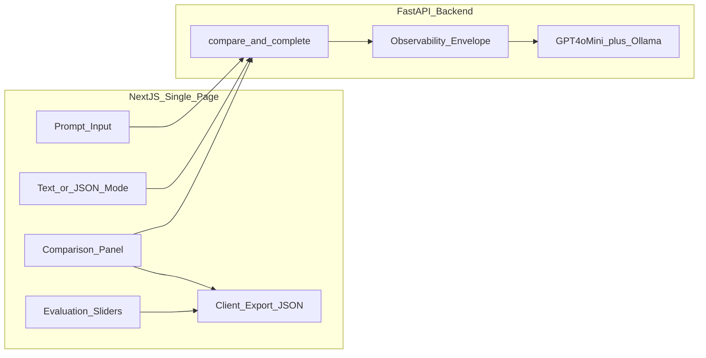

# Architecture

> Week 1 Project · [Overview](overview.md) · [Build guide](BUILD-GUIDE.md)

> **Your code today:** `week-01-work/lab04_backend/` — migrate to `prompt-playground-lite/` when ready.  
> **Work path:** `Learning/week-01-work/` or `~/ai-learning/week-01-work/`.

---

## What problem are we solving?

You need a picture of how the UI, API, providers, and observability fit together — and how your **lab folder** becomes the **project folder** without starting over.

---

## System diagram



**Week 1 note:** The frontend box is **optional** for minimum viable Week 1. The backend + capstone export satisfies the core engineering outcomes.

---

## Target folder structure

```
prompt-playground-lite/
├── frontend/
│   ├── app/
│   │   ├── page.tsx              # Single page — all UI here (MVP)
│   │   └── layout.tsx
│   ├── components/               # Split out after MVP works
│   │   ├── PromptInput.tsx
│   │   ├── ComparisonGrid.tsx
│   │   ├── MetricsBar.tsx
│   │   ├── ScorePanel.tsx
│   │   └── ExportButton.tsx
│   ├── lib/api.ts
│   └── package.json
├── backend/                      # copied from lab04_backend/
│   ├── app/
│   │   ├── main.py
│   │   ├── config.py
│   │   ├── observability.py
│   │   ├── providers/
│   │   ├── schemas.py
│   │   └── services/
│   │       ├── comparison.py
│   │       └── extraction.py
│   ├── tests/
│   └── requirements.txt
├── .env.example
├── .gitignore
├── Makefile
└── README.md
```

---

## Migration from `lab04_backend/`

Your labs intentionally built a flat backend folder. The project nests it under `prompt-playground-lite/backend/`.

### Option A — automated (recommended)

```bash
cd Learning/week-01
./scripts/scaffold-playground-lite.sh
```

The script copies `lab04_backend/` → `prompt-playground-lite/backend/` and adds a minimal frontend template.

### Option B — manual

```bash
cd week-01-work
mkdir -p prompt-playground-lite
cp -R lab04_backend prompt-playground-lite/backend
```

Verify:

```bash
cd prompt-playground-lite/backend
source ../../.venv/bin/activate
pytest -q
uvicorn app.main:app --reload --port 8000
```

Keep `lab04_backend/` until the copy passes tests — then delete or archive if you want one canonical path.

---

## Data flow: one compare click

```
1. User enters system + user prompt, selects models
2. Frontend POST /api/v1/compare { model_ids, request }
3. Backend generates parent_request_id
4. asyncio.gather — one provider call per model (30s timeout each)
5. Each result gets child request_id = "{parent}:{model_id}"
6. Failed models return error envelope; others unaffected
7. UI renders panels + MetricsBar per result
8. User sets sliders → Export downloads JSON
```

See [failure-recovery.md](failure-recovery.md) for timeout and JSON failure behavior.

---

## AI engineer takeaway

Architecture docs describe the **target shape**. Labs deliver **incremental slices**. Migration is copy + polish, not a rewrite.

---

## Next

[backend.md](backend.md) · [frontend.md](frontend.md) · [BUILD-GUIDE.md](BUILD-GUIDE.md)
