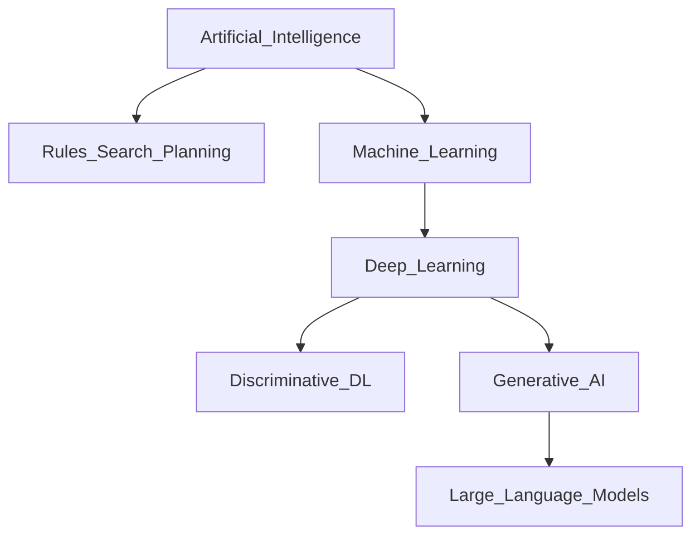
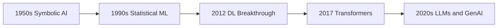
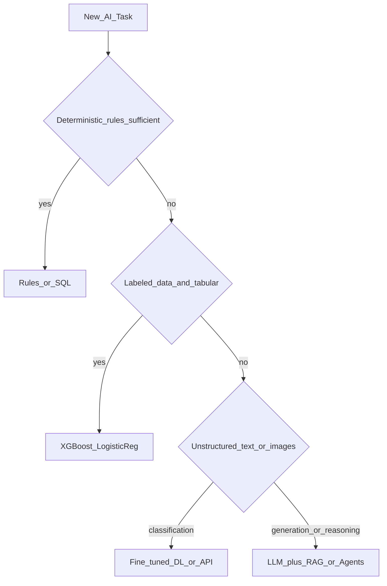

# AI vs ML vs DL vs Generative AI

> Week 1 Theory · Day 1 · [← README](../README.md) · [Roadmap](../roadmap.md) · Next: [transformers.md](transformers.md)

This page answers: **where do LLMs sit in the stack, and when should you use them in production?** Everything else in Week 1 builds on this mental model.

**Quick example:** Predicting **loan default** from 20 spreadsheet columns → classical ML (XGBoost) is usually better, cheaper, and explainable than GPT-4. Writing a **customer email** from bullet points → LLM. Naming the layer correctly is half the architecture interview.

---

## Concepts

### What problem are we solving?

You're designing a production system and someone says "use AI." But **AI**, **machine learning (ML)**, **deep learning (DL)**, and **generative AI (GenAI)** are nested layers — not interchangeable labels. Picking the wrong layer means wrong cost, wrong latency, and the wrong story in an architecture review.

This page gives you a decision map: **where LLMs sit in the stack, and when you should reach for something simpler instead.**

### Artificial Intelligence (AI)

The broad field of building systems that perform tasks requiring human-like intelligence: reasoning, perception, language understanding, planning, and decision-making.

AI is **not** synonymous with machine learning. It includes:

| Approach | How it works | Example |
|----------|--------------|---------|
| **Symbolic / rule-based** | Explicit rules and logic | Tax calculator, eligibility engine, SQL `WHERE` clauses |
| **Search & planning** | Explore state spaces | Chess engines, route planners, scheduling |
| **Machine learning** | Learn patterns from data | Spam filter, fraud model, LLM |
| **Hybrid** | Rules + ML together | Fraud system with hard blocks + ML score |

For most of your AI engineering career, "AI" in job postings means **ML and GenAI systems** — but senior engineers are expected to know when **not** to use ML at all.

### Machine Learning (ML)

A subset of AI where systems **learn patterns from data** instead of being explicitly programmed for every case. The model **generalizes** from examples to unseen inputs.

```
Training data  →  Learn function f(x)  →  Predict on new x
```

**Classical ML** (pre-deep-learning boom): logistic regression, random forests, gradient boosting (XGBoost, LightGBM). Still dominant in industry for tabular data.

> **Optional deep dive** — not required for Week 1: [Classical ML (appendix)](../../appendix/classical-ml.md) · quick lookup: [glossary](../resources/glossary.md#classical-ml-optional)

**Characteristics:**
- Needs labeled data (usually)
- Strong for structured features (numbers, categories)
- Often interpretable (feature importance, SHAP)
- Deterministic at inference (same input → same output)

### Deep Learning (DL)

A subset of ML using **neural networks with many layers**. Excels when raw unstructured input is high-dimensional: pixels, audio waveforms, text tokens.

| Era | Dominant DL architecture | Task |
|-----|--------------------------|------|
| ~2012–2017 | CNNs | Image classification, object detection |
| ~2014–2018 | [RNNs / LSTMs](../../appendix/rnn-lstm.md) | Sequences, early machine translation |
| 2017–present | **Transformers** | NLP, vision, speech, multimodal |

DL requires more data, more compute, and more engineering (GPU serving, batching) than classical ML — but it unlocked language and vision at scale.

### Generative AI (GenAI)

A subset of DL focused on **creating new content** by learning the statistical distribution of training data — then sampling from that distribution at inference time.

| Modality | Output | Example systems |
|----------|--------|-----------------|
| Text / code | Language | GPT-4o, Claude, Llama |
| Image | Pixels | DALL·E, Stable Diffusion, Midjourney |
| Audio | Waveforms | ElevenLabs, Whisper (speech-to-text is discriminative; TTS is generative) |
| Video | Frames | Sora-class models |

**Large Language Models (LLMs)** are the dominant GenAI modality for text and code. As an AI engineer in 2026, most of your work touches LLMs — but not all of it should.

### Discriminative vs Generative (important distinction)

| Type | Question answered | Example |
|------|-------------------|---------|
| **Discriminative** | "What category is this?" | Spam vs not spam; cat vs dog |
| **Generative** | "What could come next?" | Complete this sentence; write a function |

A BERT classifier is DL but **not** GenAI. GPT-4 is DL **and** GenAI. Interviewers sometimes test this distinction.

### AI engineer takeaway

Before picking a model, name the layer: rules, classical ML, discriminative DL, or GenAI. Senior engineers defend that choice with data shape, cost, and compliance — not buzzwords.

---

## Hierarchy



---

## Historical Arc (why this matters now)



| Period | Paradigm | AI engineer implication |
|--------|----------|-------------------------|
| Pre-2012 | Feature engineering + classical ML | Still valid for tabular production systems |
| 2012–2017 | Deep learning for vision/speech | GPU infra, model serving patterns |
| 2017+ | Transformers | Foundation of all modern LLMs |
| 2022+ | Instruction-tuned chat models + agents | API orchestration, RAG, evals, cost control |

You are entering the field at the **LLM + agents** stage. Your job is not to train GPT-5 from scratch — it is to **build reliable systems on top of foundation models**.

---

## Production Use Cases by Layer

| Layer | Example systems | When to use | Typical cost/latency |
|-------|----------------|-------------|----------------------|
| Rules / logic | Billing rules, access control | Deterministic, auditable, legal compliance | Lowest |
| Classical ML | [XGBoost](../../appendix/classical-ml.md) fraud, churn prediction | Tabular data, labels available, interpretability required | Low |
| DL discriminative | Image tagger, speech-to-text | Unstructured input, classification | Medium |
| GenAI / LLM | Chatbot, code assistant, summarizer | Language-heavy, open-ended, few-shot flexibility | High |

### Decision flowchart (use this in system design)



---

## Tradeoffs

- **LLMs are not always the answer.** XGBoost on tabular data often beats an LLM at 1/1000th the cost for structured prediction.
- **GenAI adds non-determinism.** Same prompt can yield different outputs. Production needs guardrails, evals, and fallbacks.
- **"AI washing."** Slapping "AI" on a project that is rules or SQL damages trust in architecture reviews.
- **Depth vs breadth.** AI engineers must defend model choice with cost, latency, and quality evidence — not model brand names.
- **GenAI for knowledge vs behavior.** LLMs are strong at language and reasoning patterns; weak at storing fresh facts (use RAG — Week 3).

---

## Best Practices

1. **Simplest approach first:** rules → classical ML → fine-tuned model → general LLM.
2. **Document the decision rationale** — "why LLM?" is a standard interview and architecture question.
3. **Separate training paradigm from serving paradigm** — you rarely train; you orchestrate, evaluate, and deploy.
4. **Match tool to data type** — tabular → classical ML; documents + Q&A → RAG + LLM; open-ended chat → LLM.

---

## Common Mistakes

- Calling every ML project "AI" without naming the approach.
- Using an LLM when you have abundant labels and tabular features (classification).
- Ignoring cost/latency: a $0.001/call XGBoost vs $0.05/call LLM matters at scale.
- Assuming GenAI replaces data engineering, feature stores, or evaluation pipelines.
- Conflating "we use OpenAI" with "we have AI" — integration ≠ system design.

---

## How This Shows Up in AI Engineering Jobs

| Interview / on-the-job | What they're testing |
|------------------------|----------------------|
| "When would you not use an LLM?" | Hierarchy literacy, cost awareness |
| "Design a fraud detection system" | Classical ML vs DL vs rules |
| "Why RAG instead of fine-tuning?" | GenAI limits, knowledge vs behavior |
| Architecture reviews | Right-sizing model choice |

---

## Checkpoint (self-test before moving on)

Can you answer without notes?

1. Is a spam filter AI, ML, or DL? (Could be ML — not necessarily DL or GenAI.)
2. Is GPT-4 discriminative or generative?
3. Name one task where classical ML beats an LLM and why.
4. What is the first question you ask before reaching for an LLM?

---

## Go Deeper — External Resources

Curated for this topic. Skim Day 1; return when preparing for interviews.

### Curriculum appendix (optional)

| Resource | Link | Why |
|----------|------|-----|
| Classical ML — logistic regression, RF, XGBoost | [appendix/classical-ml.md](../../appendix/classical-ml.md) | 10-min read tied to this page; not required for Week 1 |

### Visual / intuitive (start here)

| Resource | Link | Why |
|----------|------|-----|
| Google's ML intro | https://developers.google.com/machine-learning/crash-course | Free, structured ML foundations |
| 3Blue1Brown — Neural Networks | https://www.youtube.com/watch?v=aircAruvnKk&list=PLZHQObOWTQDNU6R1_67000Mx_ZeQBKYgW | Builds intuition for DL (optional but excellent) |
| StatQuest — ML playlist | https://www.youtube.com/playlist?list=PLblh5JKOoLUICTaGLRoHQDuV_1q_K_iji | Classical ML concepts made simple |

### Official / reference

| Resource | Link | Why |
|----------|------|-----|
| AWS — Difference ML vs AI vs DL | https://aws.amazon.com/compare/the-difference-between-artificial-intelligence-and-machine-learning/ | Concise enterprise framing |
| NVIDIA — What is Generative AI? | https://www.nvidia.com/en-us/glossary/generative-ai/ | Good GenAI definition + use cases |
| Hugging Face Course — Ch. 0 | https://huggingface.co/learn/nlp-course/chapter0/1 | NLP/LLM path from HF perspective |

### Essays (senior-level framing)

| Resource | Link | Why |
|----------|------|-----|
| Lilian Weng — From GAN to CLIP | https://lilianweng.github.io/posts/2021-05-22-contrastive/ | How generative modeling evolved (optional depth) |
| Andrej Karpathy — State of GPT | https://www.youtube.com/watch?v=bZQun8Y4jUs | 2023 but still one of the best "what is an LLM" talks |

### Papers (optional — Week 1 skim only)

| Paper | Link | One-line takeaway |
|-------|------|-------------------|
| ImageNet / AlexNet moment | https://papers.nips.cc/paper/4824-imagenet-classification-with-deep-convolutional-neural-networks | DL breakthrough for vision (2012) |
| Attention Is All You Need | https://arxiv.org/abs/1706.03762 | Transformer — read before [transformers.md](transformers.md) |
| GPT-3 | https://arxiv.org/abs/2005.14165 | Scale + in-context learning changed the field |

> Full Week 1 reading schedule: [resources/reading-list.md](../resources/reading-list.md)

---

## Next

Continue Day 1: [transformers.md](transformers.md) → [tokenization.md](tokenization.md) → [Lab 1](../labs/lab-01-tokenization.md)
