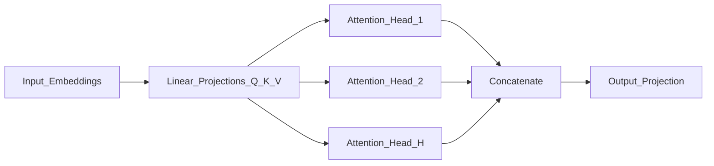

# Attention Mechanism

> Week 1 Theory · Day 2 · [← README](../README.md) · Prev: [transformers](transformers.md) · Next: [embeddings](embeddings.md)

Attention is how transformers decide **which tokens to focus on**. It explains context cost, KV cache memory, and the O(n²) long-context bottleneck.

---

## Concepts

### What problem are we solving?

Language is full of long-range dependencies. In *"The cat sat on the mat because it was tired"*, what does **it** refer to? Earlier architectures passed information step-by-step and often lost these links over distance.

**Attention** lets every token look directly at every other token and decide how much each one matters — the core mechanism inside every transformer block.

### Intuition: weighted relevance

Think of each token asking: *"Who else in this sentence should I pay attention to right now?"*

The model computes a **weighted sum** over all tokens. Tokens that matter more get higher weights; irrelevant tokens get weights near zero. In **self-attention**, the same sequence supplies all the information — each position both asks questions and answers them.

### Query, Key, and Value (Q/K/V)

Each token is projected into three vectors (see [Attention in glossary](../resources/glossary.md#llm--week-1-terms) for Q/K/V):

| Component | Role | Plain English |
|-----------|------|---------------|
| **Query (Q)** | What am I looking for? | "I need to resolve what *it* refers to." |
| **Key (K)** | What do I contain? | "I am the word *cat*." |
| **Value (V)** | What information do I pass forward? | The actual content to blend if this match scores high |

**Query** and **Key** are compared to produce attention weights; **Value** is what gets mixed into the output.

### Scaled dot-product attention (the formula)

Once you have the intuition, the math is a compact version of "compare Q to every K, softmax to weights, blend V":

```
Attention(Q, K, V) = softmax(QK^T / √d_k) × V
```

Scaling by `√d_k` prevents the dot products from growing too large — without it, softmax saturates and gradients vanish during training.

### Multi-head attention

Instead of one attention pass, the model runs **multiple heads in parallel** — each head can specialize (syntax, coreference, long-range links). Outputs are concatenated and projected back.



### Causal mask (decoder-only)

In chat LLMs, token `i` may only attend to tokens `≤ i`. The model cannot peek at future tokens during training or generation. This is why decoder-only models generate left-to-right, one token at a time.

### AI engineer takeaway

Attention is O(n²) in sequence length — doubling context roughly quadruples compute and [KV cache](../resources/glossary.md#llm--week-1-terms) memory. Size inference hardware and context budgets with that scaling in mind.

---

## Complexity and Production Impact

Self-attention over length `n`: **O(n² · d)** for the attention matrix.

| Implication | What it means for you |
|-------------|----------------------|
| Longer context | Quadratic compute + memory growth |
| KV cache | Stores K/V per layer per token during decode — major GPU RAM use |
| Sparse / sliding window | Some models (Mistral, etc.) approximate full attention to reduce cost |

See [context-window.md](context-window.md) and [inference.md](inference.md).

---

## Tradeoffs

| Factor | Implication |
|--------|-------------|
| Full attention | Best quality; expensive at long n |
| KV cache | Speeds decode; memory scales with sequence length |
| "Attention understands" | Misleading — it's weighted math; semantics emerge from training |

---

## Best Practices

- Model context as a **budget**, not unlimited memory.
- Separate **prefill** (process prompt) from **decode** (generate tokens) when tuning latency.
- In interviews: always mention O(n²) when asked about long context.

---

## Common Mistakes

- Saying attention "understands meaning" literally.
- Ignoring KV cache when sizing inference hardware.
- Assuming 128K context means equally good attention at all positions ("lost in the middle").

---

## Checkpoint

1. Write the attention formula from memory.
2. Why do decoder-only models need a causal mask?
3. Why does doubling context length roughly quadruple attention cost?

---

## Go Deeper

| Resource | Link | Why |
|----------|------|-----|
| Illustrated Transformer | https://jalammar.github.io/illustrated-transformer/ | Q/K/V visuals |
| Lilian Weng — Attention? | https://lilianweng.github.io/posts/2018-06-24-attention/ | Deeper math + variants |
| KV cache explained (blog) | https://developer.nvidia.com/blog/mastering-llm-techniques-inference-optimization/ | Inference optimization |

---

## Next

[embeddings.md](embeddings.md) → [Lab 2](../labs/lab-02-embeddings.md)
