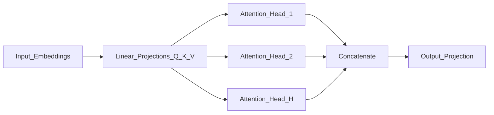
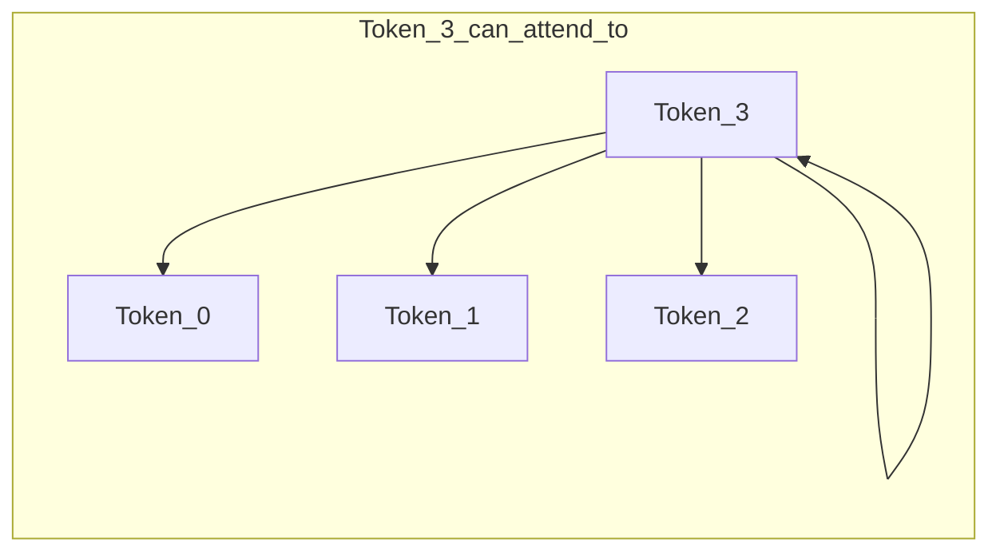

# Attention Mechanism

> Week 1 Theory · Day 2 · [← README](../README.md) · Prev: [transformers](transformers.md) · Next: [embeddings](embeddings.md)

Attention is how transformers decide **which tokens to focus on**. It explains context cost, KV cache memory, and the O(n²) long-context bottleneck.

---

## Concepts

### What problem are we solving?

Language is full of long-range dependencies. In *"The cat sat on the mat because it was tired"*, what does **it** refer to? Earlier architectures passed information step-by-step and often lost these links over distance.

**Attention** lets every token look directly at every other token and decide how much each one matters — the core mechanism inside every transformer block.

### Intuition: weighted relevance

Think of each token asking: *"Who else in this sentence should I pay attention to right now?"*

The model computes a **weighted sum** over all tokens. Tokens that matter more get higher weights; irrelevant tokens get weights near zero. In **self-attention**, the same sequence supplies all the information — each position both asks questions and answers them.

### Query, Key, and Value (Q/K/V)

Each token is projected into three vectors (see [Attention in glossary](../resources/glossary.md#llm--week-1-terms) for Q/K/V):

| Component | Role | Plain English |
|-----------|------|---------------|
| **Query (Q)** | What am I looking for? | "I need to resolve what *it* refers to." |
| **Key (K)** | What do I contain? | "I am the word *cat*." |
| **Value (V)** | What information do I pass forward? | The actual content to blend if this match scores high |

**Query** and **Key** are compared to produce attention weights; **Value** is what gets mixed into the output.

### Scaled dot-product attention (the formula)

Once you have the intuition, the math is a compact version of "compare Q to every K, softmax to weights, blend V":

```
Attention(Q, K, V) = softmax(QK^T / √d_k) × V
```

Read it right-to-left in plain English: **compare** queries to keys, **normalize** into weights, **mix** values.

#### The three matrices (Q, K, V)

For a sequence of `n` tokens (each starts as an embedding vector of size `d`), three learned linear projections produce:

| Matrix | Typical shape | Role |
|--------|---------------|------|
| **Q** (Query) | `n × d_k` | One query vector per token — "what am I looking for?" |
| **K** (Key) | `n × d_k` | One key vector per token — "what do I advertise about myself?" |
| **V** (Value) | `n × d_v` | One value vector per token — "what content do I contribute if selected?" |

`d_k` is the dimension of Q and K (often `d_k = d / num_heads` in multi-head attention). **Query** and **Key** are compared to produce weights; **Value** is what actually gets blended into the output.

#### Step 1: `QK^T` — compatibility scores

The matrix multiply `QK^T` produces an **`n × n` score matrix**:

| | Token 0 | Token 1 | … | Token n−1 |
|---|---------|---------|---|-----------|
| **Token 0 asks** | score(0,0) | score(0,1) | … | score(0,n−1) |
| **Token 1 asks** | score(1,0) | score(1,1) | … | … |
| **…** | | | | |

- **Row `i`** = token `i`'s query compared against every key.
- **Column `j`** = how much every query "likes" token `j`'s key.
- **Cell `(i, j)`** = dot product `Q[i] · K[j]` — high when the two vectors point in similar directions in embedding space.

This is the "who should I pay attention to?" step. Every token scores every other token in one shot — that parallel lookup is why transformers replaced slow step-by-step RNNs for long-range links.

#### Step 2: `/ √d_k` — why scale?

Dot products grow with vector dimension. When `d_k` is large (e.g. 64 or 128), raw scores can become very large numbers.

| Without scaling | With `/ √d_k` |
|-----------------|--------------|
| Scores explode as `d_k` grows | Scores stay in a stable range |
| Softmax becomes nearly one-hot (one weight ≈ 1, rest ≈ 0) | Softmax produces smoother, learnable distributions |
| Gradients vanish during training | Training remains stable |

Softmax on huge scores saturates — the model can't learn fine-grained "pay a little attention here, a lot there." Dividing by `√d_k` fixes that. (This is **scaled** dot-product attention — the name in the paper.)

#### Step 3: `softmax(...)` — attention weights

`softmax` is applied **row by row** (each token gets its own distribution):

```
weight[i, j] = exp(score[i,j]) / Σ_k exp(score[i,k])
```

Each row sums to **1.0** — a probability distribution over all `n` positions.

| Property | Meaning |
|----------|---------|
| All weights ≥ 0 | No negative attention |
| Each row sums to 1 | Token `i` allocates 100% of its "focus budget" across all positions |
| High weight on `j` | Token `i` will borrow heavily from token `j`'s value |

**Decoder-only LLMs:** Before softmax, a **causal mask** sets scores for future positions (`j > i`) to `-∞`. After softmax those weights become 0. Token `i` only attends to tokens at positions `≤ i`. See [Causal mask](#causal-mask-decoder-only) below.

#### Step 4: `× V` — weighted blend of values

The `n × n` weight matrix multiplies `V` (`n × d_v`):

```
output[i] = Σ_j weight[i,j] × V[j]
```

For each token `i`, the output is a **weighted average** of all value vectors. Tokens with high weight contribute more of their content; tokens with weight near zero are effectively ignored.

Attention does not "look up meaning" magically — it is **learned similarity** (Q·K) followed by **weighted mixing** (V). Semantics emerge because training adjusts the projection weights so useful Q/K/V patterns form.

#### Worked example: two tokens

Simplified numbers with `d_k = 2`, after scaling:

```
scores = [[ 2,  0],     softmax row 0 → [0.88, 0.12]
          [ 0,  2]]     softmax row 1 → [0.12, 0.88]
```

If `V = [[1, 0],      (token 0's value)
        [0, 1]]`      (token 1's value)

Then:

```
output[0] = 0.88 × [1,0] + 0.12 × [0,1] = [0.88, 0.12]   ← mostly token 0
output[1] = 0.12 × [1,0] + 0.88 × [0,1] = [0.12, 0.88]   ← mostly token 1
```

Each position mostly keeps its own representation, with a small cross-token blend. In real models, learned weights produce sharper patterns — e.g. **it** heavily weighting **cat**.

#### Coreference example

In *"The cat sat on the mat because it was tired"*:

1. When processing **it**, its **query** vector encodes something like "I need a noun to refer to."
2. **Keys** for **cat**, **mat**, etc. are compared to that query.
3. After training, `score(it, cat)` is typically much higher than `score(it, mat)`.
4. Softmax turns that into weights; the output for **it** blends mostly **cat**'s value vector.

That link is **learned from data**, not programmed. The formula is the same for every token — training teaches which Q/K pairs should score high.

#### Formula → engineering

| Part of formula | What it means in production |
|-----------------|----------------------------|
| `n × n` attention matrix | **O(n²)** compute and memory — doubling context ≈ **4×** attention cost |
| K and V per layer | Stored during decode as **KV cache** — major GPU RAM use on long chats |
| Causal mask | Generation is left-to-right; token `i` never sees the future |
| Multiple heads (below) | Parallel attention passes; each head can specialize |

See [Complexity and Production Impact](#complexity-and-production-impact) and [context-window.md](context-window.md).

### Multi-head attention

Instead of one attention pass, the model runs **multiple heads in parallel** — each head can specialize (syntax, coreference, long-range links). Outputs are concatenated and projected back.



### Causal mask (decoder-only)

In chat LLMs, token `i` may only attend to tokens `≤ i`. Future positions get score `-∞` before softmax → weight 0. The model cannot peek at tokens it has not yet seen during training or generation.



This is why decoder-only models generate **left-to-right**, one token at a time — each new token attends to the full prefix, never the future.

### AI engineer takeaway

Attention is O(n²) in sequence length — doubling context roughly quadruples compute and [KV cache](../resources/glossary.md#llm--week-1-terms) memory. Size inference hardware and context budgets with that scaling in mind.

---

## Complexity and Production Impact

Self-attention over length `n`: **O(n² · d)** for the attention matrix.

| Implication | What it means for you |
|-------------|----------------------|
| Longer context | Quadratic compute + memory growth |
| KV cache | Stores K/V per layer per token during decode — major GPU RAM use |
| Sparse / sliding window | Some models (Mistral, etc.) approximate full attention to reduce cost |

See [context-window.md](context-window.md) and [inference.md](inference.md).

---

## Tradeoffs

| Factor | Implication |
|--------|-------------|
| Full attention | Best quality; expensive at long n |
| KV cache | Speeds decode; memory scales with sequence length |
| "Attention understands" | Misleading — it's weighted math; semantics emerge from training |

---

## Best Practices

- Model context as a **budget**, not unlimited memory.
- Separate **prefill** (process prompt) from **decode** (generate tokens) when tuning latency.
- In interviews: always mention O(n²) when asked about long context.

---

## Common Mistakes

- Saying attention "understands meaning" literally.
- Ignoring KV cache when sizing inference hardware.
- Assuming 128K context means equally good attention at all positions ("lost in the middle").

---

## Checkpoint

1. Write the attention formula from memory.
2. What are the shapes of Q, K, and V for `n` tokens? What does cell `(i, j)` in `QK^T` represent?
3. Why divide by `√d_k` before softmax?
4. Why do decoder-only models need a causal mask?
5. Why does doubling context length roughly quadruple attention cost?

---

## Go Deeper

| Resource | Link | Why |
|----------|------|-----|
| Illustrated Transformer | https://jalammar.github.io/illustrated-transformer/ | Q/K/V visuals |
| Lilian Weng — Attention? | https://lilianweng.github.io/posts/2018-06-24-attention/ | Deeper math + variants |
| KV cache explained (blog) | https://developer.nvidia.com/blog/mastering-llm-techniques-inference-optimization/ | Inference optimization |

---

## Next

[embeddings.md](embeddings.md) → [Lab 2](../labs/lab-02-embeddings.md)
