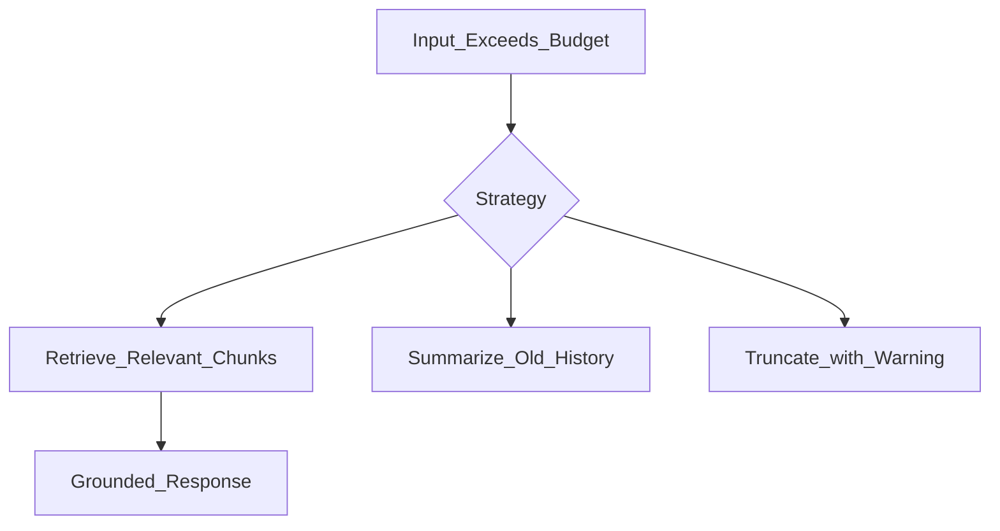

# Context Window

> Week 1 Theory · Day 3 · [← README](../README.md) · Prev: [tokenization](tokenization.md) · Next: [inference](inference.md)

The **context window** is your hard budget for input + output tokens. Exceeding it breaks apps silently or expensively.

---

## Concepts

### What problem are we solving?

Every LLM request has a **hard cap** on how many [tokens](../resources/glossary.md#token) fit in one call — the [context window](../resources/glossary.md#context-window). Input and output share that budget. Exceed it and your app errors, silently truncates, or burns money on tokens that never reach the model reliably.

### What counts toward the budget?

Not just the user's latest message. One request typically includes:

| Component | Example | Why it matters |
|-----------|---------|----------------|
| System prompt | "You are a helpful assistant…" | Fixed cost on every call |
| Chat history | Prior user/assistant turns | Grows with conversation length |
| RAG chunks | Retrieved document snippets | Week 3 — stuffing docs eats budget fast |
| User message | Current question | What users think they're paying for |
| **Generated output** | `max_tokens` response | Output tokens count toward the **same** limit |

GPT-4o Mini supports large contexts; local Llama varies by build — **always check model docs** for your deployment.

### Capacity vs quality

A large window (128K, 200K) is a **capacity** claim, not a quality guarantee. Models may **under-attend** to information buried in the middle of very long contexts ("lost in the middle" — see below). Do not assume stuffing 100 pages means the model reliably used page 50.

**AI engineer takeaway:** Treat the context window as a **budget you design for** — reserve output tokens explicitly, log `input_tokens / context_limit` per request, and prefer retrieval over mega-prompts when corpora don't fit.

---

## What Happens When You Exceed the Limit

1. **Hard error** — API rejects request
2. **Silent truncation** — provider drops tokens (often oldest)
3. **App-level truncation** — your code chooses what to keep

All three need explicit handling in production.

---

## Truncation Strategies

| Strategy | Keeps | Loses | When |
|----------|-------|-------|------|
| Head | Start of prompt | Recent turns | Rare |
| Tail | Recent turns | System prompt | Risky |
| Middle-out | Start + end | Middle | Long docs in some APIs |
| Summarize | Summary of old | Detail | Chat history compression |
| **RAG** | Relevant chunks only | Irrelevant bulk | **Preferred for knowledge** (Week 3) |



---

## "Lost in the Middle"

Research shows models may **under-attend** to information in the center of very long contexts. Do not assume stuffing 100 pages guarantees the model "read" page 50.

---

## Context Budget Formula

```
max_input = context_limit - max_output_tokens - system_tokens - safety_margin
```

Log utilization: `input_tokens / context_limit` per request.

---

## Tradeoffs

| Strategy | Strength | Weakness |
|----------|----------|----------|
| **RAG** (retrieve relevant chunks) | Grounded answers; scales to large corpora | Extra pipeline (Week 3) |
| Summarize old history | Fits long multi-turn chats | Loses detail; summary errors compound |
| Middle-out truncation | Keeps start + end of long docs | Middle facts vanish without warning |
| Mega-prompt (stuff everything) | Simple to code | Expensive; quality degrades in the middle |
| Silent provider truncation | Request "succeeds" | Oldest tokens dropped — often system instructions |

---

## Best Practices

- Reserve output tokens explicitly (`max_tokens` in API).
- Never silently drop system instructions.
- Prefer RAG over mega-prompts for large corpora.
- Warn users when old chat history is compressed.

See [failure-recovery.md](../project/failure-recovery.md) — token overflow handling.

---

## Common Mistakes

- Stuffing full document corpus into one prompt.
- Forgetting output tokens count toward limit.
- Assuming long-context marketing = uniform quality at all positions.

---

## Checkpoint

1. 128K window, 4K reserved output, 2K system — max user+history budget?
2. Name two strategies better than blind truncation for a 500-page manual.
3. What is "lost in the middle"?

---

## Go Deeper

| Resource | Link | Why |
|----------|------|-----|
| Lost in the Middle paper | https://arxiv.org/abs/2307.03172 | Long-context quality |
| OpenAI — context windows | https://platform.openai.com/docs/models | Model-specific limits |
| Anthropic — long context tips | https://docs.anthropic.com/en/docs/build-with-claude/prompt-caching | Context + caching |

---

## Next

[inference.md](inference.md) → [temperature-top-p.md](temperature-top-p.md)
