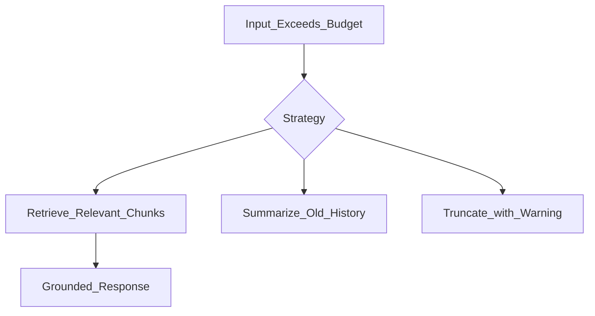

# Context Window

> Week 1 Theory · Day 3 · [← README](../README.md) · Prev: [tokenization](tokenization.md) · Next: [inference](inference.md)

The **context window** is the maximum number of tokens the model can see in one request — input **and** output combined. Think of it as a **fixed-size desk**: everything you put on it has to fit, or something falls off.

---

## Concepts

### What problem are we solving?

You cannot paste unlimited text into an LLM call. Every model has a hard cap (e.g. 128K tokens for many cloud models). Exceed it and you get errors, silent truncation, or surprise bills.

**Input and output share the same desk.** A 128K window is not "128K tokens of prompt plus unlimited answer" — if you reserve 4K for the answer, you only have ~124K left for everything else.

### What actually counts toward the budget?

One chat request is usually more than the user's latest message:

| Piece | Example | Often forgotten? |
|-------|---------|------------------|
| System prompt | "You are a helpful assistant…" | Yes — sent **every** call |
| Chat history | Last 20 back-and-forth turns | Grows over time |
| RAG chunks | Pasted doc snippets (Week 3) | Can be huge |
| User message | "Summarize this" | What users notice |
| **Your answer** | Up to `max_tokens` | **Counts toward the same limit** |

### Worked example: budgeting a single call

Assume GPT-4o Mini with a **128,000 token** context window:

| Component | Tokens |
|-----------|--------|
| System prompt | 500 |
| Chat history (10 turns) | 8,000 |
| User message + attached notes | 15,000 |
| **Subtotal input** | **23,500** |
| Reserved for output (`max_tokens`) | 4,000 |
| Safety margin (your choice) | 500 |
| **Total planned** | **28,000** |

**Remaining headroom:** 128,000 − 28,000 = **100,000 tokens** — you're fine.

Now imagine the user pastes a **120,000-token** PDF into the chat:

| Component | Tokens |
|-----------|--------|
| System + history | 8,500 |
| Pasted PDF | 120,000 |
| Reserved output | 4,000 |
| **Total** | **132,500** → **over limit** |

Your app must trim, summarize, retrieve chunks (RAG), or reject — not blindly send and hope.

### Big window ≠ perfect memory

Marketing says "200K context!" That means **capacity**, not that the model reliably uses every token equally.

Research on **"lost in the middle"**: facts buried in the center of a very long prompt are often ignored. Stuffing 100 pages does not mean the model faithfully used page 50.

| Claim | Reality |
|-------|---------|
| "It fits in context" | Technically may fit |
| "It read everything carefully" | Often false for middle sections |
| Better approach for large docs | RAG — retrieve only relevant chunks (Week 3) |

### AI engineer takeaway

Design a **context budget** in code: count tokens, reserve output, trim or retrieve before calling the API. Log `input_tokens / context_limit` so you see utilization before users hit errors.

---

## What happens when you exceed the limit

| What the system does | What you experience |
|----------------------|---------------------|
| **Hard error** | API returns 400 — request fails |
| **Silent truncation** | Provider drops tokens (often oldest) — model "forgets" early instructions |
| **Your code truncates** | You choose what to keep — must not drop system prompt silently |

All three need explicit handling. See [failure-recovery.md](../project/failure-recovery.md).

---

## Strategies when content does not fit

| Strategy | Plain English | Good when |
|----------|---------------|-----------|
| **RAG** | Search docs; send only top relevant chunks | Large knowledge bases (Week 3) |
| **Summarize history** | Compress old chat turns into a short summary | Long conversations |
| **Tail-keep** | Drop oldest messages, keep recent | Chat apps (Week 2) |
| **Middle-out** | Keep start + end, drop middle | Some long-doc APIs |
| **Mega-prompt** | Stuff everything in | Almost never — expensive and unreliable |



---

## Context budget formula

```
max_input = context_limit - max_output_tokens - system_tokens - safety_margin
```

**Checkpoint math:** 128K window, 4K reserved output, 2K system, 1K margin → max for history + user ≈ **121K tokens**.

---

## Tradeoffs

| Strategy | Strength | Weakness |
|----------|----------|----------|
| RAG | Grounded; scales to huge corpora | Extra pipeline (Week 3) |
| Summarize old history | Keeps chat going | Summary errors compound |
| Silent truncation | Request "succeeds" | System instructions may vanish |
| Mega-prompt | Easy to code | Cost + "lost in the middle" |

---

## Best Practices

- Always set `max_tokens` — reserves output space on the desk.
- Never silently drop the system prompt.
- Warn users when old messages are compressed.
- Prefer retrieval over "paste the whole company wiki."

---

## Common Mistakes

- Treating 128K as "unlimited for practical purposes."
- Forgetting output tokens count toward the limit.
- Pasting full PDFs instead of chunking + search.

---

## Checkpoint

1. 128K window, 4K output reserve, 2K system, 1K margin — what's left for user + history?
2. Name two strategies better than pasting a 500-page manual.
3. What is "lost in the middle"?

---

## Go Deeper

| Resource | Link | Why |
|----------|------|-----|
| Lost in the Middle paper | https://arxiv.org/abs/2307.03172 | Long-context quality |
| OpenAI — models | https://platform.openai.com/docs/models | Per-model limits |

---

## Next

[inference.md](inference.md) → [temperature-top-p.md](temperature-top-p.md)
