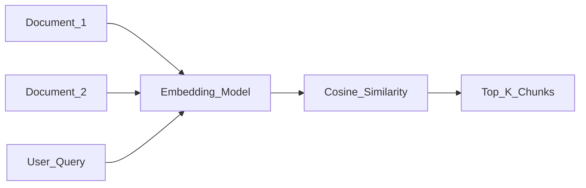

# Embeddings

> Week 1 Theory · Day 2 · [← README](../README.md) · Prev: [attention](attention.md) · Next: [Lab 2](../labs/lab-02-embeddings.md)

**Embeddings** turn text into vectors for semantic search — the foundation of RAG (Week 3). Lab 2 builds cosine similarity search over document snippets.

---

## Concepts

### What problem are we solving?

Keyword search fails when users and documents use different words for the same idea. A query like *"how do I loop in Python?"* won't match a doc that only says *"for loops and iteration."*

**Embeddings** map text into dense vectors where similar meaning lands nearby in space — enabling semantic search, clustering, and the retrieval step in RAG.

### What is an embedding?

An **embedding** is a fixed-size vector (typically 384–3072 dimensions). Semantically similar text → nearby points; unrelated text → farther apart.

### Embedding models vs generation LLMs

Do not use a chat LLM's raw hidden states as production embeddings without proper pooling and evaluation. Use a model trained for retrieval.

| | Embedding model | Generation LLM |
|---|-----------------|------------------|
| Architecture | Usually **[encoder-only](../resources/glossary.md#llm--week-1-terms)** ([BERT](transformers.md)-style) | **[Decoder-only](../resources/glossary.md#llm--week-1-terms)** |
| Output | Fixed-size vector | Next token stream |
| Training | Contrastive / masked language modeling | Next-token prediction |
| Use | Search, clustering, RAG retrieval | Chat, code, reasoning |

**Encoder-only** models (e.g. BERT, `nomic-embed-text`) read the full input bidirectionally and output a single vector — ideal for "what does this text mean?" **Decoder-only** models (GPT, Llama) predict the next token — ideal for generation, not retrieval.

### AI engineer takeaway

Pick a dedicated embedding model for RAG retrieval; never swap models without re-indexing. Chunk documents before embedding — one vector per 256–512 token chunk, not one vector per PDF.

---

## Similarity Search

```
cosine_sim(A, B) = (A · B) / (||A|| × ||B||)
```

Range: -1 to 1. Threshold ~0.7+ often indicates strong match (domain-dependent).



---

## Embedding Models (Week 1 stack)

| Model | Type | Use in Week 1 |
|-------|------|---------------|
| `nomic-embed-text` (Ollama) | Local, free | Lab 2 default |
| OpenAI `text-embedding-3-small` | API, cheap | Optional cloud compare |
| `bge-large-en-v1.5` | Open weights | Self-hosted production path |

---

## Tradeoffs

| Choice | Pro | Con |
|--------|-----|-----|
| Same model for embed + generate | Simpler | Usually worse retrieval |
| Large dims (3072) | Better quality | More storage, slower search |
| Local embeddings | Free, private | Hardware + may lag API quality |

---

## Best Practices

- **Chunk long documents** before embedding — one vector per 256–512 token chunk.
- **Never swap embedding models** without re-indexing all vectors.
- Normalize vectors before cosine search in most vector DBs.
- High similarity ≠ factual correctness (semantic ≠ true).

---

## Common Mistakes

- Embedding entire 50-page PDF as one vector.
- Changing embed model mid-project without re-embedding.
- Assuming top retrieval result is always correct (Lab 2 failure analysis).

---

## Checkpoint

1. Encoder vs decoder — which for embeddings?
2. Why chunk documents before embedding?
3. What similarity metric does Lab 2 use?

---

## Go Deeper

| Resource | Link | Why |
|----------|------|-----|
| OpenAI embeddings guide | https://platform.openai.com/docs/guides/embeddings | API usage |
| MTEB leaderboard | https://huggingface.co/spaces/mteb/leaderboard | Compare embed models |
| Pinecone — embeddings intro | https://www.pinecone.io/learn/vector-embeddings/ | Vector search intuition |

---

## Next

[Lab 2](../labs/lab-02-embeddings.md) in work dir → mark [Day 2](../daily/day-02.md) done → **[Day 3](../daily/day-03.md)** starts with [context-window.md](context-window.md)
