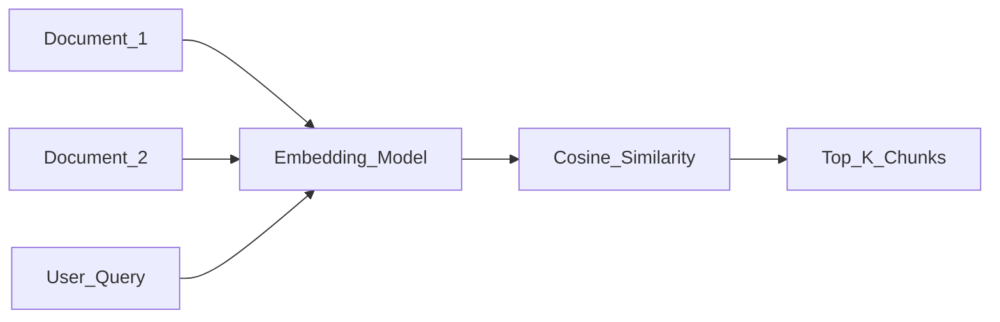

# Embeddings

> Week 1 Theory · Day 2 · [← README](../README.md) · Prev: [attention](attention.md) · Next: [Lab 2](../labs/lab-02-embeddings.md)

**Embeddings** turn text into numbers so a computer can answer: *"Which of these documents is most similar in meaning?"* That is the foundation of semantic search and RAG (Week 3). Lab 2 has you build a tiny version of this.

---

## Concepts

### What problem are we solving?

Keyword search only finds **exact word matches**. If a user searches *"how do I loop in Python?"* but your doc only says *"for loops and iteration in Python"*, a traditional search may return nothing useful.

**Embeddings** map text into vectors (lists of numbers) where **similar meaning → nearby points**. Search becomes "find the closest vectors" instead of "find the word loop."

### A concrete example

Imagine three short docs and one user query:

| Text | Role |
|------|------|
| "Python for loops iterate over sequences." | Doc A |
| "The company Q3 revenue grew 12%." | Doc B |
| "Iteration with `for x in items` in Python." | Doc C |
| **User query:** "How do I loop in Python?" | Query |

After embedding, cosine similarity might look like:

| Pair | Similarity (example) | Match? |
|------|----------------------|--------|
| Query ↔ Doc A | **0.89** | Strong — same topic |
| Query ↔ Doc C | **0.85** | Strong — same topic, different wording |
| Query ↔ Doc B | **0.12** | Weak — finance, not Python |

Keyword search might miss Doc C (no word "loop"). Embedding search finds both A and C because **meaning** is close, not just spelling.

### What is an embedding?

An **embedding** is a fixed-size vector — often 384 to 3072 numbers — produced by a specialized model. You do not read the numbers by hand; you compare them with math (cosine similarity, dot product).

Think of it as a **coordinate in meaning-space**: docs about Python cluster together; docs about finance cluster elsewhere.

### Embedding models vs chat LLMs (don't mix them up)

| | Embedding model | Chat LLM (GPT, Llama) |
|---|-----------------|----------------------|
| **Job** | "What does this text mean?" → one vector | "What word comes next?" → stream of tokens |
| **Architecture** | Usually encoder-only (reads whole input at once) | Decoder-only (generates left-to-right) |
| **Output** | Fixed vector per chunk | Text |
| **Use in your stack** | RAG retrieval, search, clustering | Chat, code, agents |

Do not use a chat model's hidden states as production embeddings without proper evaluation. Use a model **trained for retrieval** (e.g. `nomic-embed-text` in Ollama, OpenAI `text-embedding-3-small`).

### One vector per chunk — not per PDF

| Approach | Result |
|----------|--------|
| Embed entire 50-page PDF as **one** vector | One blurry average — search quality is poor |
| Split into **256–512 token chunks**, embed each | Precise hits on the right section |

Lab 2 uses small snippets; Week 3 scales this to a full RAG pipeline.

### AI engineer takeaway

Pick a dedicated embedding model for search; **never swap models without re-indexing all vectors**. Log which embed model you used — changing it mid-project silently breaks retrieval quality.

---

## How similarity search works

```
cosine_sim(A, B) = (A · B) / (||A|| × ||B||)
```

**Plain English:** Measures the angle between two vectors. Range roughly -1 to 1; in practice often 0 to 1 for text.

| Score | Typical interpretation |
|-------|------------------------|
| 0.85+ | Very strong match (domain-dependent) |
| 0.7–0.85 | Related — worth showing to user |
| < 0.5 | Probably different topic |



Lab 2: embed 5–10 snippets, rank by similarity, write `similarity_results.md` noting any **false positives** (high score but wrong answer).

---

## Models for Week 1

| Model | Type | Use in Week 1 |
|-------|------|---------------|
| `nomic-embed-text` (Ollama) | Local, free | Lab 2 default |
| OpenAI `text-embedding-3-small` | API, cheap | Optional cloud compare |
| `bge-large-en-v1.5` | Open weights | Self-hosted production path |

---

## Tradeoffs

| Choice | Good for | Watch out for |
|--------|----------|---------------|
| Same model for embed + chat | Simpler codebase | Usually worse retrieval |
| Large vectors (3072 dims) | Slightly better quality | More storage, slower search |
| Local embeddings | Free, private data | Hardware limits; may lag API quality |

---

## Best Practices

- Chunk long documents before embedding.
- Normalize vectors when your vector DB expects it.
- High similarity ≠ factual truth — semantic match only; model can still hallucinate after retrieval (Week 3).

---

## Common Mistakes

- One vector per entire book or PDF.
- Changing embed model without re-embedding everything.
- Assuming the top search result is always correct (check Lab 2 failure cases).

---

## Checkpoint

1. Why does keyword search fail for "loop" vs "iteration"?
2. Encoder or decoder for embeddings?
3. Why chunk before embedding?
4. What does Lab 2 measure?

---

## Go Deeper

| Resource | Link | Why |
|----------|------|-----|
| OpenAI embeddings guide | https://platform.openai.com/docs/guides/embeddings | API usage |
| MTEB leaderboard | https://huggingface.co/spaces/mteb/leaderboard | Compare embed models |
| Pinecone — embeddings intro | https://www.pinecone.io/learn/vector-embeddings/ | Visual intuition |

---

## Next

[Lab 2](../labs/lab-02-embeddings.md) in work dir → mark [Day 2](../daily/day-02.md) done → **[Day 3](../daily/day-03.md)** starts with [context-window.md](context-window.md)
