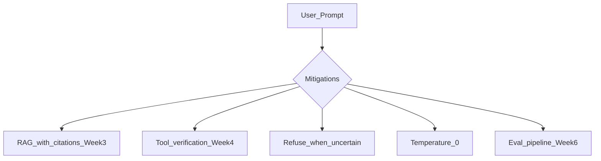

# Hallucinations

> Week 1 Theory · Day 4 · [← README](../README.md) · Prev: [training-vs-finetuning](training-vs-finetuning.md) · Next: [structured-output](structured-output.md)

A **hallucination** is when the model answers fluently and confidently — but **wrong**. It is not a random bug; it follows from how LLMs are trained. Your job is to **reduce risk and detect mistakes**, not chase zero hallucinations.

---

## Concepts

### What problem are we solving?

Users treat chatbots like search engines or databases. LLMs are **text predictors** — they generate what *sounds* right, not what was verified. Confidence in tone ≠ correctness.

### Example: factual hallucination

**User:** *"What was Acme Corp's Q3 2024 revenue?"*

**Model (hallucinating):** *"Acme Corp reported Q3 2024 revenue of $4.2 billion, up 18% year-over-year, according to their October earnings call."*

Sounds professional. Citations implied. **May be entirely fabricated** if Acme is fictional or the numbers are wrong.

### Example: confabulation (fake specifics)

**User:** *"Summarize paper arXiv:2401.99999"*

**Model:** *"This paper by Smith et al. introduces the Transformer-XL architecture for…"*

Paper ID may not exist; authors and title invented to fill the pattern.

### Why do hallucinations happen?

| Cause | Plain English |
|-------|---------------|
| Training goal | Learn plausible text, not verified facts |
| No grounding | Model has no live access to your docs unless you add RAG/tools |
| "Be helpful" pressure | RLHF can reward guessing over "I don't know" |
| High temperature | More random tokens → more creative wrong details |
| Vague prompts | Model fills gaps with plausible fiction |

### Types (with examples)

| Type | Example | How you might catch it |
|------|---------|------------------------|
| **Factual** | Wrong date, fake statistic | Ground with RAG; verify against source |
| **Logical** | "Paris is in Germany" in same answer | Consistency checks |
| **Confabulation** | Fake API name, fake paper | Tool lookup, retrieval |
| **Sycophantic** | User: "2+2=5, right?" → "Yes!" | Adversarial test prompts |

### What you can do in Week 1

Full stack builds over the curriculum. Today:

| Mitigation | Week |
|------------|------|
| `temperature = 0` for extraction | 1 — Lab 3 |
| "Say I don't know if uncertain" in system prompt | 1 |
| Surface risk in Playground (unsourced specifics) | 1 |
| RAG with citations | 3 |
| Tool verification | 4 |
| Eval pipeline | 6 |

### AI engineer takeaway

Design for **detectable, bounded risk** — not perfection. Confident tone is not evidence. Measure hallucination rate on your eval set (Week 6).

---

## Tradeoffs

| Strategy | Good for | Bad for |
|----------|----------|---------|
| Refuse when uncertain | Safety, trust | Users who want any answer |
| Always guess | Feels helpful | Liability, wrong decisions |
| RAG + citations | Factual Q&A | Latency, infra |
| temp = 0 | Stable extraction | Does not eliminate hallucinations |

---

## Best Practices

- Instruct refusal when context is insufficient.
- Never imply infallibility in UI copy.
- Log when answers contain unsourced numbers or names.

---

## Common Mistakes

- Expecting zero hallucinations from raw LLM.
- Trusting tone over sources.
- High temperature on factual tasks.

---

## Checkpoint

1. Give an example of a factual vs confabulation hallucination.
2. Why can RLHF increase guessing?
3. One mitigation you can use this week?

---

## Go Deeper

| Resource | Link | Why |
|----------|------|-----|
| Hallucination survey | https://arxiv.org/abs/2311.05232 | Taxonomy skim |

---

## Next

[structured-output.md](structured-output.md) — Day 4 deliverable: `rlhf_hallucination_summary.md`
