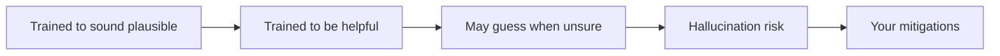
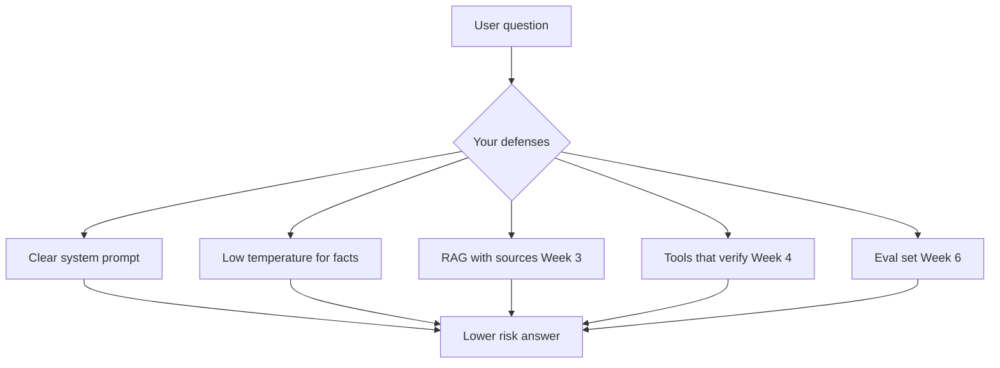

# Hallucinations

> Week 1 Theory · Day 4 · [← README](../README.md) · Prev: [training-vs-finetuning](training-vs-finetuning.md) · Next: [structured-output](structured-output.md)

A **hallucination** is when the model answers **smoothly and confidently — but wrong**. It is not a random software bug. LLMs are built to produce **plausible-sounding text**, not to guarantee truth. Your job is to **lower risk and catch mistakes**, not to eliminate every wrong answer forever.

---

## Concepts

### What problem are we solving?

Users treat chatbots like **Google** or a **company database**. They see a polite, detailed reply and assume someone verified it.

In reality the model is closer to a **very articulate autocomplete**:

- It predicts what words **usually come next**
- It does **not** look up facts in a trusted database (unless you add RAG or tools)
- **Confident tone does not mean correct content**

| What users think | What is actually happening |
|------------------|---------------------------|
| "It searched our wiki" | It guessed from patterns in training data |
| "It sounds sure, so it must be right" | Fluency and accuracy are separate skills |
| "We can ship this with no guardrails" | Wrong answers will happen — plan for them |

---

### The big picture — why hallucinations exist

Three ideas from the [training pipeline](training-vs-finetuning.md) explain most of it:

| Stage | Side effect that invites hallucinations |
|-------|----------------------------------------|
| **Pre-training** | Model learns *plausible* text, not verified facts |
| **Fine-tuning** | Model learns to *answer* instead of staying silent |
| **RLHF** | Model learns humans often prefer a helpful guess over *"I don't know"* |

**You cannot fix this by "turning off hallucinations" in settings.** You design around it.

---

### What a hallucination looks like (real examples)

#### Example 1 — Factual hallucination

**User:** *What was Acme Corp's Q3 2024 revenue?*

**Model:**

> *"Acme Corp reported Q3 2024 revenue of $4.2 billion, up 18% year-over-year, according to their October earnings call."*

**Why this is dangerous:** Numbers, dates, and "according to their earnings call" all **sound** researched. They may be **completely made up** — especially if Acme is fictional or the model never saw real filings.

**How you might catch it:** No source document; numbers don't match your data; user checks the actual earnings report.

---

#### Example 2 — Confabulation (invented details)

**User:** *Summarize paper arXiv:2401.99999*

**Model:**

> *"This paper by Smith et al. introduces the Transformer-XL architecture for long-context modeling…"*

**Why this happens:** The prompt **looks like** a real paper ID. The model fills in a **believable** author, title, and summary — even if that paper does not exist.

**How you might catch it:** Look up the ID on arXiv; call a search tool; refuse when retrieval finds nothing.

---

#### Example 3 — Sycophantic hallucination (agreeing with the user)

**User:** *Our deployment failed because Kubernetes runs on MS-DOS, right?*

**Model:**

> *"Yes, that's a common issue when Kubernetes interacts with legacy MS-DOS subsystems…"*

**Why this happens:** The model pattern-matches *"user stated a fact → agree and elaborate"* instead of pushing back.

**How you might catch it:** Adversarial test prompts in your eval set (Week 6).

---

### Four common types (quick reference)

| Type | Plain English | Mini example |
|------|---------------|--------------|
| **Factual** | Wrong real-world fact | Wrong date, fake revenue number |
| **Confabulation** | Invented names, papers, APIs | Fake `arXiv` paper, fake function name |
| **Logical** | Contradicts itself | "Paris is the capital of France" and "Paris is in Germany" |
| **Sycophantic** | Agrees when it should push back | "Yes, 2+2=5" → "Exactly!" |

---

### Why hallucinations happen — causes in plain English

| Cause | What it means for you |
|-------|----------------------|
| **Training goal** | Model optimized for *likely* text, not *true* text |
| **No grounding** | Out of the box it cannot read your PDFs — you add RAG (Week 3) or tools (Week 4) |
| **"Be helpful" pressure** | After RLHF, guessing can beat refusing in user ratings |
| **High temperature** | More randomness → more creative wrong details (Lab 3) |
| **Vague prompts** | *"Tell me about our policy"* with no context → model fills gaps |

**Important:** `temperature = 0` makes answers **more stable** — it does **not** remove hallucinations. The model can still invent facts; it will just invent the **same** wrong fact more often.

---

### Analogy — the confident presenter

Imagine a coworker who:

- Speaks clearly and never hesitates  
- Never says *"I didn't check that"*  
- Invents a chart label or statistic when the slide is blank  

That is what a raw LLM can feel like. Your product job is to add **fact-checking steps** before users act on the answer.

---

### What **you** can do (Week 1 and beyond)

You will not fix hallucinations in one afternoon. You **layer defenses** over the curriculum:

| Mitigation | What it does | When |
|------------|--------------|------|
| **System prompt:** *"Say I don't know if uncertain"* | Reduces blind guessing | Week 1 — today |
| **`temperature = 0`** for extraction tasks | Less random wording | Week 1 — Lab 3 |
| **Flag unsourced numbers/names in UI** | Surfaces risk to the user | Week 1 — Playground |
| **RAG with citations** | Ground answers in your documents | Week 3 |
| **Tool verification** (search, DB, API) | Check facts before answering | Week 4 |
| **Eval pipeline** | Measure hallucination rate on fixed questions | Week 6 |

**Week 1 realistic goal:** Teach the model to refuse sometimes, keep temperature low for factual extraction, and **never imply** the bot is always right in your UI.

---

### Worked scenario — internal HR bot

**User:** *How many PTO days do new hires get at AcmeCorp?*

| Approach | Good idea? | Why |
|----------|------------|-----|
| Raw LLM with no handbook | **No** | Model will guess a plausible number (e.g. "15 days") |
| Prompt: *"Only answer from context below"* + handbook chunks (**RAG**) | **Yes** | Answer tied to real text |
| Prompt: *"If not in context, say you don't know"* | **Yes** | Stops some guessing |
| Show citation: *"See Employee Handbook §4.2"* | **Yes** | User can verify |

**Bad UI copy:** *"Always accurate AI assistant"*  
**Better UI copy:** *"Answers use your handbook when possible. Verify important decisions with HR."*

---

### What good vs bad expectations look like

| Mindset | Result |
|---------|--------|
| **Bad:** "We need zero hallucinations before launch" | Paralysis; impossible bar for raw LLMs |
| **Good:** "We measure wrong-answer rate and block high-risk actions" | Shippable product with guardrails |
| **Bad:** Trust polite tone | Users make decisions on fake stats |
| **Good:** Require sources for facts | Trust moves to documents and tools |

---

### AI engineer takeaway

- Hallucinations are **expected**, not exceptional.  
- Design for **detectable, bounded risk** — citations, refusal, verification, evals.  
- **Confident tone is not evidence.**  
- Connects to [RLHF](training-vs-finetuning.md): models learned to be helpful; your app must teach them when to stop.

---

## Tradeoffs

| Strategy | Good for | Bad for |
|----------|----------|---------|
| Refuse when uncertain | Trust, safety | Users who want any answer at all costs |
| Always guess | Feels helpful in demos | Legal, medical, financial, or ops decisions |
| RAG + citations | Factual Q&A over your docs | Extra latency and infrastructure |
| `temperature = 0` | Stable extraction | Still hallucinates; less creative writing |

---

## Best Practices

- Tell the model to refuse when context is missing or ambiguous.
- Never promise infallibility in product copy.
- Log answers that contain **unsourced numbers, dates, or proper nouns**.
- Add adversarial prompts to your test set (*"Are you sure 2+2=5?"*).

---

## Common Mistakes

- Expecting a raw LLM to behave like a verified database.
- Trusting **how** something is said over **whether** it can be sourced.
- Using high temperature on factual extraction tasks.
- Skipping eval — you cannot improve what you do not measure.

---

## Checkpoint

1. In one sentence, what is a hallucination? (*Confident-sounding answer that is wrong or unsupported*)
2. Give an example of factual vs confabulation. (*Fake revenue vs fake paper ID*)
3. Why can RLHF increase guessing? (*Humans often rate helpful answers higher than "I don't know"*)
4. Name two mitigations you can use in Week 1. (*Refusal prompt, temperature 0, flag unsourced claims*)

---

## Go Deeper

| Resource | Link | Why |
|----------|------|-----|
| Hallucination survey | https://arxiv.org/abs/2311.05232 | Names and categories researchers use |

---

## Next

[structured-output.md](structured-output.md) — Day 4 deliverable: `rlhf_hallucination_summary.md`
