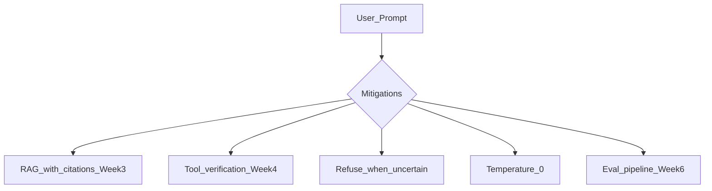

# Hallucinations

> Week 1 Theory · Day 4 · [← README](../README.md) · Prev: [training-vs-finetuning](training-vs-finetuning.md) · Next: [structured-output](structured-output.md)

**Hallucinations** are fluent but wrong outputs. They are predictable given how LLMs are trained — design systems to reduce and detect them, not to eliminate them entirely.

---

## Concepts

### What problem are we solving?

Users expect answers to be **true**. LLMs are trained to produce **plausible** text — the next token that fits the pattern, not a verified fact. That gap is the hallucination problem.

A model can sound completely confident while inventing a citation, misstating a date, or agreeing with a false premise. **Tone of confidence is not evidence of correctness.** Your job is to design systems that ground, verify, or refuse — not to assume the model "knows."

### Why do they happen?

| Cause | Plain English |
|-------|---------------|
| Training objective | Optimizes for likely text, not truth |
| No grounding | Model has no live access to your docs or tools unless you add it |
| [RLHF](../resources/glossary.md) pressure | "Be helpful" can mean guessing instead of refusing |
| Sampling | Higher [temperature](../resources/glossary.md) increases creative (wrong) completions |
| Ambiguous prompts | Model fills gaps with plausible fiction |

### AI engineer takeaway

Treat hallucinations as a **system design** problem: mitigate with RAG, tools, low temperature, and explicit refusal instructions — then measure with eval. Zero hallucinations is not a realistic bar; **detectable and bounded risk** is.

---

## Types

| Type | Example | Signal |
|------|---------|--------|
| **Factual** | Wrong dates, fake stats | Contradicts known sources |
| **Logical** | Self-contradiction | Consistency checks |
| **Confabulation** | Fake paper, fake API name | Tool / retrieval verification |
| **Sycophantic** | Agrees with false premise | Adversarial testing |

---

## Root Causes

1. Noisy training data from the web
2. No grounding at inference
3. RLHF pressure to be "helpful" → guess vs refuse
4. Ambiguous prompts
5. High temperature ([Lab 3](../labs/lab-03-sampling.md))

---

## Mitigation Stack

Week 1 Playground Lite surfaces **risk signals** (unsourced specifics, inconsistent runs) — not ground truth.

---

## Tradeoffs

| Choice | Strength | Weakness |
|--------|----------|----------|
| **Refuse when uncertain** | Fewer false claims; safer UX | More "I don't know" — users may perceive as unhelpful |
| **Guess to be helpful** | Feels responsive; fewer dead ends | Higher hallucination rate; liability risk |
| **RAG / grounding** | Answers tied to retrievable sources | Latency, infra cost, retrieval can still miss |
| **Tool verification** | Facts checked against APIs or DBs | Slower; only as good as tool coverage |
| **Temperature = 0** | More deterministic factual extraction | Less creative; doesn't eliminate hallucinations |
| **No mitigation (raw LLM)** | Fastest, simplest | Unacceptable for production factual use cases |

Design explicitly: product owners often want both speed and perfect accuracy — you pick where on this spectrum each feature lives.

---

## Best Practices

- Instruct: "Say I don't know if uncertain."
- Use temp=0 for factual extraction.
- Show sources when using RAG (Week 3).
- Never imply infallibility in UX.

---

## Common Mistakes

- Expecting zero hallucinations from raw LLM.
- Trusting confident tone.
- Measuring hallucinations only — ignore helpfulness/relevance.

---

## Checkpoint

1. Name two hallucination types.
2. Why does RLHF sometimes increase guessing?
3. One Week 1 mitigation you can implement today?

---

## Go Deeper

| Resource | Link | Why |
|----------|------|-----|
| Survey — Hallucination in LLMs | https://arxiv.org/abs/2311.05232 | Taxonomy (skim) |
| OpenAI — safety best practices | https://platform.openai.com/docs/guides/safety-best-practices | Production guidance |

---

## Next

[structured-output.md](structured-output.md) — write `rlhf_hallucination_summary.md` (Day 4 deliverable)
