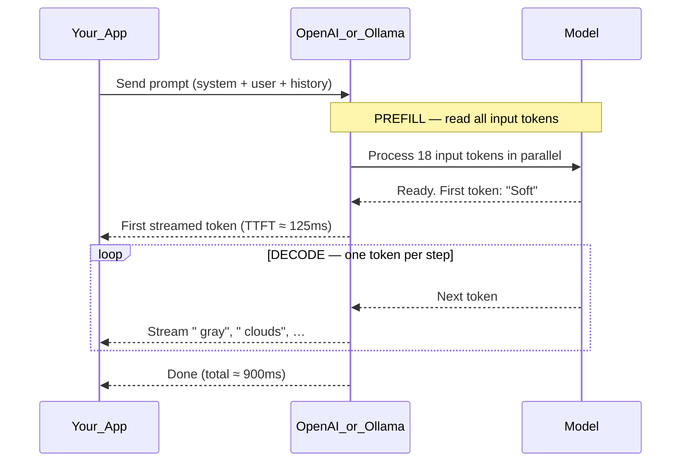

# Inference

> Week 1 Theory · Day 3 · [← README](../README.md) · Prev: [context-window](context-window.md) · Next: [temperature-top-p](temperature-top-p.md)

When you type a prompt and hit Send, the model **generates text one token at a time**. That runtime process is called **inference**. Training built the model's brain once; inference is the model **thinking out loud** on every API call you make.

---

## Concepts

### What problem are we solving?

LLM products live or die on **speed and cost at runtime**. Users don't care how long training took — they care how fast your chat responds and how much you pay per request.

Two ideas to keep separate:

| | Training | Inference |
|---|----------|-----------|
| **When** | Once (or rarely) before launch | Every user message |
| **What happens** | Model learns weights from billions of examples | Model uses those weights to produce text |
| **Who pays** | ML team / training budget | You, per API call or per GPU hour |
| **Analogy** | Studying for an exam for months | Answering one question on the day |

**Inference** is everything that happens between your HTTP request and the model's final token — reading the prompt, generating the answer, streaming it back.

---

### What actually happens when you call the API?

Imagine you send this to GPT-4o Mini:

> **System:** You are a helpful assistant.  
> **User:** Write a haiku about rain.

Here is a realistic timeline (numbers are illustrative):

```
0 ms     Your app sends the request to api.openai.com
120 ms   Model finishes reading your prompt (prefill) — still no visible text
125 ms   First word appears: "Soft"                    ← time to first token (TTFT)
180 ms   "Soft gray"
240 ms   "Soft gray clouds"
...
900 ms   Full haiku complete                           ← total latency
```

The user experiences two different waits:

1. **Before the first word** — "Why is it thinking?" → mostly **prefill**
2. **While words trickle in** — "Is it stuttering?" → mostly **decode**

Your observability envelope should log both. Hiding them behind one `latency_ms` number makes debugging painful.

---

### Prefill: reading the prompt

**Prefill** = the model processes **all input tokens at once** before it writes the first output token.

Think of it like a student **reading the entire exam paper** before writing answer #1. The whole system prompt, chat history, and user message get ingested in parallel.

| Input in our example | Rough token count |
|----------------------|-------------------|
| System prompt | ~10 tokens |
| User message | ~8 tokens |
| **Total prefill** | ~18 tokens |

**What dominates prefill time?**

- **Prompt length** — a 50-page document pasted into chat = slow start
- **Model size** — bigger models think longer per token
- **Hardware** — cloud GPU vs your laptop running Ollama

**User symptom:** *"It takes forever before anything appears."*  
**Likely fix:** Shorter system prompt, fewer RAG chunks (Week 3), smaller model, or faster hardware.

---

### Decode: writing the answer

**Decode** = generate **one output token at a time**, left to right.

After prefill, the model predicts the next token, appends it to the context, predicts the next one, and so on until it hits a stop condition or `max_tokens`.

Our haiku might decode like this:

| Step | Context ends with… | Model predicts |
|------|-------------------|----------------|
| 1 | `…about rain.` | `Soft` |
| 2 | `…about rain. Soft` | ` gray` |
| 3 | `…Soft gray` | ` clouds` |
| … | … | … |

Each step is a full forward pass through the model — but only for **one new token**, not the entire history from scratch (thanks to the KV cache below).

**What dominates decode time?**

- **Output length** — `max_tokens=4000` can drag
- **Tokens per second** — hardware + model size
- **Streaming** — Week 2; users feel decode as a smooth trickle vs one blob

**User symptom:** *"It started fast but the answer takes forever."*  
**Likely fix:** Lower `max_tokens`, faster model, or quantization (INT4) on local hardware.

---

### Prefill vs decode — side by side

| | Prefill | Decode |
|---|---------|--------|
| **Plain English** | Read the question | Write the answer, one word at a time |
| **Processes** | All **input** tokens in parallel | One **output** token per step |
| **Runs how many times** | Once per request | Once per output token |
| **User feels it as** | Delay before first word | Speed of streaming / total wait |
| **Key metric** | **TTFT** (time to first token) | Tokens/sec, inter-token gap |
| **Gets worse when** | Long prompts, huge system instructions | Long answers, slow GPU |



---

### KV cache: why the model doesn't re-read everything

Without optimization, each decode step would re-run attention over **every token so far** — prompt + all generated output. That gets expensive fast.

The **KV cache** (key/value cache) stores attention results from earlier tokens so decode only computes the **new** token.

**Analogy:** You're writing a long email reply. Instead of re-reading your entire draft from page 1 every time you add a word, you keep notes on what you've already processed. The KV cache is those notes.

| Without KV cache | With KV cache |
|------------------|---------------|
| Step 50 re-processes tokens 1–49 | Step 50 only processes token 50 |
| Correct but wasteful | How production inference actually works |
| O(n²) work per decode step | Much cheaper decode |

**Tradeoff:** KV cache **uses GPU memory**. Longer conversations = more cached tokens = more RAM.

Rough memory intuition (you don't need to memorize the formula):

```
KV cache memory grows with: context length × model layers × batch size
```

So a 128K context window sounds great until you realize what it costs to **serve** many users at once — that's Week 5 territory.

---

### Metrics — with example numbers

Suppose Lab 6 benchmarks Llama 3.1 8B on your laptop:

| Metric | Example value | What it tells you |
|--------|---------------|-------------------|
| **TTFT** | 180 ms | How long until the first token appears (prefill + overhead) |
| **Tokens/sec** | 42 tok/s | Decode speed after streaming starts |
| **Total latency** | 2.1 s | End-to-end for a 60-token response |
| **Input tokens** | 25 | Billable / prefill cost driver |
| **Output tokens** | 60 | Billable / decode cost driver |

**Inter-token latency** = gap between streamed chunks. If tokens arrive in bursts (200ms, then nothing, then 200ms), the UI feels janky even if average tokens/sec looks fine.

| If this number is bad… | Look at… |
|------------------------|----------|
| High TTFT | Prompt length, cold start (Ollama first request), network |
| Low tokens/sec | Model size, CPU vs GPU, quantization |
| High total latency but OK TTFT | `max_tokens` too high, slow decode |

Lab 6 asks you to measure `latency_ms` and `tokens_per_sec` for local models — you'll feel the difference between Llama and Mistral on your own hardware.

---

### Training vs inference — don't mix them up

| Someone says… | They probably mean… |
|---------------|---------------------|
| "Fine-tuning took 6 hours" | Training / adaptation — not user-facing latency |
| "The API is slow" | Inference — prefill, decode, or network |
| "We need more GPUs" | Could be either — ask which phase |

In interviews: **training = learn weights; inference = use weights to generate.**

---

### AI engineer takeaway

Log **TTFT**, **tokens/sec**, **input tokens**, **output tokens**, and **total latency** on every call (your observability envelope from Day 5). When a user complains about slowness, ask: *"Is the prompt huge, or is the answer long?"* — that splits prefill vs decode immediately.

---

## Tradeoffs

| Choice | Good for | Watch out for |
|--------|----------|---------------|
| **Streaming** (Week 2) | Chat UX — text appears immediately | Harder error handling mid-stream |
| **Non-streaming** (Week 1 Lite) | Simple JSON compare, clean metrics | Feels slow even when total time is similar |
| **Cloud API** (GPT-4o Mini) | Quality, no hardware ops | Per-token cost, network latency |
| **Local Ollama** (Llama 8B) | Free dev volume, privacy | Cold start, hardware ceiling |
| **Smaller / quantized model** | Speed, less RAM | May lose quality on hard tasks |
| **Long system prompt** | Detailed instructions | TTFT and cost on every single request |

---

## Best Practices

- Set **`max_tokens`** — prevents a runaway 10,000-token answer from draining budget.
- Use **local models for dev volume**, cloud for quality checks — same prompt, compare in Lab 5/6.
- Log **`latency_ms`** plus token counts on every response (Week 1 observability envelope).
- **Warm up Ollama** before benchmarking — first request after idle is often much slower (cold start).
- When comparing models, keep **prompt + hardware** identical — otherwise numbers are meaningless.

---

## Common Mistakes

- Blaming "the model" for slowness when the **prompt is 80K tokens** of pasted PDF.
- Optimizing **total latency only** — missing that TTFT is 8 seconds because of prefill.
- Forgetting **Ollama cold start** on the first request after lunch.
- Confusing **training time** (weeks) with **inference latency** (milliseconds).
- Setting `max_tokens=4096` for a task that needs one sentence.

---

## Checkpoint

1. In plain English: what is inference?
2. You paste a 30-page document and the chat feels slow **before any text appears**. Is that prefill or decode?
3. What is TTFT, and which phase does it mostly reflect?
4. Why does the KV cache exist?
5. What will Lab 6 measure on your machine?

---

## Go Deeper

| Resource | Link | Why |
|----------|------|-----|
| Illustrated Transformer (inference section) | https://jalammar.github.io/illustrated-gpt2/ | Visual decode walkthrough |
| NVIDIA — LLM inference | https://developer.nvidia.com/blog/mastering-llm-techniques-inference-optimization/ | KV cache, batching (Week 5 preview) |
| Ollama API | https://github.com/ollama/ollama/blob/main/docs/api.md | Lab 6 local benchmarks |

---

## Next

[temperature-top-p.md](temperature-top-p.md) → [Lab 3](../labs/lab-03-sampling.md)
