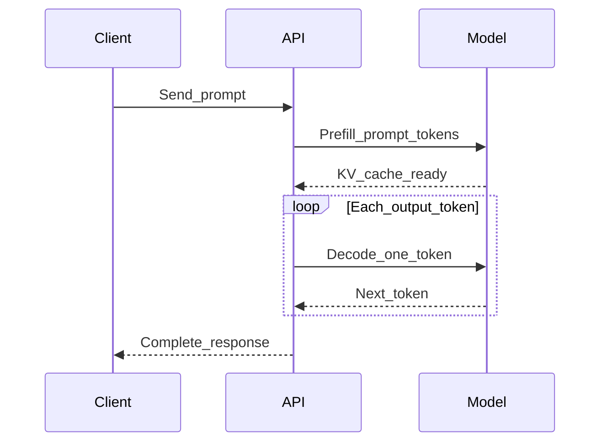

# Inference

> Week 1 Theory · Day 3 · [← README](../README.md) · Prev: [context-window](context-window.md) · Next: [temperature-top-p](temperature-top-p.md)

**Inference** is runtime generation — what happens when you call GPT-4o Mini or Ollama. Lab 6 benchmarks local tokens/sec.

---

## Concepts

### What problem are we solving?

**Training** teaches the model weights once. **Inference** is what happens every time a user sends a prompt — the model applies those weights at runtime to produce text. For LLMs this is [autoregressive](../resources/glossary.md#autoregressive): one token at a time, each new token appended to context for the next step.

When users say "the API is slow," they are feeling inference — not training. Your job is to know **which phase** dominates latency.

### Two phases: prefill and decode

| Phase | Plain English | What dominates |
|-------|---------------|----------------|
| **[Prefill](../resources/glossary.md#prefill)** | Process the **entire prompt** in parallel; build the [KV cache](../resources/glossary.md#kv-cache) | **[TTFT](../resources/glossary.md#ttft)** (time to first token) — "how fast did it start?" |
| **[Decode](../resources/glossary.md#decode)** | Generate **one token at a time**, reusing cached keys/values | Streaming smoothness and total generation time |

Think of it like reading a question before answering: prefill ingests the whole prompt upfront; decode writes the response word by word.

| Symptom users report | Likely bottleneck | What to check |
|----------------------|-------------------|---------------|
| "It takes forever to start typing" | Prefill / [TTFT](../resources/glossary.md#ttft) | Prompt length, system prompt size, RAG chunk count |
| "It started fast but the answer drags" | Decode | `max_tokens`, model size, hardware |
| "Concurrent users kill our GPU" | [KV cache](../resources/glossary.md#kv-cache) memory | Context length × batch size (Week 5 serving) |

**AI engineer takeaway:** Long prompts hurt [TTFT](../resources/glossary.md#ttft); long answers hurt [decode](../resources/glossary.md#decode). Log both — optimizing total latency alone hides whether users wait on prefill or generation.

---

## Prefill vs Decode

| Phase | What happens | Latency profile |
|-------|--------------|-----------------|
| **[Prefill](../resources/glossary.md#prefill)** | Process entire prompt in parallel; fill [KV cache](../resources/glossary.md#kv-cache) | Dominates **[TTFT](../resources/glossary.md#ttft)** (time to first token) |
| **[Decode](../resources/glossary.md#decode)** | Generate one token per step using cached K/V | Dominates streaming / total generation time |



---

## KV Cache

The [KV cache](../resources/glossary.md#kv-cache) stores key/value tensors from prior tokens so the model does not recompute attention over the full history on every [decode](../resources/glossary.md#decode) step.

```
Memory ∝ batch_size × layers × 2 × sequence_length × head_dim
```

Long context + high concurrency = GPU memory pressure. Week 2 adds streaming; Week 5 covers serving at scale.

---

## Metrics That Matter

| Metric | Meaning | User feels |
|--------|---------|------------|
| **[TTFT](../resources/glossary.md#ttft)** | Time to first token | "How fast did it start?" |
| **Inter-token latency** | Gap between streamed tokens | Smoothness |
| **Throughput** | Tokens/sec (aggregate) | Server capacity |
| **Total latency** | End-to-end | Simple but hides prefill vs decode |

Lab 6: measure `latency_ms` and `tokens_per_sec` for Llama vs Mistral locally.

---

## Tradeoffs

| Choice | Pro | Con |
|--------|-----|-----|
| Streaming (Week 2) | Better UX | Harder error handling |
| Non-streaming (Week 1 Lite) | Simpler | Feels slower |
| Larger model | Quality | Cost + latency |
| Quantization (INT4/8) | Speed, less RAM | Possible quality loss |
| Local Ollama | Free, private | Hardware limits |

---

## Best Practices

- Set `max_tokens` — prevents runaway cost.
- Right-size: GPT-4o Mini for quality checks; Llama for dev volume.
- Log `latency_ms` on every call (observability envelope).
- Compare models using same prompt + same hardware (Lab 6).

---

## Common Mistakes

- Confusing training time with inference latency.
- Ignoring Ollama cold start on first request.
- Optimizing total latency only — missing high TTFT on long prompts.

---

## Checkpoint

1. What dominates TTFT — prefill or decode?
2. Why does KV cache exist?
3. What will Lab 6 measure?

---

## Go Deeper

| Resource | Link | Why |
|----------|------|-----|
| NVIDIA — LLM inference | https://developer.nvidia.com/blog/mastering-llm-techniques-inference-optimization/ | KV cache, batching |
| vLLM paper/blog | https://blog.vllm.ai/ | Production serving (Week 5 preview) |
| Ollama API | https://github.com/ollama/ollama/blob/main/docs/api.md | Lab 6 local benchmarks |

---

## Next

[temperature-top-p.md](temperature-top-p.md) → [Lab 3](../labs/lab-03-sampling.md)
