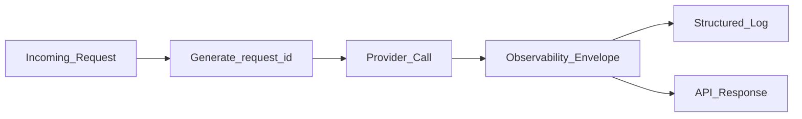

# Observability for LLM Requests

> Week 1 Theory · Day 5 · [← README](../README.md) · [Project Observability](../project/observability.md)

When an LLM call fails in production, you need to know *which* request, *which* model, and *how much* it cost — without replaying the full prompt. This page defines the **observability envelope** your Playground Lite (and every downstream week) must emit on every call.

---

## Concepts

### What problem are we solving?

Traditional app logs tell you *that* something broke. LLM systems need more: **token counts** (billing), **latency per model** (SLAs), **parse status** (structured output), and **correlation IDs** (multi-model compare, retries, UI events).

Without a standard envelope, you cannot answer: "Did Model B timeout or return garbage JSON?" or "What did this compare run cost?"

### What is the observability envelope?

A fixed set of fields attached to **every** LLM response — success, partial failure, or hard error. Think of it as the "flight recorder" for one model call.

| Field | Type | Purpose |
|-------|------|---------|
| `request_id` | UUID string | Correlate logs, errors, and UI events |
| `parent_request_id` | UUID string | Batch compare operations (optional on single calls) |
| `input_tokens` | int | Cost attribution, context budgeting |
| `output_tokens` | int | Cost attribution, generation length |
| `cost_usd` | float | Budget tracking |
| `latency_ms` | float | End-to-end per model |
| `error` | string \| null | Provider failure; null on success |
| `parse_status` | enum \| null | `success` \| `repaired` \| `parse_failure` (extraction only) |
| `json_validation_error` | string \| null | Pydantic/JSON error detail |



### Multi-model compare: parent and child IDs

When one prompt fans out to several models, use a **parent** ID for the batch and **child** IDs per model:

```
parent_request_id: 550e8400-...
├── request_id: 550e8400-...:openai/gpt-4o-mini
├── request_id: 550e8400-...:ollama/llama3.1:8b   (error: timeout)
└── request_id: 550e8400-...:ollama/mistral:7b
```

Partial failures must still return full envelopes for failed models — never drop a slot because one provider timed out.

**AI engineer takeaway:** Observability is not optional telemetry — it is how you debug cost spikes, compare model quality, and prove SLAs in interviews and on-call.

---

## Tradeoffs

| Approach | Strength | Weakness |
|----------|----------|----------|
| Minimal envelope (tokens + latency) | Fast to ship; covers cost/debug basics | Misses parse failures and correlation across compare |
| Full envelope (9 fields + parse status) | Production-ready; Week 1 standard | Slightly more schema work upfront |
| Full prompt logging | Easiest replay | Privacy risk, storage cost, compliance issues |
| Distributed tracing (OpenTelemetry) | End-to-end across services | Heavier setup — Week 6 preview; envelope still required per LLM call |

---

## Best Practices

- Generate `request_id` at the API boundary.
- Log structured JSON; include `model_id`, `parse_status`, never API keys or full prompts.
- Calculate `cost_usd` for successful **and** failed calls (input tokens may still be billed).

---

## Common Mistakes

- Logging only on error.
- Using timestamps as IDs.
- Omitting `error` on partial failures in multi-model compare.
- Dropping `parse_status` when JSON ladder fails.

---

## Checkpoint

1. List all 9 observability fields.
2. How are parent and child `request_id` related in compare?
3. What must happen when Model B times out but A and C succeed?

---

## Go Deeper

| Resource | Link | Why |
|----------|------|-----|
| OpenTelemetry concepts | https://opentelemetry.io/docs/concepts/ | Week 6 preview |
| [project/observability.md](../project/observability.md) | local | Implementation checklist |
| [Lab 5 resiliency test](../labs/lab-05-model-comparison.md) | local | Partial failure pattern |

---

## Next

[prompt-engineering.md](prompt-engineering.md) → [Lab 4](../labs/lab-04-provider-abstraction.md)
