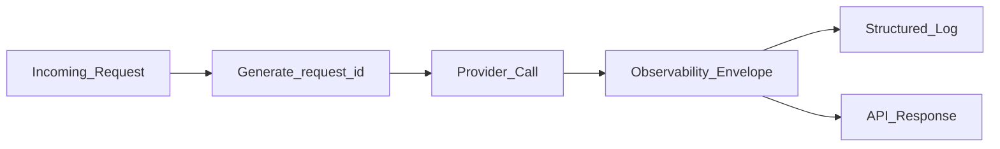

# Observability for LLM Requests

> Week 1 Theory · Day 5 · [← README](../README.md) · [Project Observability](../project/observability.md)

When a user says *"the compare feature broke"*, you need to answer in minutes: which model failed, what did it cost, and was it a timeout or bad JSON? **Observability** is the flight recorder on every LLM call — the fields your Playground Lite must return on every response.

---

## Concepts

### What problem are we solving?

Regular app logs tell you *something* crashed. LLM systems need richer context:

| Question | Field that answers it |
|----------|----------------------|
| "Which request was this?" | `request_id` |
| "How much did we spend?" | `input_tokens`, `output_tokens`, `cost_usd` |
| "Was it slow to start or slow to finish?" | `latency_ms` (+ TTFT in Week 2) |
| "Did JSON parsing work?" | `parse_status` |
| "What went wrong?" | `error` |

Without a **standard envelope** on every call, multi-model compare is a black box.

### A real debugging story

User runs **compare** with GPT-4o Mini + Llama 3.1 8B. UI shows two panels — one empty with "Error."

**Bad logging:** `"Error in compare"` — you cannot tell which model, whether you were billed, or if you should retry.

**Good envelope on the failed slot:**

```json
{
  "request_id": "550e8400-e29b-41d4-a716-446655440000:ollama/llama3.1:8b",
  "parent_request_id": "550e8400-e29b-41d4-a716-446655440000",
  "model_id": "llama3.1:8b",
  "text": "",
  "input_tokens": 0,
  "output_tokens": 0,
  "latency_ms": 30000.0,
  "cost_usd": 0.0,
  "error": "timeout after 30s",
  "parse_status": null
}
```

Meanwhile GPT-4o Mini's slot still has full text and tokens. **Partial failure** — one model down, others succeed. Your UI and tests must handle this (Lab 5 `test_compare_partial_failure`).

### The observability envelope (9 fields)

Attach these to **every** LLM response — success, partial failure, or hard error:

| Field | Type | Plain English |
|-------|------|---------------|
| `request_id` | UUID string | Unique ID for this one model call |
| `parent_request_id` | UUID (optional) | Groups all models in one compare batch |
| `input_tokens` | int | How many prompt tokens (billing + context) |
| `output_tokens` | int | How many generated tokens |
| `cost_usd` | float | Dollar cost for this call |
| `latency_ms` | float | End-to-end time for this model |
| `error` | string or null | Provider failure message; null if OK |
| `parse_status` | enum or null | `success` / `repaired` / `parse_failure` (JSON mode) |
| `json_validation_error` | string or null | Why Pydantic rejected the JSON |



### Multi-model compare: parent and child IDs

One user click → three API calls. Use one **parent** ID plus **child** IDs per model:

```
parent_request_id: 550e8400-...
├── request_id: ...:openai/gpt-4o-mini     ✓ success
├── request_id: ...:ollama/llama3.1:8b     ✗ error: timeout
└── request_id: ...:ollama/mistral:7b      ✓ success
```

**Rule:** Never drop a failed model from the response array — return the envelope with `error` set so the UI can show "Model B timed out."

### AI engineer takeaway

Observability is how you debug cost spikes, prove SLAs, and pass interviews. Generate `request_id` at the API boundary; log structured JSON; never log API keys or full prompts in production.

---

## Tradeoffs

| Approach | Good for | Watch out for |
|----------|----------|---------------|
| Minimal (tokens + latency) | Quick MVP | Misses parse failures and compare correlation |
| Full 9-field envelope | Week 1 standard; production-ready | Small schema upfront cost |
| Logging full prompts | Easy replay | Privacy and compliance risk |

---

## Best Practices

- Generate IDs at the API boundary, not inside the provider SDK callback.
- Calculate `cost_usd` even on failures — input tokens may still be billed.
- Log `model_id` + `request_id` together in structured JSON.

---

## Common Mistakes

- Logging only on error (no baseline for "slow but successful").
- Using timestamps as IDs (collisions under load).
- Omitting failed models from compare results.
- Dropping `parse_status` when JSON ladder fails.

---

## Checkpoint

1. List all 9 observability fields.
2. User compares 3 models; Llama times out. What should the API return?
3. Why log `cost_usd` on failed calls?

---

## Go Deeper

| Resource | Link | Why |
|----------|------|-----|
| [project/observability.md](../project/observability.md) | local | Implementation checklist |
| OpenTelemetry concepts | https://opentelemetry.io/docs/concepts/ | Week 6 preview |

---

## Next

[prompt-engineering.md](prompt-engineering.md) → [Lab 4](../labs/lab-04-provider-abstraction.md)
