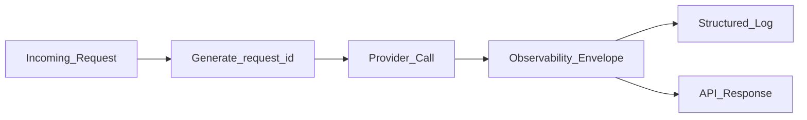

# Observability for LLM Requests

> Week 1 Theory · Day 5 · [← README](../README.md) · Prev: [structured-output](structured-output.md) · [Project Observability](../project/observability.md)

When a user says *"the compare feature broke"*, you need to answer in minutes: which model failed, what did it cost, and was it a timeout or bad JSON? **Observability** is the flight recorder on every LLM call — a fixed set of fields attached to every response so you can debug, bill, and prove SLAs without guessing.

---

## Concepts

### What problem are we solving?

Regular app logs tell you *something* crashed. LLM systems need richer context:

| Question | Field that answers it |
|----------|----------------------|
| "Which request was this?" | `request_id` |
| "How much did we spend?" | `input_tokens`, `output_tokens`, `cost_usd` |
| "Was it slow to start or slow to finish?" | `latency_ms` (+ TTFT in Week 2) |
| "Did JSON parsing work?" | `parse_status` |
| "What went wrong?" | `error` |

Without a **standard envelope** on every call, multi-model compare is a black box.

### A real debugging story

User runs **compare** with GPT-4o Mini + Llama 3.1 8B. UI shows two panels — one empty with "Error."

**Bad logging:** `"Error in compare"` — you cannot tell which model, whether you were billed, or if you should retry.

**Good envelope on the failed slot:**

```json
{
  "request_id": "550e8400-e29b-41d4-a716-446655440000:ollama/llama3.1:8b",
  "parent_request_id": "550e8400-e29b-41d4-a716-446655440000",
  "model_id": "llama3.1:8b",
  "text": "",
  "input_tokens": 0,
  "output_tokens": 0,
  "latency_ms": 30000.0,
  "cost_usd": 0.0,
  "error": "timeout after 30s",
  "parse_status": null
}
```

Meanwhile GPT-4o Mini's slot still has full text and tokens. **Partial failure** — one model down, others succeed. Your UI and tests must handle this (Lab 5 `test_compare_partial_failure`).

### Success looks like (same shape, every time)

When the call works, return the **same fields** — just with `error: null` and real token counts. Your frontend `MetricsBar` can render one component for both paths.

```json
{
  "request_id": "7c9e6679-7425-40de-944b-e07fc1f90ae7:openai/gpt-4o-mini",
  "parent_request_id": "7c9e6679-7425-40de-944b-e07fc1f90ae7",
  "model_id": "openai/gpt-4o-mini",
  "text": "Here is a haiku about rain:\n\nSoft gray clouds gather\nRain taps gently on the roof\nEarth drinks and rests",
  "input_tokens": 42,
  "output_tokens": 28,
  "latency_ms": 842.3,
  "cost_usd": 0.000031,
  "error": null,
  "parse_status": null,
  "json_validation_error": null
}
```

**Why the shape never changes:** If success and failure return different JSON keys, your UI breaks on errors — exactly when the user needs feedback most.

### Symptom → cause (debugging with numbers)

A user reports: *"Compare hung for 8 seconds, then one panel went blank."* One `latency_ms` number is not enough — walk the timeline:

```
0 ms      User clicks Compare (3 models)
120 ms    GPT-4o Mini starts returning text          latency_ms → ~900 on success
120 ms    Mistral 7B starts returning text           latency_ms → ~1100 on success
8000 ms   Llama panel still empty                    latency_ms → 30000, error: "timeout after 30s"
```

| User symptom | Field to check | Likely cause |
|--------------|----------------|--------------|
| Blank panel, others OK | `error` on that slot only | Local Ollama down, wrong model name, GPU OOM |
| All panels slow | Every `latency_ms` high | Huge prompt → slow prefill ([inference.md](inference.md)) |
| JSON mode shows raw text | `parse_status: parse_failure` | Model ignored schema; try structured output API |
| Bill spike overnight | Sum of `cost_usd` by `model_id` | Someone left compare on in a loop, or prompt grew |

**Week 1 rule:** Log one structured JSON line per model call (see [project/observability.md](../project/observability.md)). In production you would ship these to a log aggregator; for Lab 4, `stdout` is enough.

### The observability envelope (9 fields)

Attach these to **every** LLM response — success, partial failure, or hard error:

| Field | Type | Plain English |
|-------|------|---------------|
| `request_id` | UUID string | Unique ID for this one model call |
| `parent_request_id` | UUID (optional) | Groups all models in one compare batch |
| `input_tokens` | int | How many prompt tokens (billing + context) |
| `output_tokens` | int | How many generated tokens |
| `cost_usd` | float | Dollar cost for this call |
| `latency_ms` | float | End-to-end time for this model |
| `error` | string or null | Provider failure message; null if OK |
| `parse_status` | enum or null | `success` / `repaired` / `parse_failure` (JSON mode) |
| `json_validation_error` | string or null | Why Pydantic rejected the JSON |



### Multi-model compare: parent and child IDs

One user click → three API calls. Use one **parent** ID plus **child** IDs per model:

```
parent_request_id: 550e8400-...
├── request_id: ...:openai/gpt-4o-mini     ✓ success
├── request_id: ...:ollama/llama3.1:8b     ✗ error: timeout
└── request_id: ...:ollama/mistral:7b      ✓ success
```

**Rule:** Never drop a failed model from the response array — return the envelope with `error` set so the UI can show "Model B timed out."

### Cost math on a compare batch (numeric walkthrough)

Suppose one compare runs GPT-4o Mini + two local Ollama models. GPT-4o Mini pricing is roughly **$0.15 / 1M input tokens** and **$0.60 / 1M output tokens** (check current pricing — numbers here are illustrative).

| Model | input_tokens | output_tokens | cost_usd (illustrative) |
|-------|--------------|---------------|-------------------------|
| GPT-4o Mini | 180 | 95 | (180 × 0.15 + 95 × 0.60) / 1_000_000 ≈ **$0.000084** |
| Llama 3.1 8B (local) | 180 | 0 | **$0.0** (timeout — no output billed) |
| Mistral 7B (local) | 180 | 110 | **$0.0** (Ollama on your machine) |

**Batch total for finance:** Sum the three `cost_usd` values ≈ $0.000084 — not zero, even though two models are local. Cloud spend still happened.

**Failed call nuance:** OpenAI may still charge for **input tokens** if the request reached their servers before a client-side timeout. That is why `cost_usd` and `input_tokens` belong on error envelopes too — not only on happy paths.

### What you log vs what you return

| Include in API response + structured log | Do **not** log in production |
|------------------------------------------|------------------------------|
| `request_id`, `model_id`, tokens, cost, latency | Full system + user prompts (PII) |
| `error`, `parse_status` | API keys or auth headers |
| Prompt **version id** (Week 2) | Raw completions with customer data |

Your Playground Lite can show prompts in the UI during development. Production systems redact or hash them.

### AI engineer takeaway

Observability is how you debug cost spikes, prove SLAs, and pass interviews. Generate `request_id` at the API boundary; log structured JSON; never log API keys or full prompts in production.

---

## Tradeoffs

| Approach | Good for | Watch out for |
|----------|----------|---------------|
| Minimal (tokens + latency) | Quick MVP | Misses parse failures and compare correlation |
| Full 9-field envelope | Week 1 standard; production-ready | Small schema upfront cost |
| Logging full prompts | Easy replay | Privacy and compliance risk |

---

## Best Practices

- Generate IDs at the API boundary, not inside the provider SDK callback.
- Calculate `cost_usd` even on failures — input tokens may still be billed.
- Log `model_id` + `request_id` together in structured JSON.

---

## Common Mistakes

- Logging only on error (no baseline for "slow but successful").
- Using timestamps as IDs (collisions under load).
- Omitting failed models from compare results.
- Dropping `parse_status` when JSON ladder fails.

---

## Checkpoint

1. List all 9 observability fields. (*request_id, parent_request_id, input/output tokens, cost_usd, latency_ms, error, parse_status, json_validation_error — plus model_id/text in the API*)
2. User compares 3 models; Llama times out. What should the API return? (*3 result objects; Llama slot has error set, empty text, full envelope; others succeed; same parent_request_id*)
3. Why log `cost_usd` on failed calls? (*Input tokens may still be billed; finance needs accurate totals*)
4. User sees one blank compare panel. Which field tells you it was a timeout vs bad JSON? (*`error` vs `parse_status` / `json_validation_error`*)
5. Why generate `request_id` at the API boundary, not inside the SDK? (*One ID per HTTP request; correlates logs, UI, and support tickets*)

---

## Go Deeper

| Resource | Link | Why |
|----------|------|-----|
| [project/observability.md](../project/observability.md) | local | Implementation checklist |
| OpenTelemetry concepts | https://opentelemetry.io/docs/concepts/ | Week 6 preview |

---

## Next

[prompt-engineering.md](prompt-engineering.md) (skim) → [Lab 4](../labs/lab-04-provider-abstraction.md) → mark Day 5 in [progress.md](../progress.md)
