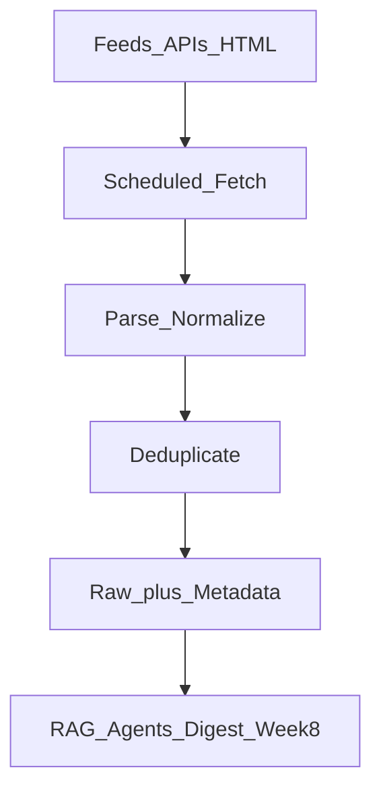

# RSS and Web Ingestion Primer

> Week 1 Theory · Day 6 · [← README](../README.md) · Next: [Lab 6](../labs/lab-06-local-benchmark.md)

Preview for **AI Radar** (Week 8 capstone): how to ingest news, papers, and launches without brittle scraping.

---

## Concepts

Preview for **AI Radar** (Week 8): how to pull in news and papers without brittle HTML scraping.

### What problem are we solving?

You want a daily digest of AI news. The naive approach — scrape 20 websites' HTML — breaks every time someone redesigns a page. The engineering question is: **what is the most stable way to get new content on a schedule?**

### Example: one RSS item (what you actually get)

Feed: `https://rss.arxiv.org/rss/cs.AI` — poll it every hour with `feedparser`.

```xml
<item>
  <title>Attention Is All You Need (relisted example)</title>
  <link>https://arxiv.org/abs/1706.03762</link>
  <pubDate>Thu, 15 Jan 2026 08:00:00 GMT</pubDate>
  <description>Abstract text here…</description>
</item>
```

Your code normalizes to:

```json
{
  "id": "sha256_of_url",
  "source": "arxiv_cs_ai",
  "title": "Attention Is All You Need…",
  "url": "https://arxiv.org/abs/1706.03762",
  "published_at": "2026-01-15T08:00:00Z",
  "content_snippet": "Abstract text here…"
}
```

**Dedupe** by URL hash so polling twice does not spam the digest.

### RSS: the simplest reliable feed

**RSS (Really Simple Syndication)** is an XML format publishers expose at a fixed URL. Each feed contains `<item>` entries with `title`, `link`, `pubDate`, and `description`. You **poll** feeds on a schedule — no browser, no layout parsing.

Think of RSS as a changelog API the publisher maintains for you.

### Web ingestion hierarchy

Prefer the most stable source type first:

| Priority | Method | Plain English |
|----------|--------|---------------|
| 1 | RSS / Atom feeds | Publisher-maintained XML — lowest maintenance |
| 2 | Official APIs | GitHub, arXiv, Hacker News — rate limits apply |
| 3 | Sitemaps | URL discovery; still need fetch + parse |
| 4 | HTML scraping | Last resort — breaks when layout changes |



### AI Radar source examples

| Source | Method | Notes |
|--------|--------|-------|
| arXiv cs.AI | RSS | https://rss.arxiv.org/rss/cs.AI |
| Tech blogs | RSS | Respect `ETag` / `Last-Modified` |
| GitHub trending | API | Rate limits; auth token |
| Product pages | Scrape only if no feed | High maintenance |

### Normalized record (Week 8 target)

Every source should map to the same shape before RAG or summarization:

```json
{
  "id": "sha256_of_canonical_url",
  "source": "arxiv_cs_ai",
  "title": "Paper title",
  "url": "https://...",
  "published_at": "2026-01-15T08:00:00Z",
  "fetched_at": "2026-01-15T08:05:00Z",
  "content_snippet": "Abstract...",
  "content_hash": "sha256_of_body"
}
```

**AI engineer takeaway:** Ingestion is plumbing — feeds and APIs beat scrapers; dedupe and store raw so you can re-parse without re-fetching when your downstream LLM pipeline changes.

---

## Tradeoffs

| Approach | Strength | Weakness |
|----------|----------|----------|
| RSS / Atom | Stable schema; low ops | Not every site publishes a feed |
| Official API | Rich metadata; pagination | Auth, quotas, ToS |
| HTML scraping | Works when nothing else does | Fragile; legal/robots concerns |
| Push webhooks | Real-time | Rare for news; you build receiver infra |

---

## Best Practices

- **Dedupe** by URL or content hash before storage.
- **Store raw + parsed** — re-parse without re-fetch.
- **robots.txt** + rate limits + identifiable `User-Agent`.
- Feeds over scraping whenever possible.

---

## Lab 6 Mini-Exercise

Fetch arXiv cs.AI (or any RSS), parse 5 items, output `rss_sample.json` in work directory. Use `feedparser` (in [requirements.txt](../requirements.txt)).

---

## Common Mistakes

- Scraping when RSS exists.
- No deduplication → duplicate digests.
- Ignoring timezone in `pubDate`.

---

## Checkpoint

1. Why prefer RSS over scraping?
2. What fields in the normalized record?
3. How does this connect to AI Radar?

---

## Go Deeper

| Resource | Link | Why |
|----------|------|-----|
| RSS 2.0 spec | https://www.rssboard.org/rss-specification | Field reference |
| arXiv cs.AI RSS | https://rss.arxiv.org/rss/cs.AI | Lab 6 feed |
| feedparser docs | https://feedparser.readthedocs.io/ | Python parsing |
| GitHub REST API | https://docs.github.com/en/rest | Week 8 GitHub tracking |

---

## Next

[Lab 6](../labs/lab-06-local-benchmark.md)
