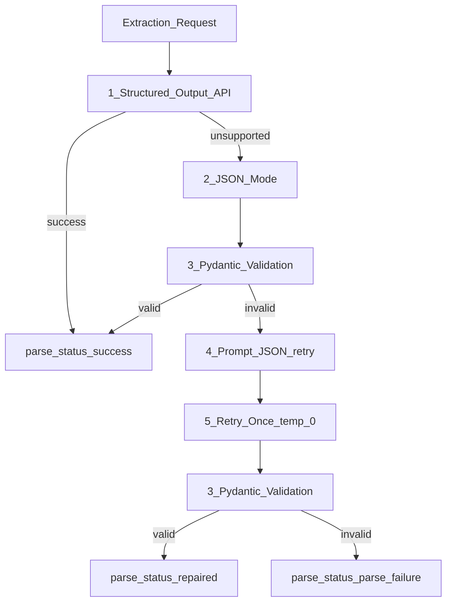

# Structured Outputs and JSON Mode

> Week 1 Theory · Day 4 · [← README](../README.md) · [Failure Recovery](../project/failure-recovery.md)

LLMs naturally return prose. Production systems need **typed data** — fields your code can validate, log, and route. This page covers how to constrain model output to JSON and schemas, and what to do when parsing fails.

---

## Concepts

### What problem are we solving?

Your backend cannot safely `json.loads()` free-form chat text. Extraction, tool calls, and compare pipelines need **predictable shapes**: known keys, correct types, required fields.

Ask a model to "return JSON" in a prompt and you will eventually get markdown fences, trailing commas, wrong keys, or valid JSON that fails your schema. **Syntax** (valid JSON) and **semantics** (matches your schema) are different guarantees — production code must handle both.

### What are the options?

| Approach | Plain English | Guarantee |
|----------|---------------|-----------|
| Prompt-only ("return JSON") | Hope and parse | Weak — frequent parse errors |
| **[JSON mode](../resources/glossary.md)** | API forces valid JSON syntax | Syntax only — keys/types may still be wrong |
| **[Structured output](../resources/glossary.md)** | Provider validates against JSON Schema | Strong — schema enforced at generation time |

Use the **JSON reliability ladder** below: start with the strongest option your provider supports, fall back gracefully, and always validate with Pydantic before trusting the result.

### AI engineer takeaway

Structured output is how you turn an LLM into a **reliable API contract** — define schemas once (Pydantic), enforce at the provider when possible, and never let a parse failure crash your aggregator; surface `parse_status` instead.

---

## JSON Reliability Ladder (Production Flow)

Use this cascade in Week 1 and all downstream weeks. Stop at the first step that succeeds.



| Step | Action |
|------|--------|
| 1 | Provider **structured output** API with JSON Schema (GPT-4o Mini) |
| 2 | Fall back to **JSON mode** (`response_format: json_object`) |
| 3 | **Validate** with Pydantic `model_validate()` |
| 4 | **Prompt repair** — append "Return only valid JSON matching schema" |
| 5 | **Retry once** at temperature=0 |
| Fail | Set `parse_status: parse_failure`, populate `json_validation_error` |

---

## Response Schema (Week 1)

Every extraction response must include:

```json
{
  "request_id": "uuid",
  "text": "raw model output",
  "parsed_json": { },
  "parse_status": "success",
  "json_validation_error": null,
  "input_tokens": 0,
  "output_tokens": 0,
  "latency_ms": 0.0,
  "cost_usd": 0.0,
  "error": null
}
```

### `parse_status` Values

| Value | Meaning |
|-------|---------|
| `success` | Parsed and validated on first attempt |
| `repaired` | Succeeded after JSON mode fallback, prompt repair, or single retry |
| `parse_failure` | All ladder steps exhausted |

### `json_validation_error`

Human-readable Pydantic or `json.JSONDecodeError` message. Log with `request_id`; show abbreviated message in UI.

---

## Tradeoffs

| Approach | Pro | Con |
|----------|-----|-----|
| Structured outputs API | Reliable parsing, fewer retries | Provider-specific; not all models support it |
| JSON mode | Broader support | May return wrong keys or types |
| Prompt + json.loads | Works everywhere | Fragile; high failure rate at scale |

---

## Best Practices

- Prefer **structured output API** for GPT-4o Mini; use ladder for Llama (prompt JSON only).
- Set **temperature = 0** for all extraction steps.
- Always wrap validation in try/except; never crash the compare aggregator on parse failure.
- Define schemas with Pydantic — single source of truth.

---

## Common Mistakes

- Assuming JSON mode means schema compliance.
- Not handling partial/truncated JSON when `max_tokens` is too low.
- Retrying more than once (cost + latency spiral).
- Omitting `parse_status` in observability logs.

---

## Checkpoint

1. JSON mode vs structured outputs — which enforces schema?
2. What are the three `parse_status` values?
3. How many retries in the Week 1 ladder?

---

## Go Deeper

| Resource | Link | Why |
|----------|------|-----|
| OpenAI Structured Outputs | https://platform.openai.com/docs/guides/structured-outputs | Primary Week 1 API |
| Pydantic validation | https://docs.pydantic.dev/latest/concepts/models/ | Lab 4+ schemas |
| [failure-recovery.md](../project/failure-recovery.md) | local | Malformed JSON UX |

---

## Next

[Lab 4](../labs/lab-04-provider-abstraction.md) — implement extraction ladder → **[Day 5](../daily/day-05.md)**
