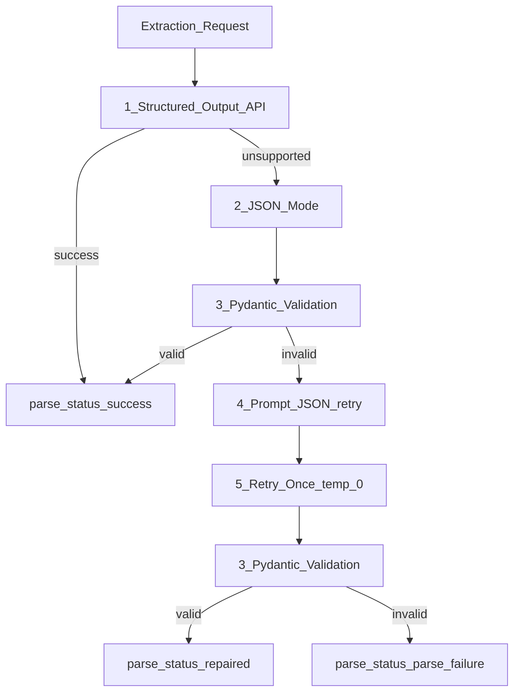

# Structured Outputs and JSON Mode

> Week 1 Theory · Day 4 · [← README](../README.md) · [Failure Recovery](../project/failure-recovery.md)

Your backend needs **typed data** — JSON your code can validate — not prose wrapped in markdown fences. This page shows what goes wrong with naive "return JSON" prompts and the **reliability ladder** to fix it.

---

## Concepts

### What problem are we solving?

You ask the model to extract contact info. Your code does `json.loads(response)`.

**What you hope for:**

```json
{"name": "John Doe", "email": "john@example.com", "age": 34}
```

**What you often get with prompt-only JSON:**

````text
Here is the JSON you requested:

```json
{
  "name": "John Doe",
  "email": "john@example.com",
  "age": "34"
}
```

Let me know if you need anything else!
````

Problems: markdown fences, extra prose, wrong type (`"34"` string vs number `34`), trailing commas. **`json.loads()` crashes** — and if you're running multi-model compare, one crash should not kill the whole batch.

**Two levels of "correct":**

| Level | Meaning |
|-------|---------|
| **Syntax** | Valid JSON text |
| **Semantics** | Matches *your* schema (required fields, correct types) |

JSON mode fixes syntax. **Structured output** (schema mode) pushes toward semantics. **Pydantic** is your final gate in application code.

### Three approaches compared

| Approach | Plain English | Reliability |
|----------|---------------|-------------|
| Prompt-only ("return JSON") | Hope the model cooperates | Low |
| **JSON mode** | API forces valid JSON syntax | Medium — keys/types may still be wrong |
| **Structured output** | API constrains generation to your JSON Schema | High on supported models |

### Walking the ladder (concrete)

**Request:** Extract `{name, email, age}` from *"John Doe, 34, john@example.com"*

| Step | What you try | Example outcome |
|------|--------------|-----------------|
| 1 | OpenAI structured output + schema | `parse_status: success` on first try |
| 2 | JSON mode (`response_format: json_object`) | Valid JSON but `age` is string → Pydantic fails |
| 3 | Pydantic `model_validate()` | Catches type errors |
| 4 | Append "Return only JSON matching schema" | Sometimes repairs |
| 5 | Retry once at `temperature=0` | `parse_status: repaired` |
| Fail | All steps exhausted | `parse_status: parse_failure`, log `json_validation_error`, **don't crash compare** |

### AI engineer takeaway

Structured output turns an LLM into a **reliable API contract**. Define schemas once in Pydantic; enforce at the provider when possible; always surface `parse_status` instead of throwing uncaught exceptions.

---

## JSON Reliability Ladder



| Step | Action |
|------|--------|
| 1 | Provider structured output with JSON Schema (GPT-4o Mini) |
| 2 | Fall back to JSON mode |
| 3 | Validate with Pydantic |
| 4 | Prompt repair line |
| 5 | Single retry at temp=0 |
| Fail | Return `parse_failure` + error message |

---

## Response shape (Week 1)

```json
{
  "request_id": "uuid",
  "text": "raw model output",
  "parsed_json": { "name": "John Doe", "email": "john@example.com", "age": 34 },
  "parse_status": "success",
  "json_validation_error": null,
  "input_tokens": 45,
  "output_tokens": 28,
  "latency_ms": 820.0,
  "cost_usd": 0.00002,
  "error": null
}
```

### `parse_status` values

| Value | Meaning |
|-------|---------|
| `success` | First attempt parsed and validated |
| `repaired` | Succeeded after fallback or retry |
| `parse_failure` | Ladder exhausted — show error in UI, continue other models |

---

## Tradeoffs

| Approach | Good for | Watch out for |
|----------|----------|---------------|
| Structured output API | Production extraction on OpenAI | Not all models support it |
| JSON mode | Broader provider support | Wrong keys/types |
| Prompt + `json.loads` | Quick scripts | Fragile at scale |

---

## Best Practices

- Prefer structured output for GPT-4o Mini; use ladder for Llama (prompt JSON).
- `temperature = 0` for all extraction steps.
- Set `max_tokens` high enough — truncated JSON is a common silent failure.
- One retry max — more retries = cost spiral.

---

## Common Mistakes

- Assuming JSON mode = schema compliance.
- Letting parse failure crash the whole compare aggregator.
- Omitting `parse_status` in logs.

---

## Checkpoint

1. What's the difference between syntax and semantics for JSON?
2. Which step uses Pydantic?
3. What happens on `parse_failure` in a 3-model compare?

---

## Go Deeper

| Resource | Link | Why |
|----------|------|-----|
| OpenAI Structured Outputs | https://platform.openai.com/docs/guides/structured-outputs | Primary API |
| [failure-recovery.md](../project/failure-recovery.md) | local | UX for bad JSON |

---

## Next

[Lab 4](../labs/lab-04-provider-abstraction.md) → **[Day 5](../daily/day-05.md)**
