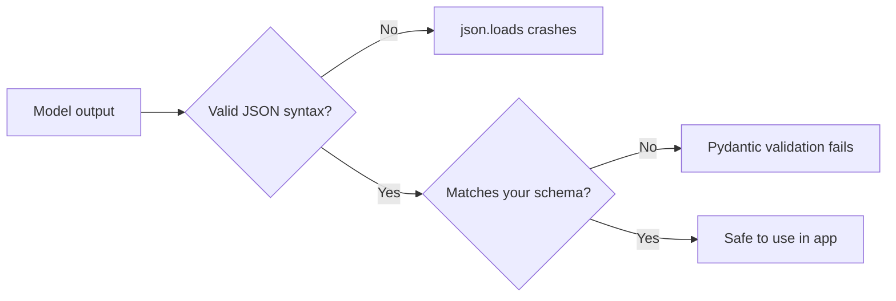
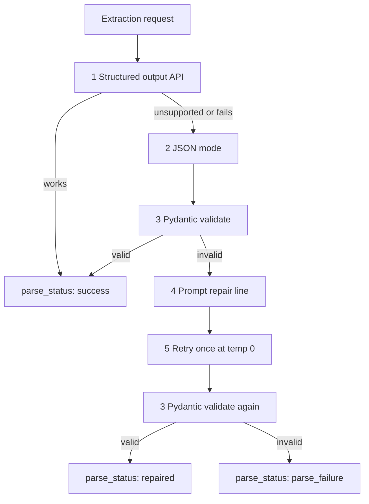

# Structured Outputs and JSON Mode

> Week 1 Theory · Day 4 · [← README](../README.md) · Prev: [hallucinations](hallucinations.md) · Next: [Lab 4](../labs/lab-04-provider-abstraction.md)

Your backend does not want a friendly paragraph. It wants **typed data** — a JSON object your code can validate and pass to the next function. LLMs are trained to **chat**; asking *"return JSON"* in a prompt often gives markdown fences, extra words, and wrong field types. This page shows what goes wrong and the **reliability ladder** you will use in Labs 4–5 and the Week 1 project.

---

## Concepts

### What problem are we solving?

You build an endpoint: *extract contact info from free text → return JSON → save to database.*

Your Python code does something like:

```python
data = json.loads(model_response)  # hope this works...
```

**What you need:**

```json
{"name": "John Doe", "email": "john@example.com", "age": 34}
```

**What you often get if you only say *"return JSON"* in the prompt:**

````text
Here is the JSON you requested:

```json
{
  "name": "John Doe",
  "email": "john@example.com",
  "age": "34"
}
```

Let me know if you need anything else!
````

Your app **crashes** or returns 500. Problems:

| Problem | Why it breaks your code |
|---------|-------------------------|
| Extra prose before/after | `json.loads()` fails on non-JSON text |
| Markdown ` ```json ` fences | Not valid JSON as a whole string |
| `"age": "34"` (string) | Your code expects a number; database insert fails |
| Missing field | KeyError in downstream logic |
| Truncated JSON | Model hit `max_tokens` mid-object — silent corruption |

| What developers assume | What actually happens |
|------------------------|----------------------|
| "JSON mode = perfect API" | Syntax may be fixed; **shape** can still be wrong |
| "The model understands my schema" | It guesses unless you **constrain** generation |
| "One bad parse should fail the request" | In multi-model compare, **one failure should not kill the batch** |

---

### The big picture — two kinds of "correct"

When we say the response is "correct," we mean two different things:

| Level | Plain English | Example |
|-------|---------------|---------|
| **Syntax** | Valid JSON **text** — parses with `json.loads()` | `{ "name": "John" }` not `Here is JSON: {...}` |
| **Semantics** | Matches **your schema** — right fields, right types, required keys present | `age` is number `34`, not string `"34"` |



**JSON mode** mainly helps with **syntax**.  
**Structured output** pushes toward **semantics**.  
**Pydantic** in your backend is the **final gate** — even perfect-looking JSON gets validated before you trust it.

---

### Three approaches — from hope to contract

| Approach | Plain English | Reliability | When to use |
|----------|---------------|-------------|-------------|
| **Prompt-only** (*"Return JSON with name, email, age"*) | Hope the model cooperates | **Low** | Quick scripts only |
| **JSON mode** | API forces output to be **valid JSON** | **Medium** | Broader model support; still check types |
| **Structured output** | API constrains output to **your JSON Schema** | **High** (supported models) | Production extraction on GPT-4o Mini |

**Analogy — ordering at a restaurant:**

| Approach | Like asking for... |
|----------|-------------------|
| Prompt-only | *"Bring me something healthy"* — you might get a salad wrapped in a newspaper with a poem on the side |
| JSON mode | *"Put the food on a plate"* — valid container, wrong dish still possible |
| Structured output | *"Exactly this combo meal #4, no substitutions"* — kitchen must match the menu card |

---

### Worked example — same input, three outcomes

**User text to extract from:**

> *"John Doe, 34, john@example.com"*

**Goal schema:** `{ "name": string, "email": string, "age": integer }`

#### Outcome A — Prompt-only (fragile)

````text
Sure! {"name": "John Doe", "email": "john@example.com", "age": "34"}
````

- `json.loads()` may fail on the leading *"Sure!"*
- Even if you strip prose, `"34"` is a **string**, not an integer

#### Outcome B — JSON mode

```json
{"name": "John Doe", "email": "john@example.com", "age": "34"}
```

- **Syntax:** valid JSON
- **Semantics:** `age` wrong type → Pydantic `model_validate()` fails

#### Outcome C — Structured output + Pydantic

```json
{"name": "John Doe", "email": "john@example.com", "age": 34}
```

- API steered generation toward schema
- Pydantic confirms types → `parse_status: success`

---

### The JSON reliability ladder (use this in Labs 4–5)

When extraction must not crash your app, climb the ladder **in order**. Stop when something works.

| Step | What you try | Typical result |
|------|--------------|----------------|
| **1** | **Structured output** + JSON Schema (GPT-4o Mini) | `parse_status: success` on first try |
| **2** | Fall back to **JSON mode** (`response_format: json_object`) | Valid JSON; types may still be wrong |
| **3** | **Pydantic** `model_validate()` | Catches wrong types / missing fields |
| **4** | Append prompt: *"Return only JSON matching the schema"* | Sometimes repairs |
| **5** | **Retry once** at `temperature = 0` | `parse_status: repaired` |
| **Fail** | All steps exhausted | `parse_status: parse_failure` — log error, **do not crash** multi-model compare |



**Week 1 rule:** One retry maximum. More retries → cost spiral with little gain.

**Local models (Ollama / Llama):** Often no structured output API — start at step 2 or prompt-only, always validate with Pydantic.

---

### What your API should return (Week 1 envelope)

Do not throw an uncaught exception when JSON fails. Return a **consistent envelope** so the UI and compare view can show what happened:

```json
{
  "request_id": "uuid",
  "text": "raw model output",
  "parsed_json": { "name": "John Doe", "email": "john@example.com", "age": 34 },
  "parse_status": "success",
  "json_validation_error": null,
  "input_tokens": 45,
  "output_tokens": 28,
  "latency_ms": 820.0,
  "cost_usd": 0.00002,
  "error": null
}
```

### `parse_status` — three values to memorize

| Value | Meaning | What the UI should do |
|-------|---------|------------------------|
| `success` | Parsed and validated on first try | Show structured fields |
| `repaired` | Succeeded after fallback or one retry | Show fields; optional "recovered" hint in logs |
| `parse_failure` | Ladder exhausted | Show raw text + error; **other models in compare still run** |

See [failure-recovery.md](../project/failure-recovery.md) for how the Playground surfaces bad JSON without breaking the page.

---

### Worked scenario — comparing three models

**Task:** Extract invoice fields from messy email text. You call GPT-4o Mini, Claude, and local Llama in one compare view.

| If you... | What goes wrong |
|-----------|-----------------|
| Let `json.loads()` throw on first failure | **Entire compare request 500** — user sees nothing |
| Return `parse_status` per model | GPT succeeds, Llama shows `parse_failure` with raw output — **fair comparison** |

**Good engineer behavior:** Structured output on OpenAI, ladder fallback on others, never let one provider's parse error kill the aggregator.

---

### JSON mode vs structured outputs — one paragraph

**JSON mode** guarantees the model's reply is **syntactically valid JSON** — no markdown wrapper, no *"Here you go!"* prefix. It does **not** guarantee the right keys, required fields, or types. **Structured outputs** go further: you pass a **JSON Schema**, and the provider constrains token generation so the result matches your shape (on supported models like GPT-4o Mini). Use structured output when available, JSON mode as fallback, **Pydantic always** as the last line of defense in your Python backend.

---

### AI engineer takeaway

- LLMs are **chat engines**, not native databases — plan for parse failures.  
- Separate **syntax** (valid JSON) from **semantics** (your schema).  
- Define schemas once in **Pydantic**; enforce at the provider when you can.  
- Always expose **`parse_status`** — never assume the first model reply is safe to `json.loads()` blindly.

---

## Tradeoffs

| Approach | Good for | Watch out for |
|----------|----------|---------------|
| Structured output API | Production extraction on OpenAI | Not every model supports it |
| JSON mode | Wider provider support | Wrong keys and types still happen |
| Prompt + `json.loads()` | One-off scripts | Fragile at scale |
| Many retries | Desperate recovery | Cost and latency add up fast |

---

## Best Practices

- Use **structured output** for GPT-4o Mini; use the **ladder** for Llama and prompt-only providers.
- Set **`temperature = 0`** for all extraction steps.
- Set **`max_tokens`** high enough — truncated JSON looks valid until the last field is missing.
- **One retry max** per request on the ladder.
- Log `parse_status` and `json_validation_error` for every call — you will debug from these fields.

---

## Common Mistakes

- Assuming **JSON mode = schema compliance** (it is not).
- Letting one model's parse failure **crash** a multi-model compare.
- Omitting `parse_status` from API responses and logs.
- Ignoring **truncated JSON** when `max_tokens` is too low.

---

## Checkpoint

1. What is the difference between syntax and semantics? (*Valid JSON text vs matches your schema/types*)
2. Which step uses Pydantic? (*Step 3 — validation after JSON is parsed*)
3. What should happen on `parse_failure` in a 3-model compare? (*Show error for that model; others still return results*)
4. Does JSON mode fix wrong types? (*No — e.g. `"34"` string vs `34` integer*)

---

## Go Deeper

| Resource | Link | Why |
|----------|------|-----|
| OpenAI Structured Outputs | https://platform.openai.com/docs/guides/structured-outputs | Primary API docs |
| [failure-recovery.md](../project/failure-recovery.md) | local | UX when JSON fails |

---

## Next

[Lab 4](../labs/lab-04-provider-abstraction.md) — provider abstraction + JSON ladder in code → **[Day 5](../daily/day-05.md)**
