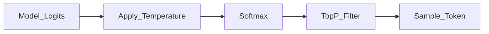

# Temperature and Top-P

> Week 1 Theory · Day 3 · [← README](../README.md) · Prev: [inference](inference.md) · Next: [Lab 3](../labs/lab-03-sampling.md)

After the model scores possible next words, something has to **pick one**. **Temperature** and **top-p** control how random that pick feels. Lab 3 runs the same prompt at different settings so you can see the difference in your own output files.

---

## Concepts

### What problem are we solving?

The model does not output one "correct" word — it outputs a **ranked list of probabilities** for every possible next token. Sampling settings decide whether you always take the #1 choice (deterministic) or sometimes pick #3 or #7 (creative, risky).

Wrong settings cause:

- **JSON extraction** that breaks format every other call
- **Creative writing** that sounds robotic at temperature 0
- **Hallucinated facts** at high temperature (made-up dates, fake names)

Sampling does **not** make the model smarter. It only changes **which token gets selected** from the same underlying scores.

### The pipeline in plain English

```
Model scores every possible next word (logits)
    → adjust with temperature
    → convert to probabilities (softmax)
    → optionally cut off unlikely tails (top-p)
    → pick one token
    → repeat for the next position
```

### Same prompt, different temperature (example)

**Prompt (Lab 3 style):** *"List one major AI model release from January 2025."*

| Setting | Example behavior |
|---------|------------------|
| **temperature = 0** | Same answer every run; format stable; fewer invented dates |
| **temperature = 0.7** | Slight wording changes; still mostly sensible |
| **temperature = 1.2** | Different model names each run; more plausible-sounding **but wrong** specifics |

At temp 0 you might get: *"OpenAI announced GPT-4o updates in early 2025."* (consistent)

At temp 1.2 you might get: *"Anthropic released Claude 4 Ultra on January 3, 2025 with 2M context."* (confident tone — **verify every fact**)

Lab 3 asks you to log: **fabricated specifics (Y/N)** and **format compliance (Y/N)** per grid cell.

### Temperature — the main knob

**Temperature** scales how flat or peaked the probability distribution is.

| Temperature | Plain English | Use when |
|-------------|---------------|----------|
| **0** | Always pick the most likely token (greedy) | JSON, code, evals, benchmarks |
| **0.3–0.7** | Slight variety | General chat |
| **0.8–1.2+** | Surprising word choices | Brainstorming, creative writing |

Formula (for reference):

```
P(token_i) = softmax(logit_i / temperature)
```

Lower temperature → winner takes all. Higher temperature → underdog tokens get a chance.

### Top-p (nucleus sampling) — the secondary knob

**Top-p** says: "Only consider the smallest set of tokens whose probabilities add up to `p`; ignore the long tail of weird options."

| top_p | Plain English |
|-------|---------------|
| **0.1** | Very narrow — only the most likely words |
| **0.9** | Broader — more variety |
| **1.0** | No trimming — full distribution (after temperature) |

**Industry habit:** Tune **temperature first**, leave `top_p = 1.0`. Adjusting both at once makes debugging hard ("which knob broke JSON?").

### Which knob for which job?

| Goal | Start here | Why |
|------|------------|-----|
| JSON / extraction | `temperature = 0` | Reproducible structure |
| Chat assistant | `0.3–0.7` | Natural but not chaotic |
| Brainstorming product names | `0.8–1.0` | Diversity matters more than precision |
| Production evals | `temperature = 0` | Compare runs fairly |

### AI engineer takeaway

Log `temperature` and `top_p` with every `request_id`. Use **temp 0** for structured output ([structured-output.md](structured-output.md)). Change **one knob at a time** when tuning.

---



---

## Tradeoffs

| Setting | Good for | Bad for |
|---------|----------|---------|
| temp = 0 | JSON, tests, benchmarks | Creative variety |
| temp 1.0+ | Ideation | Factual extraction |
| low top_p | Focused vocabulary | May block valid rare tokens |

---

## Best Practices

- temp = 0 for structured output ladder.
- Same prompt at temp 0 should be nearly identical across runs (provider-dependent).
- Never crank temperature to "fix" a badly written prompt.

---

## Common Mistakes

- High temperature for JSON extraction.
- Expecting identical outputs at temp > 0.
- Changing temperature and top_p together without A/B tests.

---

## Checkpoint

1. JSON extraction: temp 0 or 1.2?
2. What does top_p remove from the distribution?
3. Why run Lab 3's grid instead of guessing?

---

## Go Deeper

| Resource | Link | Why |
|----------|------|-----|
| OpenAI API reference | https://platform.openai.com/docs/api-reference/chat/create | Parameter docs |
| HF generation strategies | https://huggingface.co/docs/transformers/generation_strategies | Theory |

---

## Next

[Lab 3](../labs/lab-03-sampling.md) → **[Day 4](../daily/day-04.md)**
