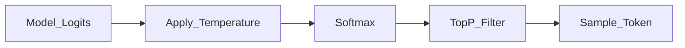

# Temperature and Top-P

> Week 1 Theory · Day 3 · [← README](../README.md) · Prev: [inference](inference.md) · Next: [Lab 3](../labs/lab-03-sampling.md)

Sampling controls **randomness** in LLM output. Lab 3 runs a temperature/top-p grid to show impact on hallucinations and format consistency.

---

## Concepts

### What problem are we solving?

After the model scores every possible next token (logits), something has to **pick one**. That choice controls how **random** or **deterministic** the output feels — critical for JSON extraction, creative writing, and eval reproducibility.

Sampling does **not** make the model smarter. It only changes which token gets selected from the same underlying distribution.

### How it works (one sentence)

Logits → softmax → **probability distribution** over the vocabulary → sample one token → repeat for each step of generation.

### Temperature vs top-p — which knob?

| Knob | What it does | Typical use |
|------|--------------|-------------|
| **[Temperature](../resources/glossary.md#temperature)** | Scales all probabilities — lower = more greedy | **Start here** — temp 0 for structured output and evals |
| **[Top-p](../resources/glossary.md#top-p)** (nucleus) | Drops unlikely tail tokens; sample only from the top cumulative mass | Fine-tune focus when temperature alone is too loose |

| Goal | Start with | Why |
|------|------------|-----|
| JSON / code / extraction | `temperature = 0` | Near-deterministic; format-stable |
| General chat | `0.3–0.7` | Some variety without chaos |
| Brainstorming | `0.8–1.2+` | More diverse phrasing — watch for [hallucinations](../resources/glossary.md#hallucination) |

**AI engineer takeaway:** Use **temperature = 0** for structured output ([structured-output.md](structured-output.md)); log `temperature` and `top_p` with every `request_id`. **Adjust one knob at a time** — changing both without A/B tests makes debugging impossible.

---

## Temperature

```
P(token_i) = softmax(logit_i / temperature)
```

| Temperature | Behavior | Use when |
|-------------|----------|----------|
| **0** | Greedy (highest prob token) | JSON extraction, code, evals, Lab 3 baseline |
| **0.3–0.7** | Moderate diversity | General chat |
| **0.8–1.2+** | High variance | Creative writing, brainstorming |

Temperature does **not** make the model smarter — it adds randomness.

---

## Top-P (Nucleus Sampling)

Select smallest token set whose cumulative probability ≥ `p`; sample within that set.

- `top_p = 0.1` — very focused
- `top_p = 0.9` — broader
- `top_p = 1.0` — no truncation



---

## Interaction Rule

**Adjust one knob at a time.** Industry default: tune temperature, leave `top_p = 1.0` (or vice versa). Changing both without A/B tests makes debugging impossible.

---

## Tradeoffs

| Setting | Strength | Weakness |
|---------|----------|----------|
| `temperature = 0` | Reproducible; consistent format (Lab 3 baseline) | No variety for creative tasks |
| High temperature (`1.0+`) | Brainstorming; diverse phrasing | More fabricated specifics and format drift |
| Low `top_p` (e.g. `0.5`) | Focused vocabulary | May discard valid but low-probability tokens |
| `top_p = 1.0` | No nucleus truncation | Relies entirely on temperature for control |

---

## Lab 3 Connection

Fixed prompt about January 2025 model releases:

- `temperature = 0` → consistent format, fewer fabricated dates
- `temperature = 1.2` → more varied, more hallucinated specifics

Log: fabricated specifics (Y/N), format compliance (Y/N).

---

## Best Practices

- **temperature = 0** for structured output ladder ([structured-output.md](structured-output.md))
- Log sampling params with `request_id` in observability envelope
- Same prompt at temp 0 should be near-deterministic (provider-dependent)

---

## Common Mistakes

- Cranking temperature to "fix" bad prompts.
- Expecting identical outputs at temp > 0.
- Using high temperature for JSON extraction.

---

## Checkpoint

1. Which setting for JSON extraction — temp 0 or 1.2?
2. What does top_p truncate?
3. Why run Lab 3 grid instead of guessing?

---

## Go Deeper

| Resource | Link | Why |
|----------|------|-----|
| OpenAI — API reference (temperature) | https://platform.openai.com/docs/api-reference/chat/create | Parameter docs |
| Hugging Face — generation strategies | https://huggingface.co/docs/transformers/generation_strategies | Sampling theory |

---

## Next

[Lab 3](../labs/lab-03-sampling.md) → **[Day 4](../daily/day-04.md)**
