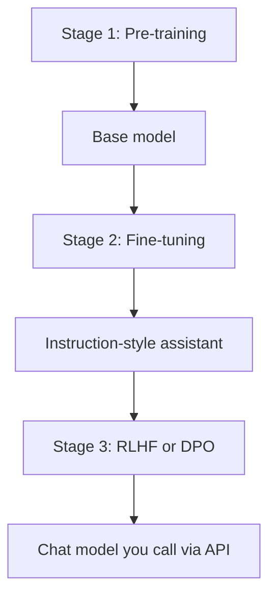

# Training vs Fine-tuning vs RLHF

> Week 1 Theory · Day 4 · [← README](../README.md) · Next: [hallucinations](hallucinations.md)

When you call GPT-4o Mini, you get a model that **someone else already built** through a long factory line. You do not retrain that brain from scratch — you **use** it. This page explains that factory line in plain English so you know what already happened before your first API call, and what **you** can actually change (usually prompts and RAG, not training).

---

## Concepts

### What problem are we solving?

Your chatbot gives wrong tone, ignores instructions, or sounds generic. In a meeting someone says *"let's fine-tune it"* or *"let's retrain the model."* You need to know:

- What those words **actually mean**
- Which fix is **cheap and fast** for your situation
- What is **not your job** as an application engineer

| What people say | What it usually means | Is it your first move? |
|-----------------|----------------------|------------------------|
| "Retrain GPT from scratch" | Rebuild the whole model on the internet | **No** — costs millions; OpenAI/Meta do this |
| "Fine-tune on our PDF" | Teach weights your handbook facts | **Usually no** — use **RAG** for documents (Week 3) |
| "I changed the system prompt" | Told the model how to behave in text | **Yes** — that's **prompt engineering**, not training |

---

### The big picture — three stages

Modern chat models (GPT-4o, Claude, Llama chat versions) go through **three main phases** at the vendor. Each phase teaches something different.

Think of training a new engineer:

| Phase | What the model learns | Engineer analogy |
|-------|----------------------|------------------|
| **1. Pre-training** | Language, grammar, broad facts | Read every textbook in the library |
| **2. Fine-tuning** | How to answer like a helpful assistant | Internship in one role (support, coding, medical) |
| **3. RLHF** | What humans *prefer* — tone, safety, brevity | Manager reviews emails before they go to customers |



**GPT-4o Mini** is already at step F. Your job starts with **prompts, RAG, and tools** — not step A.

---

### Stage 1 — Pre-training (you will not do this)

**Goal:** Teach the model language and general knowledge.

**Data:** Huge piles of text from the web, books, code — mostly *"predict the next word."*

**What you get after pre-training:**

| Good at | Still bad at |
|---------|--------------|
| Completing sentences | Following your instructions |
| Broad facts (often) | Knowing when to stop talking |
| Grammar and patterns | Being safe or polite by default |

**Example — same prompt, base model behavior:**

> **Prompt:** Tell me about Java

A **base** model might continue like autocomplete:

> *"Tell me about Java programming. Java was developed by Sun Microsystems in 1995..."*  
> (keeps going like a Wikipedia article — no clear "answer for a user")

It learned **text patterns**, not **"answer the human helpfully."**

**Cost:** Enormous (millions of dollars, thousands of GPUs, months).  
**Your takeaway:** Never propose "let's pretrain our own GPT" in a normal product team.

---

### Stage 2 — Fine-tuning (specialize the model)

**Goal:** Teach the model a **specific job** — usually *"act as a helpful assistant."*

**Data:** Pairs of **prompt → ideal answer**, written by humans or other models.

| Pre-training teaches | Fine-tuning teaches |
|---------------------|---------------------|
| "What text usually comes next?" | "When user asks X, respond like this" |

**Example training pair:**

| User (prompt) | Assistant (ideal answer) |
|---------------|-------------------------|
| Explain transformers in simple terms | Transformers use attention so each word can look at other words... |

The model still **updates its weights**, but on a **much smaller** dataset than pre-training.

**Same prompt after fine-tuning:**

> **Prompt:** Tell me about Java

> *"Java is a programming language used for backend services, Android apps, and enterprise software. Want a quick overview or something specific?"*

It learned to **answer the user**, not just continue text.

**Common outputs of this stage:** ChatGPT-style models, code assistants, medical copilots, enterprise bots.

**Interview question:** *Why not train from scratch for our use case?*  
**Answer:** Pre-training already cost a fortune and captured general knowledge. Fine-tuning **reuses** that brain and only adjusts behavior — far cheaper.

**Optional note:** Vendors often call the chat step **SFT** (supervised fine-tuning) or **instruction tuning**. Same idea: show good examples, learn to follow them.

---

### Stage 3 — RLHF (teach preferences, not just correct answers)

**Goal:** Make the model **helpful, safe, and pleasant** — not just technically correct.

**Full name:** Reinforcement Learning from Human Feedback.

Fine-tuning asks: *"What is the right answer?"*  
RLHF asks: *"Which answer do humans **prefer**?"*

**Example — two answers to the same question:**

> **User:** How do I reset my password?

| Answer A | Answer B |
|----------|----------|
| Go to Settings → Security → Reset password. Link: … | Passwords were invented in the 1960s. The history of authentication spans... |

Humans rank **A better than B**. A **reward model** learns that pattern. The chat model is nudged to produce more answers like A.

**What RLHF improves:**

- Shorter, clearer replies  
- Polite tone  
- Less unsafe content  
- Less rambling  

**Side effect to know:** Models may **sound confident** when unsure instead of saying "I don't know" — that connects to [hallucinations](hallucinations.md).

**Pipeline in plain steps:**

```
User prompt
    → Model writes several draft answers
    → Humans rank drafts (or rate them)
    → Train a "reward model" from those rankings
    → Nudge the chat model toward higher-rated style
    → Aligned assistant (what you get from the API)
```

**Modern shortcut — DPO (optional):** Newer systems sometimes skip the separate reward model and train directly from pairs like *"good answer vs bad answer."* Simpler pipeline, similar goal: **better behavior**.

---

### One prompt, three stages — quick compare

**Prompt:** *Tell me about Java*

| Stage | What the model learned | Typical behavior |
|-------|------------------------|------------------|
| Pre-training | Word patterns and facts | Long autocomplete-style text |
| Fine-tuning | Answer users directly | Clear explanation, on-topic |
| RLHF | Be helpful and concise | Polite, structured, not 20 pages |

| | Pre-training | Fine-tuning | RLHF |
|---|--------------|-------------|------|
| **Goal** | Learn language | Learn a task / assistant role | Learn human preferences |
| **Data** | Raw internet text | Prompt → good answer pairs | Ranked or preferred answers |
| **Who pays** | Vendor (huge) | Vendor (moderate) | Vendor (high) |
| **You do this?** | No | Rarely (Week 7: small LoRA) | No |

---

### What **you** actually change (not the vendor pipeline)

The API model is already pre-trained, fine-tuned, and aligned. Your levers:

```
1. Prompt engineering     ← try first (tone, rules, examples)
2. RAG                    ← facts from your documents (Week 3)
3. Structured output      ← force JSON shape (API feature)
4. Tools / agents         ← let the model call code or APIs
5. Fine-tune / LoRA       ← niche style or format (Week 7, last resort)
```

**Rule of thumb:** Fine-tuning changes **how the model behaves**. It does **not** replace a document database.

---

### Worked scenario — company FAQ bot

**Need:** Answer questions from a 200-page employee handbook.

| Approach | Good idea? | Why |
|----------|------------|-----|
| Fine-tune on the whole PDF | **No** | Handbook updates → retrain again; model won't cite page numbers |
| **RAG** — search handbook, then answer | **Yes** | Fresh facts every time PDF changes |
| Prompt: "You are a friendly HR assistant" | **Yes** | Cheap way to set tone |

**Different need:** Every reply must start with `AcmeCorp:` and use formal legal tone.

| Approach | Good idea? | Why |
|----------|------------|-----|
| Strong system prompt | **Try first** | Often enough |
| LoRA fine-tune on 500 example replies | **Maybe** (Week 7) | When prompts won't stay consistent in evals |

---

### AI engineer takeaway

- **Pre-training / RLHF:** Happened at OpenAI, Anthropic, Meta — you consume the result.  
- **Fine-tuning (vendor or yours):** Behavior and style — not a substitute for your PDFs.  
- **Facts from docs → RAG.** **Tone and rules → prompts first.**  
- In design reviews, say *"we'll prompt + RAG"* before *"we'll fine-tune."*

---

## When NOT to fine-tune

- New facts from documents → **RAG**
- Quick experiments → **change the prompt**
- Small examples → paste them in the prompt (few-shot)
- "We updated the system prompt" → **not** fine-tuning

Consider fine-tuning only when: proprietary tone, strict output format, or behavior that **prompts cannot hold** after real evaluation.

---

## Tradeoffs (your levers, not vendor training)

| What you try | Cost | How fast | Easy to change? |
|--------------|------|----------|-----------------|
| Prompt engineering | $ | Hours | Yes |
| RAG | $$ | Days–weeks | Yes (update docs) |
| LoRA fine-tune | $$$ | Weeks | Harder (Week 7) |
| Full fine-tune | $$$$ | Months | Rare |

---

## Best Practices

- Use **chat** API models (instruction-tuned), not raw base models, for end users.
- Before proposing fine-tune, document why prompts and RAG failed on the same eval set.
- Measure before and after any change with the **same test questions**.

---

## Common Mistakes

- Fine-tuning to memorize a knowledge base (use RAG).
- Calling a prompt tweak "training."
- Skipping evaluation before and after changes.

---

## Checkpoint

1. In order, what are the three vendor stages? (*Pre-training → fine-tuning → RLHF*)
2. Company FAQ from a PDF — RAG or fine-tune? (*RAG*)
3. Does RLHF optimize "correct" or "preferred" answers? (*Preferred*)
4. What do you try before fine-tuning? (*Prompts, then RAG*)

---

## Go Deeper

| Resource | Link | Why |
|----------|------|-----|
| InstructGPT paper | https://arxiv.org/abs/2203.02155 | Where RLHF became mainstream |
| Karpathy — State of GPT | https://www.youtube.com/watch?v=bZQun8Y4jUs | Visual walkthrough of the full pipeline |

---

## Next

[hallucinations.md](hallucinations.md) → [structured-output.md](structured-output.md)
