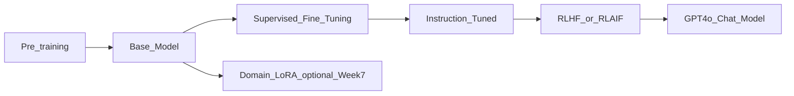

# Training vs Fine-tuning vs RLHF

> Week 1 Theory · Day 4 · [← README](../README.md) · Next: [hallucinations](hallucinations.md)

You will almost never **train** a foundation model from scratch. You **call** models that already went through a long pipeline at OpenAI, Anthropic, or Meta. This page explains that pipeline so you pick the right lever: prompt, RAG, or fine-tune.

---

## Concepts

### What problem are we solving?

The model gives wrong tone, ignores format, or lacks domain vocabulary. What do you do?

| Wrong instinct | Right question |
|--------------|----------------|
| "Let's retrain GPT from scratch" | Costs millions — not your job |
| "Let's fine-tune for our FAQ PDF" | Facts belong in **RAG**, not weights |
| "I improved the system prompt" | That's **prompt engineering**, not fine-tuning |

You need vocabulary for each **stage** so you propose sane solutions in design reviews.

### The factory line (plain English)

| Stage | What happens | Real-world analogy |
|-------|--------------|-------------------|
| **Pre-training** | Model reads massive text; learns language + rough facts | Reading the whole library |
| **SFT** (supervised fine-tuning) | Labeled input→output examples for specific tasks | Practice exams with answer keys |
| **Instruction tuning** | (instruction, good response) pairs — learn to follow users | Customer service scripts |
| **RLHF** | Humans rank answers; model learns preferences | Manager reviews which reply to send |

**GPT-4o Mini** you call via API is already through this line. You start at **prompt / RAG / tools**.

### Worked scenario: company FAQ bot

**Need:** Answer questions from a 200-page employee handbook.

| Approach | Right? | Why |
|----------|--------|-----|
| Fine-tune on the PDF | **No** | Facts change; retraining is slow; model won't cite pages |
| **RAG** — chunk handbook, retrieve, answer with citations | **Yes** | Updates when PDF changes (Week 3) |
| Prompt: "Be friendly HR bot" | **Yes** | Tone/behavior — cheap |

**Need:** Every reply must start with "AcmeCorp:" and use formal legal tone.

| Approach | Right? | Why |
|----------|--------|-----|
| Prompt engineering | **Try first** | Often enough |
| LoRA fine-tune on style examples | **Maybe** (Week 7) | When prompts won't stabilize format |

### RLHF in one example

Two draft answers to *"How do I reset my password?"*

- **A:** Step-by-step reset link, concise  
- **B:** Long lecture on password security history  

Humans prefer A → reward model learns → policy favors helpful, direct answers. Side effect: model may **guess** when unsure instead of refusing ([hallucinations.md](hallucinations.md)).

### Decision order (memorize)

```
1. Prompt engineering
2. RAG (new facts from documents)
3. Structured output API (format)
4. Agents + tools (actions)
5. Fine-tune / LoRA (style, niche behavior — Week 7)
```

### AI engineer takeaway

Fine-tuning changes **behavior and style**, not your live document store. Facts → RAG. Most teams never train a base model.

---

## Lifecycle diagram



---

## When NOT to fine-tune

- Adding facts from docs → **RAG**
- Quick iteration → **prompts**
- Small dataset → few-shot in prompt
- "We updated the system prompt" ≠ fine-tuning

Fine-tune when: proprietary tone, domain format, or behavior that prompts cannot stabilize after real evals.

---

## Tradeoffs

| Approach | Cost | Time | Flexibility |
|----------|------|------|-------------|
| Prompt engineering | $ | Hours | High |
| RAG | $$ | Days–weeks | Updates with docs |
| LoRA fine-tune | $$$ | Weeks | Week 7 |
| Full fine-tune | $$$$ | Months | Rare |

---

## Best Practices

- Default to instruction-tuned API models — not raw base models for users.
- Document why prompts/RAG were insufficient before proposing fine-tune.
- Same eval set before and after any change.

---

## Common Mistakes

- Fine-tuning to inject encyclopedic facts.
- Confusing prompt tweaks with training.
- Skipping eval before/after lifecycle changes.

---

## Checkpoint

1. Order: pre-train → SFT → instruct → RLHF.
2. FAQ from PDF — RAG or fine-tune?
3. What does RLHF optimize?

---

## Go Deeper

| Resource | Link | Why |
|----------|------|-----|
| InstructGPT paper | https://arxiv.org/abs/2203.02155 | RLHF origin |
| Karpathy — State of GPT | https://www.youtube.com/watch?v=bZQun8Y4jUs | Lifecycle talk |

---

## Next

[hallucinations.md](hallucinations.md) → [structured-output.md](structured-output.md)
