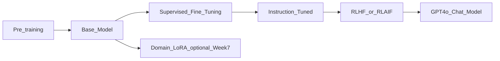

# Training vs Fine-tuning vs RLHF

> Week 1 Theory · Day 4 · [← README](../README.md) · Next: [hallucinations](hallucinations.md)

You rarely **train** models as an AI engineer — you **orchestrate** pre-trained models. This page explains the lifecycle so you pick prompt/RAG/fine-tune correctly.

---

## Concepts

### What problem are we solving?

When a model misbehaves — wrong tone, ignores instructions, or lacks domain format — you need to know **which lever to pull**. Retrain from scratch? Tweak prompts? Add documents? Fine-tune?

Most production teams never train a base model. They inherit one that already went through a long pipeline at a model lab, then adapt behavior at the edges. Confusing those stages leads to expensive mistakes (fine-tuning for facts that belong in RAG, or calling a prompt tweak "fine-tuning").

### What does the lifecycle look like?

Think of it as a factory line, not a single switch:

| Stage | Plain English | Who does it |
|-------|---------------|-------------|
| **Pre-training** | Read the internet; learn language and rough world knowledge | Model labs only |
| **[SFT](../resources/glossary.md)** (supervised fine-tuning) | Learn specific tasks from labeled examples | Labs + enterprises |
| **Instruction tuning** | Learn to follow user instructions from (instruction, response) pairs | Labs |
| **[RLHF](../resources/glossary.md)** / **[RLAIF](../resources/glossary.md)** | Align to human (or AI) preferences — helpful, harmless, honest | Labs |

Optional later: **[LoRA](../resources/glossary.md)** (Low-Rank Adaptation) — a cheap way to specialize a model without full retraining (Week 7).

**GPT-4o Mini** is already instruction-tuned and RLHF-aligned — you call it via API. Your job is choosing the right adaptation layer on top.

### AI engineer takeaway

Memorize the decision order: **prompts → RAG → structured output → agents → fine-tune**. Most behavior fixes never require training; when they do, know which lifecycle stage you're actually changing.

---

## The Model Lifecycle



| Stage | Data | Goal | Who |
|-------|------|------|-----|
| **Pre-training** | Trillions of tokens | Language + world knowledge | Model labs |
| **[SFT](../resources/glossary.md)** | Labeled task pairs | Task/domain adaptation | Labs + enterprises |
| **Instruction tuning** | (instruction, response) pairs | Follow user instructions | Labs |
| **[RLHF](../resources/glossary.md) / [RLAIF](../resources/glossary.md)** | Human or AI preferences | Helpful, harmless, honest behavior | Labs |

**GPT-4o Mini** is already instruction-tuned + RLHF-aligned — you call it via API.

---

## RLHF Pipeline (Simplified)

1. Collect preference pairs: "Response A > B"
2. Train **reward model** on preferences
3. Optimize LLM with RL ([PPO](../resources/glossary.md) or similar) against reward model
4. Result: better instruction following, refusals, tone

**[RLAIF](../resources/glossary.md)** uses another LLM as judge — cheaper to scale than human labelers.

Read: [InstructGPT paper](https://arxiv.org/abs/2203.02155) abstract + §2–3 on Day 4.

---

## Decision Tree (memorize this)

```
Need behavior change?
  → Try prompt engineering first
Need new facts from docs?
  → RAG (Week 3) — NOT fine-tuning for facts
Need consistent format/style?
  → Structured output + prompts, then consider [LoRA](../resources/glossary.md) (Week 7)
Need tool actions?
  → Agents (Week 4)
```

---

## When NOT to Fine-tune

- Adding factual knowledge → **RAG**
- Quick iteration → **prompts**
- Small data → prompts or few-shot
- "I improved my system prompt" ≠ fine-tuning

Fine-tune when: proprietary tone, domain format, or behavior prompts cannot stabilize.

---

## Tradeoffs

| Approach | Cost | Time | Flexibility |
|----------|------|------|-------------|
| Prompt engineering | $ | Hours | High |
| RAG | $$ | Days–weeks | Updates with docs |
| [LoRA](../resources/glossary.md) fine-tune | $$$ | Weeks | Retrain pipeline |
| Full fine-tune | $$$$ | Months | Rare |

---

## Best Practices

- Default to **API models** that are already instruction-tuned and RLHF-aligned — don't expose raw base models to users.
- Run the **decision tree** before proposing fine-tuning; document why prompts and RAG were insufficient.
- Treat fine-tuning as a **behavior/format** tool, not a knowledge store — facts belong in retrieval.
- Measure **before and after** any lifecycle change with the same eval set (Week 6 preview).
- When discussing alignment with stakeholders, name the stage: SFT changes task skill; RLHF changes preference and safety tone.

---

## Common Mistakes

- Fine-tuning to inject facts (inefficient vs RAG).
- Using base models for user-facing chat.
- Skipping eval before/after any lifecycle change.

---

## Checkpoint

1. Order the stages: pre-train → SFT → instruct → RLHF.
2. Why not fine-tune a FAQ bot when you have a PDF manual?
3. What does RLHF optimize?

---

## Go Deeper

| Resource | Link | Why |
|----------|------|-----|
| InstructGPT | https://arxiv.org/abs/2203.02155 | RLHF origin |
| Lilian Weng — RLHF | https://lilianweng.github.io/posts/2021-01-02-controllable-generation/ | Preference learning |
| Karpathy — State of GPT | https://www.youtube.com/watch?v=bZQun8Y4jUs | Lifecycle overview |

---

## Next

[hallucinations.md](hallucinations.md) → [structured-output.md](structured-output.md)
