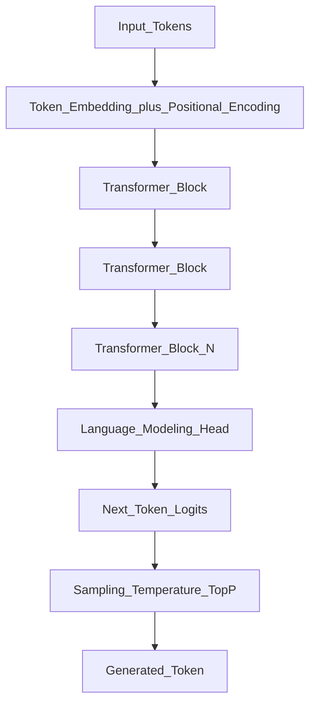

# Transformers

> Week 1 Theory · Day 1 · [← README](../README.md) · Prev: [ai-vs-ml](ai-vs-ml.md) · Next: [tokenization](tokenization.md)

The transformer (2017) is the architecture behind virtually every modern LLM. If you understand one building block this week, make it this one.

---

## Concepts

### What problem are we solving?

Language is **sequential**: the meaning of a word depends on the words around it. Models must read ordered tokens and use earlier context when predicting what comes next.

Before 2017, the standard approach was **recurrence** — networks that read one token at a time and pass a "memory" forward. The two names you will see are **RNNs** and **LSTMs**.

> **Optional deep dive** — not required for Week 1: [RNNs and LSTMs (appendix)](../../appendix/rnn-lstm.md) · quick lookup: [glossary](../resources/glossary.md#sequence-models-optional)

### What changed with the Transformer?

The **Transformer** ([Vaswani et al., 2017](https://arxiv.org/abs/1706.03762)) replaced step-by-step recurrence with **self-attention**: every token can look directly at every other token in the input.

Think of it like this:

| Old way (RNN/LSTM) | New way (Transformer) |
|--------------------|------------------------|
| Read the sentence **one word at a time**, updating a small memory | Read **all words together**, deciding which words matter for each other |
| Hard to train in parallel on GPUs | Trains efficiently at scale |
| Memory fades over long sentences | Long-range connections are easier to learn |

That shift unlocked three things that matter for your job:

1. **Parallel training** — GPUs process many tokens at once instead of waiting for each step
2. **Long-range dependencies** — connections across the full sentence (and later, very long documents)
3. **Scale** — the practical path to billion-parameter models and modern chat LLMs

You do not need to implement attention this week — [attention.md](attention.md) goes deeper. For now: **transformers = attention-based stacks that replaced RNNs for NLP.**

### Three shapes of transformer (and what you actually use)

All modern transformers share the same core building blocks (attention + feed-forward layers). They differ in **which directions** tokens are allowed to look:

| Variant | Plain English | Examples | You use it for |
|---------|---------------|----------|----------------|
| **Encoder-only** | Reads the **whole** input at once (left and right context) | BERT, embedding models | Search, classification, **RAG embeddings** (Week 3) |
| **Decoder-only** | Reads left-to-right only; predicts the **next** token | GPT, Llama, Claude | Chat, code, agents — **this is 95% of production LLM work in 2026** |
| **Encoder-decoder** | One stack reads input; another stack writes output | T5, BART | Translation, summarization pipelines (less common for general assistants) |

**Production LLM applications almost always use decoder-only models.** When you call the OpenAI or Ollama API for chat, you are talking to a decoder-only stack.

Encoder-only models still matter — not for generation, but for turning documents into vectors you can search (embeddings in RAG).

### AI engineer takeaway

When someone says "the LLM," they almost always mean a **decoder-only transformer** behind an API. Know the three variants so you pick encoder models for RAG search and decoder models for chat — not the other way around.

---

## Architecture (Decoder-Only LLM)



Each **Transformer Block** contains:

- **Multi-Head Self-Attention** — each token weighs which other tokens to focus on
- **Feed-Forward Network (FFN)** — per-token computation (typically 4× wider than the hidden size)
- **Layer Normalization** — stabilizes training
- **Residual connections** — skip connections so gradients flow through deep stacks

**Positional encoding** tells the model token order (attention alone does not know if "dog bites man" vs "man bites dog"). Modern models use **RoPE** (Rotary Position Embedding) or **ALiBi** to support longer context windows.

---

## Internal Mechanism: Next-Token Prediction

LLMs learn:

```
P(token_t | token_1, token_2, ..., token_{t-1})
```

In plain terms: *given everything so far, what word comes next?*

At inference, the model generates **one token at a time**, appending each to the context for the next step. This is **autoregressive** generation — see [inference.md](inference.md) for prefill/decode.

Training objective: minimize cross-entropy loss on next-token prediction across billions of tokens.

---

## Why Decoder-Only Won

| Factor | Explanation |
|--------|-------------|
| Simplicity | One stack handles generation, in-context learning, and tool use |
| Scale | Larger decoder-only models outperformed encoder-decoder on general tasks |
| Ecosystem | OpenAI, Anthropic, Meta, Mistral, Google all ship this variant |
| Prompting | Few-shot and instruction following emerge naturally in a unified decoder |

---

## Tradeoffs

| Approach | Strength | Weakness |
|----------|----------|----------|
| Decoder-only | Generation, agents, chat | No native bidirectional context in one pass |
| Encoder-only | Embeddings, understanding | Cannot generate text |
| Encoder-decoder | Structured seq2seq | Heavier; less common for general assistants |

---

## Best Practices

- Use **encoder models for embeddings**, **decoder models for generation** in RAG (Week 3).
- When comparing models (Lab 5), you're comparing different sizes of the same architectural family.
- Discuss **context length** and **positional encoding** together — they affect long-document behavior.

---

## Common Mistakes

- Treating BERT and GPT as interchangeable.
- Ignoring that "the LLM" in your API call is a decoder-only stack.
- Confusing transformer block count with "layers of intelligence" — depth affects capacity, not magic.

---

## Checkpoint

1. What is the training objective of a decoder-only LLM?
2. Why doesn't BERT generate text natively?
3. Name two components inside a transformer block besides attention.
4. In one sentence, what did transformers replace RNNs/LSTMs with?

---

## Go Deeper

### Curriculum appendix (optional)

| Resource | Link | Why |
|----------|------|-----|
| RNNs and LSTMs — what came before transformers | [appendix/rnn-lstm.md](../../appendix/rnn-lstm.md) | ~10 min; explains terms in this page |

### Visual / required reading

| Resource | Link | Why |
|----------|------|-----|
| **Illustrated Transformer** (Jay Alammar) | https://jalammar.github.io/illustrated-transformer/ | Best visual walkthrough — do this on Day 1 |
| **Illustrated GPT-2** | https://jalammar.github.io/illustrated-gpt2/ | Decoder-only generation step-by-step |
| Original paper | https://arxiv.org/abs/1706.03762 | Reference; skim diagrams |
| Hugging Face NLP Course Ch.1 | https://huggingface.co/learn/nlp-course/chapter1/1 | Modern framing |
| The Annotated Transformer | http://nlp.seas.harvard.edu/annotated-transformer/ | Code + math (optional) |

---

## Next

[tokenization.md](tokenization.md) → [Lab 1](../labs/lab-01-tokenization.md)
