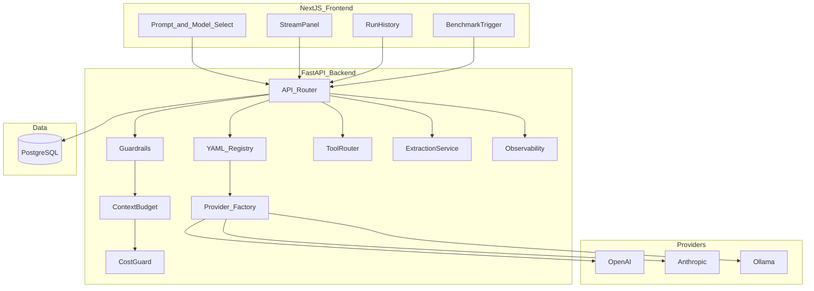

# Architecture

> Week 2 Project · [Overview](overview.md)

> **Work dir:** `~/ai-learning/week-02-work/model-benchmark-studio/`



## Folder Structure

```
model-benchmark-studio/
├── docker-compose.yml
├── config/
│   ├── models.yaml
│   └── benchmark_prompts.yaml
├── frontend/
│   ├── app/page.tsx
│   ├── components/
│   │   ├── StreamPanel.tsx
│   │   ├── RunHistory.tsx
│   │   ├── ModelSelector.tsx      # from registry
│   │   └── MetricsBar.tsx
│   └── lib/api.ts
├── backend/
│   ├── app/
│   │   ├── main.py
│   │   ├── registry.py
│   │   ├── guardrails.py
│   │   ├── middleware/context_budget.py
│   │   ├── services/
│   │   │   ├── tool_router.py
│   │   │   ├── extraction.py
│   │   │   ├── cost_guard.py
│   │   │   └── run_store.py
│   │   ├── providers/
│   │   │   ├── base.py
│   │   │   ├── openai_provider.py
│   │   │   ├── anthropic_provider.py
│   │   │   └── ollama.py
│   │   ├── db/
│   │   │   ├── models.py
│   │   │   └── session.py
│   │   └── schemas.py
│   ├── scripts/
│   │   ├── run_benchmark.py
│   │   └── summarize_benchmark.py
│   └── tests/
├── .env.example
├── Makefile
└── README.md
```

## Key Design Decisions

| Decision | Why |
|----------|-----|
| YAML registry | Change models without code deploy |
| Provider factory | Single `get_provider(name)` for routes |
| Normalized `LLMResponse` | Fair benchmarks across vendors |
| Postgres not SQLite | Week 3+ RAG history; production pattern |
| SSE not WebSocket | One-way token stream is sufficient |
