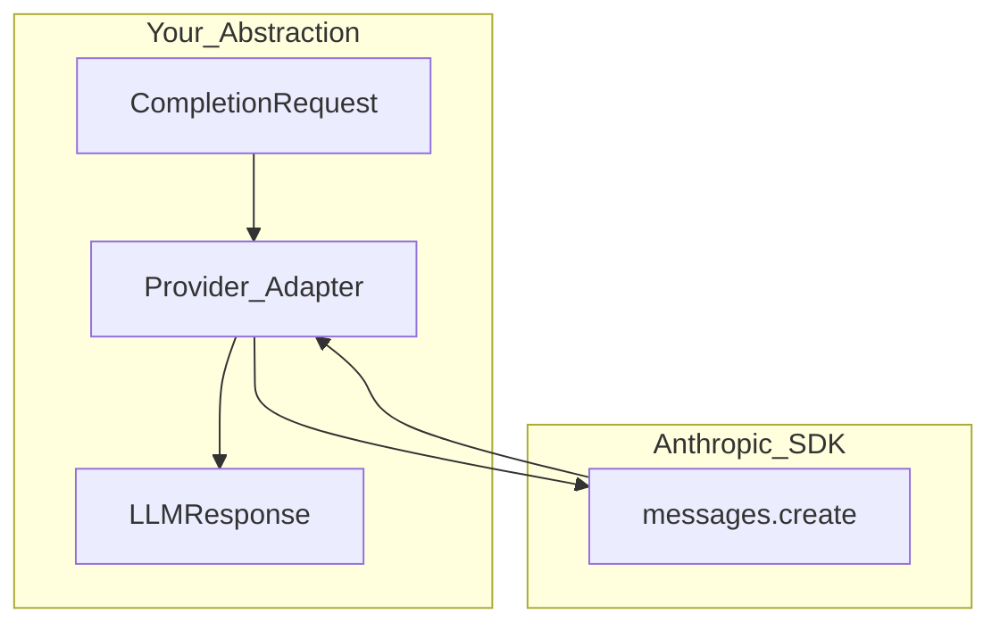

# Anthropic API (Messages)

> Week 2 Theory · Day 1 · [← README](../README.md) · [OpenAI API](openai-api.md) · [Model Selection](model-selection.md)

Anthropic's **Messages API** powers Claude models. It differs from OpenAI in a few important ways — system prompt handling, content blocks, and tool schemas. Your abstraction layer must normalize these differences.

---

## Concepts

### What problem are we solving?

Production systems rarely depend on a single vendor. Adding Anthropic gives you a **second opinion** on quality, a failover path, and leverage in vendor negotiations. Interviewers expect you to explain *how* you unified two different APIs.

### OpenAI vs Anthropic (at a glance)

| Aspect | OpenAI Chat Completions | Anthropic Messages |
|--------|-------------------------|-------------------|
| System prompt | `messages` role `system` | Top-level `system` parameter |
| User/assistant turns | `messages[]` | `messages[]` (user/assistant only) |
| Max output param | `max_tokens` | `max_tokens` (required) |
| Structured output | `response_format` JSON schema | Tool use + JSON or prompt constraints |
| Streaming | `stream=True` | `stream=True` (event types differ) |
| Context window | Model-specific (128k+ for many) | Model-specific (200k for Claude 3.5) |

### Week 2 model: Claude 3.5 Haiku

| Attribute | Value |
|-----------|-------|
| Use case | Fast reasoning, second cloud benchmark |
| Cost tier | Lower than Sonnet; higher than GPT-4o Mini on some tasks |
| Strength | Long context, careful refusals, strong prose |

### AI engineer takeaway

Build a **normalization layer**: your app speaks `CompletionRequest` / `LLMResponse`; providers translate to vendor SDKs. Never leak Anthropic's `content: [{type: "text", ...}]` blocks into your frontend.

---

## Architecture



### Minimal request (Python SDK)

```python
import anthropic

client = anthropic.Anthropic()
message = client.messages.create(
    model="claude-3-5-haiku-20241022",
    max_tokens=1024,
    system="You are a concise assistant.",
    messages=[{"role": "user", "content": user_prompt}],
)
text = message.content[0].text
```

Map `message.usage.input_tokens` / `output_tokens` into your observability envelope.

---

## Content blocks

Anthropic responses use **blocks** — text, tool_use, etc. Your adapter should:

1. Concatenate text blocks for simple chat mode.
2. Preserve `tool_use` blocks for function calling (Day 4).
3. Handle empty content gracefully (refusal or safety stop).

---

## System prompt placement

```python
# Correct — system is NOT in messages[]
client.messages.create(
    system="Rules and persona here",
    messages=[{"role": "user", "content": "Hello"}],
    ...
)

# Wrong — do not mimic OpenAI's system role in messages
```

Your `AnthropicProvider` reads `CompletionRequest.system_prompt` and maps it to `system=`.

---

## Tradeoffs

| Choice | Benefit | Cost |
|--------|---------|------|
| Claude Haiku as primary | Strong quality / speed balance | Second API key + integration |
| Claude only for long docs | Uses 200k context well | Two code paths if not abstracted |
| Prompt parity across vendors | Fair benchmarks | Tuning per model still required |

---

## Best Practices

- Always set `max_tokens` — Anthropic requires it.
- Use the official model ID strings from docs (they change with snapshots).
- Implement retry on `529` overloaded errors with backoff.
- For benchmarks, log `model`, `stop_reason`, and token usage per call.

---

## Common Mistakes

- Putting system text in a `user` message (worse instruction following).
- Forgetting to extract text from content blocks (getting `[object]` in UI).
- Assuming OpenAI tool JSON schemas drop in without testing on Claude.
- Using Sonnet pricing in cost estimates while calling Haiku.

---

## Checkpoint

1. Where does the system prompt go in Anthropic vs OpenAI?
2. Why are responses "blocks" instead of a plain string?
3. Which Week 2 model is the default Anthropic target and why?
4. What belongs in your adapter vs your route handler?

---

## Go Deeper

| Resource | Why |
|----------|-----|
| [Anthropic Messages API](https://docs.anthropic.com/en/api/messages) | Official reference |
| [Anthropic tool use](https://docs.anthropic.com/en/docs/build-with-claude/tool-use) | Function calling |
| [model-selection.md](model-selection.md) | When to pick Claude vs GPT |

---

## Next

Read [open-source-models.md](open-source-models.md) on Day 2 · **Lab:** [Lab 1](../labs/lab-01-provider-apis.md) · [Day 2 playbook](../daily/day-02.md)
