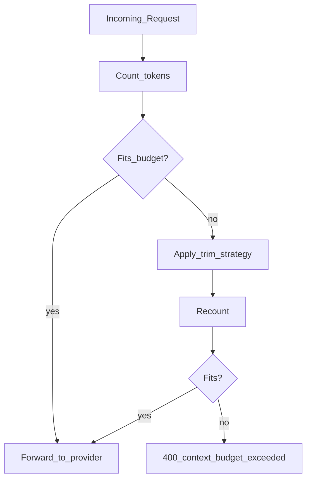

# Context Management

> Week 2 Theory · Day 5 · [← README](../README.md) · [Cost Optimization](cost-optimization.md)

Every token in the prompt competes for space in the **context window** and shows up on the invoice. Context management is how you fit the right information in without overflow or waste.

---

## Concepts

### What problem are we solving?

A user has a 40-message chat thread. Each new reply sends **the entire history** plus system prompt plus tools. Eventually you hit the context window — or pay for thousands of tokens you don't need.

**Context management** = decide what to keep, what to drop, and what to reject **before** paying for the API call.

### Worked example: tail-keep trim

**Budget:** 8,000 input tokens max (after reserving output).  
**Current history:** 12,000 tokens across 30 messages.

| Step | Action |
|------|--------|
| 1 | Count tokens — over budget by 4,000 |
| 2 | **Never drop** system prompt (500 tokens) |
| 3 | **Drop oldest** user/assistant pairs until under 8,000 |
| 4 | Maybe left with last 14 messages — send those |
| 5 | Log `trimmed_messages_count: 16` in response so support can debug "the model forgot" |

**Store full history in Postgres** (Week 2 Lab 6); **trim only what you send** to the model.

### The budget equation

```
available_input = context_window - max_output_tokens - safety_margin
```

Example: 128k window, reserve 4k for output, 2k margin → **122k max input**.

### What consumes context

| Source | Often forgotten? |
|--------|------------------|
| System prompt | Every request |
| Chat history | Grows each turn |
| RAG chunks | Week 3 — preview here |
| Tool definitions | Large schemas |
| Tool results | Can be huge JSON blobs |

### AI engineer takeaway

Implement a **`ContextBudgetMiddleware`** that counts tokens (tiktoken or provider counter), trims history, and rejects requests before they hit the API. Cheaper than a 400 error after you've queued work.

---

## Architecture



---

## Trim strategies (pick one per app)

| Strategy | How | Best for |
|----------|-----|----------|
| **Tail keep** | Drop oldest user/assistant pairs | Chat apps |
| **Head + tail** | Keep system + recent N turns | Long sessions |
| **Summarize** | LLM-compress middle history | High-value threads |
| **RAG-only** | No history; retrieve chunks | Q&A bots |

Week 2 lab: **tail keep** — drop oldest messages until under budget.

---

## Token counting

| Provider | Counter |
|----------|---------|
| OpenAI | `tiktoken` for `gpt-4o-mini` |
| Anthropic | SDK `messages.count_tokens()` or estimate |
| Ollama | Approximate with tiktoken cl100k_base |

Exact counts matter for cost; estimates are OK for pre-flight rejection.

---

## Tradeoffs

| Aggressive trim | Preserve full history |
|-----------------|----------------------|
| Lower cost | Better multi-turn coherence |
| Risk losing thread context | Risk overflow errors |

Expose `trimmed_messages_count` in observability so support can debug "the model forgot."

---

## Best Practices

- Reserve `max_tokens` before counting input budget.
- Store raw history in Postgres; trim only what you **send** to the model.
- Never silently truncate system instructions.
- Log token breakdown: system / history / tools / user.

---

## Common Mistakes

- Counting characters instead of tokens.
- Trimming without telling the user (confusing UX).
- Injecting 50k tokens of tool docs on every call.
- No rejection path — relying on provider 400 errors.

---

## Checkpoint

1. Write the context budget equation.
2. Name two trim strategies.
3. Why store full history but send a trimmed view?
4. What is "lost in the middle"?

---

## Go Deeper

| Resource | Why |
|----------|-----|
| [Week 1 context window](../../week-01/theory/context-window.md) | Window fundamentals |
| [tiktoken](https://github.com/openai/tiktoken) | OpenAI token counting |
| [Anthropic token counting](https://docs.anthropic.com/en/docs/build-with-claude/token-counting) | Claude-specific |

---

## Next

Read [guardrails.md](guardrails.md) → [cost-optimization.md](cost-optimization.md) → **Lab:** [Lab 5](../labs/lab-05-context-cost.md)
