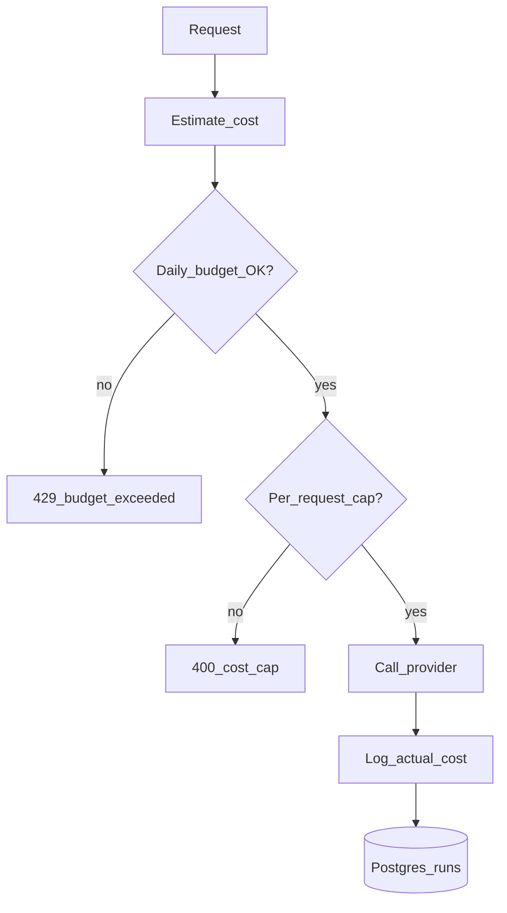

# Cost Optimization

> Week 2 Theory · Day 5 · [← README](../README.md) · [Guardrails](guardrails.md)

LLM bills scale with tokens × price × traffic. **Cost optimization** is engineering discipline: measure every request, cap spend, and route to cheaper paths when quality allows.

---

## Concepts

### What problem are we solving?

A single unbounded loop or missing `max_tokens` can burn budget in minutes. Production teams track **$/successful task**, set budgets, and optimize routing — Week 2 installs those habits in your benchmark studio.

### Cost formula

```
cost_usd = (input_tokens / 1e6 * price_input) + (output_tokens / 1e6 * price_output)
```

Pull prices from `models.yaml`; update when providers change rates.

### Optimization levers

| Lever | Impact | Week 2 implementation |
|-------|--------|----------------------|
| Cheaper model | High | Registry defaults + benchmarks prove fit |
| Shorter prompts | High | Context trimming |
| Lower `max_tokens` | Medium | Per-route caps |
| Cache responses | High | Optional — Redis in Week 5 |
| Batch API | Medium | Not in Week 2 |
| Local inference | High for volume | Ollama for dev/batch |

### AI engineer takeaway

Every `LLMResponse` must include `cost_usd`. Aggregate in Postgres for **daily spend dashboards** — interviewers ask how you'd detect a cost incident.

---

## Architecture



---

## Week 2 env knobs

```bash
MAX_COST_USD_PER_REQUEST=0.05
DAILY_BUDGET_USD=5.00
```

`CostGuard` service:

1. Estimate tokens before call (rough).
2. Reject if estimate exceeds per-request cap.
3. After call, add actual to daily counter (in-memory OK for week; Postgres in lab 6).

---

## Benchmark cost reporting

Your capstone `benchmark_report.json` should include per model:

```json
{
  "model_id": "gpt-4o-mini",
  "total_cost_usd": 0.042,
  "avg_cost_per_prompt": 0.0084,
  "total_tokens": 12500
}
```

Compare **quality scores vs $** — not tokens alone.

---

## Tradeoffs

| Aggressive caps | Loose caps |
|-----------------|------------|
| No surprise bills | Fewer false rejects |
| May block legit long docs | Risk runaway spend |

Tune caps from benchmark data, not guesses.

---

## Best Practices

- Alert at 80% of daily budget (log warning in Week 2; PagerDuty in prod).
- Tag requests with `feature` / `user_id` for cost attribution.
- Review top 10 expensive prompts weekly.
- Use local models for CI integration tests (no API spend).

---

## Common Mistakes

- Logging tokens but not dollars.
- Hardcoding prices in code instead of YAML.
- Ignoring input token cost in system prompts.
- Retrying 500s infinitely (multiplies cost).

---

## Checkpoint

1. Write the cost formula.
2. Name three optimization levers.
3. What should `benchmark_report.json` include for cost?
4. Why estimate cost *before* the API call?

---

## Go Deeper

| Resource | Why |
|----------|-----|
| [OpenAI pricing](https://openai.com/api/pricing/) | Current rates |
| [Anthropic pricing](https://www.anthropic.com/pricing) | Claude rates |
| [Week 1 tokenization](../../week-01/theory/tokenization.md) | Token counting basics |

---

## Next

**Lab:** [Lab 5 — Context & Cost](../labs/lab-05-context-cost.md) → [Day 6 playbook](../daily/day-06.md) → [project/docker.md](../project/docker.md)
