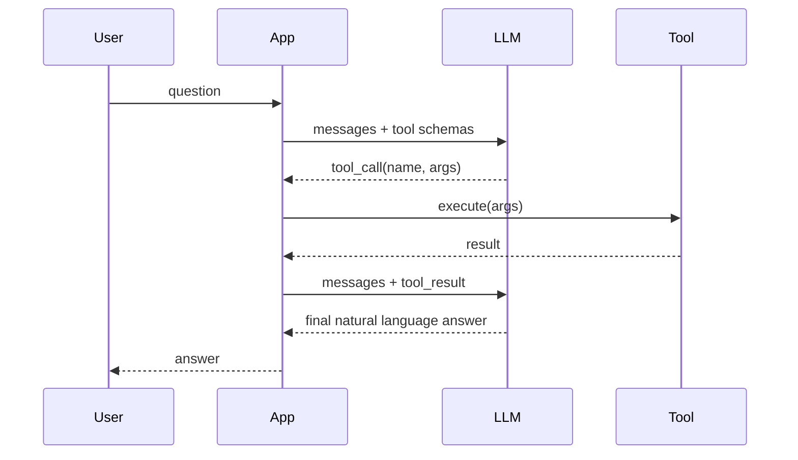

# Function Calling (Tools)

> Week 2 Theory · Day 4 · [← README](../README.md) · [Structured Outputs](structured-outputs-engineering.md)

**Function calling** (tool use) lets the model emit structured requests to run code — search, calculators, databases — instead of hallucinating facts. This is the foundation of agents (Week 4).

---

## Concepts

### What problem are we solving?

**User:** *"What's 847 × 293?"*

Without tools, the model might **guess** or do mental math wrong. With a `calculate` tool, it can say: *"I need to call calculate with this expression"* — and **your code** runs the real math.

**The model proposes. Your app executes.** Never the other way around.

### Worked example: calculate tool

**1. You send** user message + tool definition:

```
USER: What is 847 × 293? Use the calculator.
TOOLS: calculate(expression: string)
```

**2. Model responds** (no final answer yet — a tool request):

```json
{
  "tool_calls": [{
    "name": "calculate",
    "arguments": {"expression": "847 * 293"}
  }]
}
```

**3. Your code runs** `calculate("847 * 293")` → `"248171"`

**4. You send back** the tool result:

```
TOOL: 248171
```

**5. Model responds** in plain English:

```
The result of 847 × 293 is 248,171.
```

Lab 4 saves this path as `tool_call_trace.json`.

### Without tools (what goes wrong)

Same question, no tool — model might answer `248,071` (wrong digit) with full confidence. Tools ground **computable** steps in real execution.

### The tool loop



### Tool schema (OpenAI style)

```json
{
  "type": "function",
  "function": {
    "name": "get_weather",
    "description": "Get current weather for a city",
    "parameters": {
      "type": "object",
      "properties": {
        "city": { "type": "string" }
      },
      "required": ["city"]
    }
  }
}
```

Define schemas once with **Pydantic** → `model_json_schema()` → provider `tools` parameter.

### AI engineer takeaway

The model does not run tools — **your code does**. Validate args with Pydantic, enforce timeouts, and log every tool invocation. This is security-critical before Week 4 agents.

---

## OpenAI vs Anthropic

| Aspect | OpenAI | Anthropic |
|--------|--------|-----------|
| Tool definition | `tools[]` on completion | `tools[]` on messages.create |
| Model signal | `tool_calls` on assistant message | `tool_use` content block |
| Result role | `tool` message with `tool_call_id` | `tool_result` user content block |

Your `ToolRouter` service hides this behind one internal API.

---

## Week 2 scope: one tool

Implement **`get_current_time`** or **`calculate`** — deterministic, no external API keys. Stretch: `search_docs` mock returning static JSON.

Trace format for deliverable `tool_call_trace.json`:

```json
{
  "request_id": "...",
  "tool_name": "calculate",
  "arguments": {"expression": "2+2"},
  "result": "4",
  "rounds": 1,
  "latency_ms": 850
}
```

---

## Tradeoffs

| Approach | Pros | Cons |
|----------|------|------|
| Native provider tools | Model trained for format | Vendor-specific quirks |
| ReAct in prompt (text) | Portable | Fragile parsing |
| MCP (Week 4/7) | Standardized tool servers | Extra infrastructure |

Week 2: native tools only.

---

## Best Practices

- Descriptions matter — the model picks tools from names + descriptions.
- Keep tool count small per request (< 10); use routing for large catalogs.
- Set max tool rounds (e.g. 3) to prevent infinite loops.
- Never `eval()` user-supplied expressions without sandboxing.

---

## Common Mistakes

- Passing tools but not handling `tool_calls` in the response path.
- No timeout on tool execution (hangs the chat).
- Returning huge tool payloads into context (blows window).
- Trusting model-generated SQL or shell without validation.

---

## Checkpoint

1. Who executes the tool — model or application?
2. Draw the tool loop in three steps.
3. Why validate tool arguments with Pydantic?
4. How do OpenAI and Anthropic differ in tool result messages?

---

## Go Deeper

| Resource | Why |
|----------|-----|
| [OpenAI function calling](https://platform.openai.com/docs/guides/function-calling) | Schema format |
| [Anthropic tool use](https://docs.anthropic.com/en/docs/build-with-claude/tool-use) | Claude specifics |
| Week 4 preview | Agents orchestrate many tools |

---

## Next

Read [structured-outputs-engineering.md](structured-outputs-engineering.md) → **Lab:** [Lab 4](../labs/lab-04-function-calling.md) → [Day 5 playbook](../daily/day-05.md)
