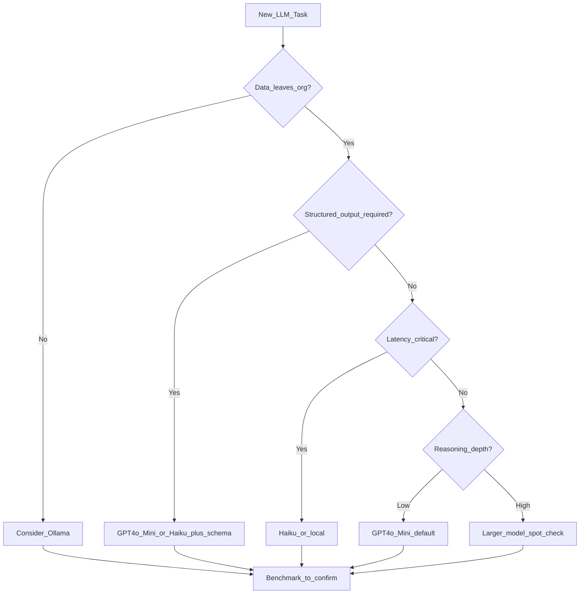

# Model Selection

> Week 2 Theory · Day 2 · [← README](../README.md) · [Open Source Models](open-source-models.md)

"Which model should we use?" is the most common question in LLM engineering. The answer is never "the newest one" — it is a **decision matrix** over task, cost, latency, privacy, and quality.

---

## Concepts

### What problem are we solving?

"Which model should we use?" is not answered by Twitter hype. You need a **decision per task type**, backed by your Day 7 benchmark data.

### Scenario: building a support bot (preview)

| Task | Week 2 pick | Why (after you benchmark) |
|------|-------------|---------------------------|
| Extract ticket JSON (name, email, issue) | GPT-4o Mini + schema | Highest parse success rate |
| Draft friendly reply | Claude Haiku or GPT-4o Mini | Compare tone + cost in report |
| Classify urgency (low/med/high) | Cheapest model that passes eval | Often Haiku or local 8B |
| Internal dev / CI tests | Llama 3.1 8B on Ollama | $0 per call |

**Wrong:** One model for everything at max temperature.  
**Right:** Registry metadata + benchmark evidence per route.

### Decision framework



### Selection dimensions

| Dimension | Question | Data source |
|-----------|----------|-------------|
| **Quality** | Does output pass eval rubric? | Benchmark suite |
| **Cost** | $/1M tokens × volume | Registry pricing + usage logs |
| **Latency** | TTFT + tokens/sec acceptable? | [streaming.md](streaming.md) metrics |
| **Context** | Fits in window with room for output? | [context-management.md](context-management.md) |
| **Capabilities** | Tools, vision, JSON schema? | Provider docs + registry flags |
| **Risk** | PII, compliance, vendor lock-in | Security review |

### AI engineer takeaway

Encode selection criteria in **`models.yaml`** metadata (cost, context window, capabilities). Your benchmark tool proves the matrix with numbers — that is portfolio gold.

---

## Week 2 registry pattern

```yaml
models:
  - id: gpt-4o-mini
    provider: openai
    display_name: GPT-4o Mini
    context_window: 128000
    cost_per_million_input: 0.15
    cost_per_million_output: 0.60
    capabilities: [chat, json_schema, tools, stream]

  - id: claude-3-5-haiku-20241022
    provider: anthropic
    display_name: Claude 3.5 Haiku
    context_window: 200000
    cost_per_million_input: 0.80
    cost_per_million_output: 4.00
    capabilities: [chat, tools, stream]

  - id: llama3.1:8b
    provider: ollama
    display_name: Llama 3.1 8B
    context_window: 128000
    cost_per_million_input: 0
    cost_per_million_output: 0
    capabilities: [chat, stream]
```

*(Verify pricing against current provider pages before benchmarking.)*

---

## Task → model cheat sheet (Week 2)

| Task | Start here | Escalate if |
|------|------------|-------------|
| JSON extraction | GPT-4o Mini + schema | Parse failures > 5% |
| Chat UI demo | Llama 3.1 8B local | Quality complaints |
| Long document Q&A | Claude Haiku (200k) | Week 3 RAG pipeline |
| Tool routing | GPT-4o Mini | Tool call errors |
| Batch summarization | Local 8B | Summary quality fails eval |

---

## Tradeoffs

| Strategy | Pros | Cons |
|----------|------|------|
| Single model everywhere | Simple | Expensive, suboptimal quality |
| Router by task type | Cost-efficient | More code paths to test |
| Cascade (cheap → expensive) | Best $/quality | Added latency on escalation |
| User-selectable model | Transparency | Support burden |

Week 2 implements **user-selectable + benchmark-informed defaults**.

---

## Best Practices

- Re-benchmark when providers ship new snapshots (monthly in active projects).
- Separate **dev** defaults (local) from **prod** defaults (cloud).
- Document escalation rules in the registry README, not tribal knowledge.
- Track real $/successful-task, not just $/token.

---

## Common Mistakes

- Choosing models from Twitter benchmarks unrelated to your task.
- Ignoring input token cost (system prompts add up).
- No failover model when primary returns 429/503.
- Comparing models on different temperature settings.

---

## Checkpoint

1. List four dimensions in the selection framework.
2. Why store `capabilities` in YAML?
3. When is local inference mandatory vs optional?
4. What is a cascade routing strategy?

---

## Go Deeper

| Resource | Why |
|----------|-----|
| [OpenAI pricing](https://openai.com/api/pricing/) | Current $/M tokens |
| [Anthropic pricing](https://www.anthropic.com/pricing) | Claude tiers |
| [Artificial Analysis](https://artificialanalysis.ai/) | Independent benchmarks |

---

## Next

**Lab:** [Lab 2 — Model Registry](../labs/lab-02-model-registry.md) → [Day 3 playbook](../daily/day-03.md) → [streaming.md](streaming.md)
