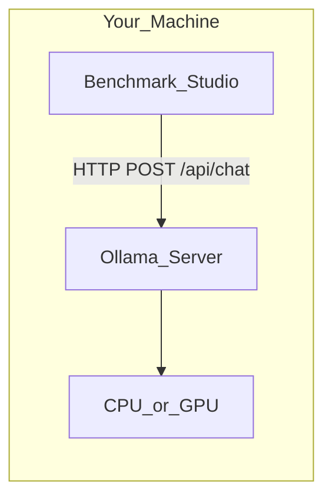

# Open Source Models (Ollama & Beyond)

> Week 2 Theory · Day 2 · [← README](../README.md) · [Model Selection](model-selection.md)

Cloud APIs are convenient; **open-weight models** run on your hardware for privacy, offline dev, and zero marginal cost. Week 2 uses **Ollama** locally; this page explains when that is enough and when you need vLLM or a GPU cluster.

---

## Concepts

### What problem are we solving?

Not every prompt can leave your laptop. **Open-source models** (run locally via Ollama) give you zero per-token cost and keep data on your machine — at the cost of hardware limits and sometimes lower quality on hard tasks.

### When local wins vs when cloud wins

| Situation | Use local (Llama 8B) | Use cloud (GPT / Claude) |
|-----------|----------------------|---------------------------|
| PII / regulated data cannot leave device | ✓ | ✗ |
| Developer running 500 tests in CI | ✓ | Expensive |
| JSON extraction with strict schema | Maybe — benchmark first | Often ✓ |
| Long reasoning chain | Quality may lag | ✓ |
| Demo with no GPU | ✗ (too slow) | ✓ |

**Week 2 rule:** Register **both** in `models.yaml` and let `benchmark_report.json` show numbers — don't assume.

### The open-source stack (2026)

| Layer | Examples | You interact via |
|-------|----------|------------------|
| **Weights** | Llama 3.1, Mistral, Qwen | `ollama pull <model>` |
| **Runtime** | Ollama, llama.cpp, vLLM | HTTP API on `:11434` |
| **Your app** | FastAPI provider | Same `BaseLLMProvider` as cloud |

### Week 2 required local model

| Model | Ollama tag | Role |
|-------|------------|------|
| Llama 3.1 8B | `llama3.1:8b` | Primary local benchmark |

Optional: `mistral:7b` for a fourth comparison row.

### AI engineer takeaway

Open-source models are **first-class citizens** in your registry, not a dev-only hack. Benchmark them with the same prompts and observability envelope as cloud models — the gap is data for decisions, not assumptions.

---

## Architecture

Ollama exposes an OpenAI-compatible chat endpoint in recent versions — your Week 1 `OllamaProvider` may already work. Week 2 adds registry metadata (`provider: ollama`, `context_window`, `cost_per_million: 0`).

---

## Ollama vs production inference

| Factor | Ollama (Week 2) | vLLM / TGI (production) |
|--------|-----------------|---------------------------|
| Setup | `ollama pull` | GPU node, K8s, model cache |
| Throughput | Fine for 1 user | Batched, high QPS |
| API | Simple HTTP | OpenAI-compatible at scale |
| When to use | Dev, privacy, demos | Serving many users |

> **Optional — not required for Week 2:** [vLLM docs](https://docs.vllm.ai/) when you deploy custom models in Week 5+.

---

## Capability expectations

Local 8B models vs cloud small models:

| Task | Llama 3.1 8B local | GPT-4o Mini / Haiku |
|------|--------------------|---------------------|
| JSON extraction | Good with structured prompts | Better schema mode |
| Tool calling | Improving; test your schemas | More reliable |
| Reasoning | Adequate for simple chains | Stronger multi-step |
| Latency (TTFT) | Often faster (no network) | Network + queue |

Your benchmark suite quantifies this — do not guess.

---

## Tradeoffs

| Run local | Run cloud |
|-----------|-----------|
| Sensitive data | Need best quality |
| High volume, cost-sensitive batch | Low volume, fast to ship |
| Offline / air-gapped | Need largest models |

---

## Best Practices

- Pin Ollama model tags in `models.yaml` (versions drift).
- Warm the model with a tiny prompt before benchmarking (cold start).
- Log **hardware context** in benchmark reports (CPU vs GPU, chip name).
- Keep cloud fallback when local returns connection errors.

---

## Common Mistakes

- Assuming local = always cheaper at team scale (engineer time + GPU amortization).
- Skipping local in benchmarks ("obviously worse") — interviewers want data.
- Using different prompts for local vs cloud (invalid comparison).
- Forgetting `ollama serve` must be running before tests.

---

## Checkpoint

1. Name two reasons to run local inference in production.
2. What Ollama command pulls Llama 3.1 8B?
3. When would you graduate from Ollama to vLLM?
4. Why register local models in YAML alongside cloud models?

---

## Go Deeper

| Resource | Why |
|----------|-----|
| [Ollama library](https://ollama.com/library) | Model tags and sizes |
| [Llama 3.1 model card](https://github.com/meta-llama/llama-models) | Capabilities and limits |
| [Week 1 Lab 6](../../week-01/labs/lab-06-local-benchmark.md) | Local benchmark primer |

---

## Next

Read [model-selection.md](model-selection.md) → **Lab:** [Lab 2 — Model Registry](../labs/lab-02-model-registry.md) → [Day 3 playbook](../daily/day-03.md)
