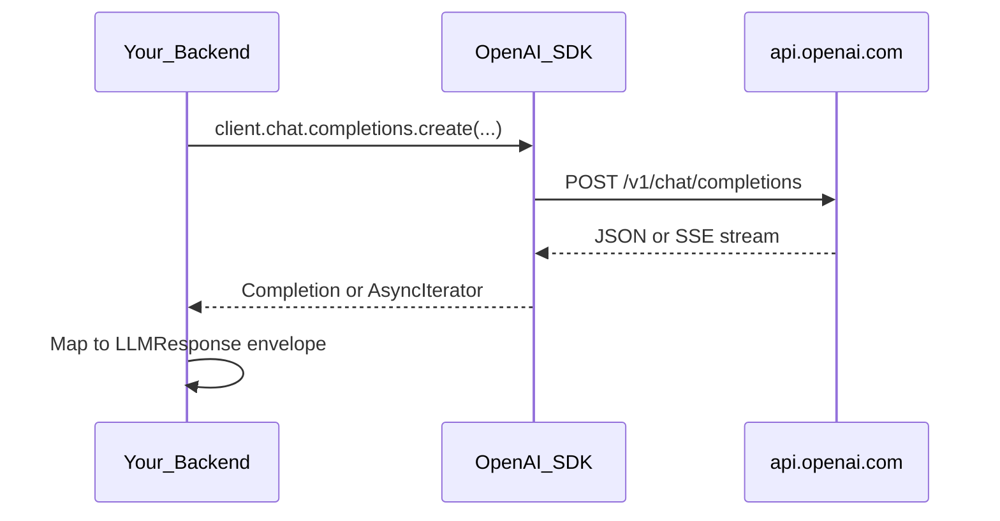
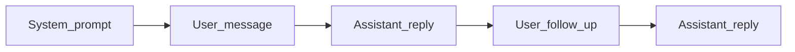

# OpenAI API (Chat Completions)

> Week 2 Theory · Day 1 · [← README](../README.md) · [Anthropic API](anthropic-api.md)

Week 1 introduced GPT-4o Mini through a thin provider wrapper. This page covers the **OpenAI Chat Completions API** as an AI engineer uses it in production: request shape, parameters, structured outputs, tools, streaming, and error handling.

---

## Concepts

### What problem are we solving?

Your app needs to send text to a cloud model and get text back — with token counts for billing and error codes when something breaks. OpenAI's Chat Completions API is the **reference pattern** most providers copy.

### A minimal request (what you actually send)

```json
{
  "model": "gpt-4o-mini",
  "messages": [
    {"role": "system", "content": "You are a concise assistant."},
    {"role": "user", "content": "Name one benefit of unit tests."}
  ],
  "temperature": 0.7,
  "max_tokens": 150
}
```

### A minimal response (what you get back)

```json
{
  "choices": [{
    "message": {
      "role": "assistant",
      "content": "Unit tests catch regressions before production."
    },
    "finish_reason": "stop"
  }],
  "usage": {
    "prompt_tokens": 28,
    "completion_tokens": 12
  }
}
```

Your `OpenAIProvider` maps this into the Week 1 **observability envelope**: `input_tokens`, `output_tokens`, `cost_usd`, `latency_ms`, `request_id`.

### Core objects (plain English)

| Object | What it is |
|--------|------------|
| **Message** | One turn: `role` (system / user / assistant / tool) + `content` |
| **Chat completion** | One API call that may include multiple messages (conversation history) |
| **Choice** | One generated response; usually you read `choices[0].message` |
| **Usage** | Token counts for billing: `prompt_tokens`, `completion_tokens` |

### Request parameters that matter

| Parameter | When to set | Week 2 default |
|-----------|-------------|----------------|
| `model` | Always | `gpt-4o-mini` |
| `temperature` | Creativity vs determinism | `0` for extraction; `0.7` for chat |
| `max_tokens` | Cap output length + cost | Reserve headroom in context budget |
| `response_format` | JSON / structured output | `{ "type": "json_schema", ... }` when supported |
| `tools` | Function calling | See [function-calling.md](function-calling.md) |
| `stream` | Real-time UX | `true` for SSE — see [streaming.md](streaming.md) |

### AI engineer takeaway

Treat the OpenAI SDK as a **transport layer**, not business logic. Wrap it behind your `BaseLLMProvider` so swapping to Anthropic or Ollama does not rewrite your app.

---

## Architecture



### Message roles in multi-turn chat



Tool calls insert `assistant` messages with `tool_calls` and `tool` role responses — covered on Day 4.

---

## Structured outputs (OpenAI-specific)

OpenAI supports **JSON Schema constrained generation** via `response_format`:

```python
response = client.chat.completions.create(
    model="gpt-4o-mini",
    messages=[{"role": "user", "content": prompt}],
    response_format={
        "type": "json_schema",
        "json_schema": {
            "name": "extraction",
            "strict": True,
            "schema": YourPydanticModel.model_json_schema(),
        },
    },
)
```

Fall back to the Week 1 [JSON reliability ladder](../../week-01/theory/structured-output.md) when `strict` fails or model lacks support.

---

## Error handling

| HTTP / error type | Meaning | Your code should |
|-------------------|---------|------------------|
| `429` | Rate limit | Exponential backoff + jitter |
| `401` | Bad API key | Fail fast; alert ops |
| `400` context_length_exceeded | Too many tokens | Trim history — [context-management.md](context-management.md) |
| `500` / `503` | Provider outage | Retry once; degrade gracefully |
| Timeout | Network / slow model | Set `timeout`; surface `error` in envelope |

---

## Tradeoffs

| Approach | Pros | Cons |
|----------|------|------|
| Official `openai` Python SDK | Maintained, streaming, types | Tied to OpenAI response shape |
| Raw HTTP (`httpx`) | Full control | You reimplement retries, streaming |
| OpenRouter (aggregator) | One key, many models | Extra hop; pricing markup |

---

## Best Practices

- Pin SDK version in `requirements.txt`; read migration notes on major bumps.
- Log `request_id` from response headers when available.
- Always pass `max_tokens` — unbounded output is a cost incident waiting to happen.
- Use `temperature=0` for benchmarks you want to reproduce.

---

## Common Mistakes

- Putting the entire RAG corpus in `system` on every call (cost + context waste).
- Ignoring `finish_reason` (`length` means truncated output).
- Parsing assistant content before checking for `tool_calls`.
- Hardcoding model strings in 20 files instead of the YAML registry.

---

## Checkpoint

1. Name the four message roles and when each is used.
2. What is the difference between `json_object` mode and `json_schema` mode?
3. Which error code signals you need context trimming?
4. Why wrap the SDK instead of calling it from route handlers?

---

## Go Deeper

| Resource | Why |
|----------|-----|
| [OpenAI API reference](https://platform.openai.com/docs/api-reference/chat) | Authoritative parameter list |
| [Structured outputs guide](https://platform.openai.com/docs/guides/structured-outputs) | Schema constraints |
| [Week 1 structured output](../../week-01/theory/structured-output.md) | JSON reliability ladder |

---

## Next

**Lab:** [Lab 1 — Provider APIs](../labs/lab-01-provider-apis.md) → mark Day 1 done → [Day 2 playbook](../daily/day-02.md) → [open-source-models.md](open-source-models.md)
