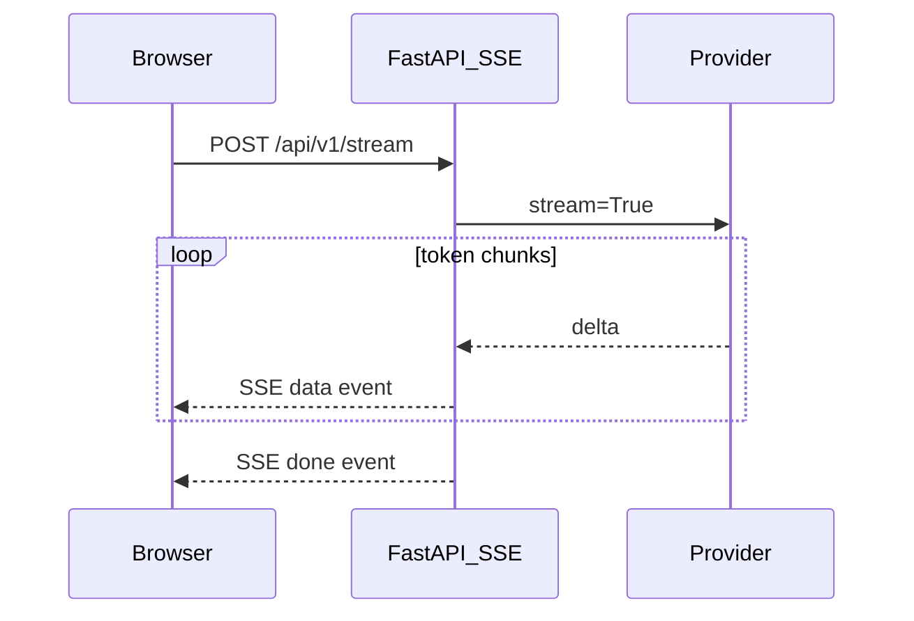

# Streaming (SSE)

> Week 2 Theory · Day 3 · [← README](../README.md) · [Function Calling](function-calling.md)

Users perceive latency from **time to first token (TTFT)**, not total generation time. Streaming sends partial output as the model generates — essential for chat UX and a key benchmark dimension in Week 2.

---

## Concepts

### What problem are we solving?

A non-streaming call blocks until the full completion returns. For a 500-token answer at 40 tok/s, that is **12+ seconds of blank UI**. Streaming shows tokens incrementally so the app feels responsive.

### Key metrics

| Metric | Definition | Why it matters |
|--------|------------|----------------|
| **TTFT** | Time from request start to first token | Perceived snappiness |
| **TPS** | Output tokens per second after first token | Reading speed UX |
| **Total latency** | Request start to final token | End-to-end SLA |

### Transport: Server-Sent Events (SSE)

SSE is HTTP long-lived: server pushes `data: {...}\n\n` events. Simpler than WebSockets for **one-way** model → client text flow.



### AI engineer takeaway

Your observability envelope should record **TTFT separately from total latency**. Interviewers ask how you would debug "slow chat" — streaming metrics answer that.

---

## Provider differences

| Provider | Stream API | Chunk shape |
|----------|------------|-------------|
| OpenAI | `stream=True` on completions | `choices[0].delta.content` |
| Anthropic | `messages.stream()` | `content_block_delta` events |
| Ollama | `stream: true` in JSON body | `message.content` fragments |

Your `BaseLLMProvider.stream()` should yield **normalized** `StreamChunk(text=, finish_reason=)` objects.

---

## FastAPI pattern (Week 2)

Use `sse-starlette` or `StreamingResponse`:

```python
from sse_starlette.sse import EventSourceResponse

async def event_generator():
    ttft_ms = None
    start = time.perf_counter()
    async for chunk in provider.stream(request, model_id):
        if ttft_ms is None and chunk.text:
            ttft_ms = (time.perf_counter() - start) * 1000
        yield {"event": "token", "data": json.dumps({"text": chunk.text})}
    yield {"event": "done", "data": json.dumps({"ttft_ms": ttft_ms, ...})}

return EventSourceResponse(event_generator())
```

Frontend: `EventSource` or `fetch` with readable stream — see [project/frontend.md](../project/frontend.md).

---

## Tradeoffs

| Streaming | Non-streaming |
|-----------|---------------|
| Better UX | Simpler to parse (one JSON blob) |
| Harder error handling mid-stream | Easier retries |
| Required for long answers | Fine for short JSON extraction |

Use streaming for **chat UI**; allow non-streaming for **batch benchmark** rows where you need clean usage stats.

---

## Best Practices

- Send a heartbeat or flush headers early to avoid proxy timeouts.
- Handle client disconnect — cancel the upstream async generator.
- Include `request_id` in the first SSE event for log correlation.
- Buffer tool-call JSON carefully — tools often need full message before parse.

---

## Common Mistakes

- Measuring only total latency (missing TTFT in benchmarks).
- Mixing SSE and WebSockets without reason.
- Not handling `finish_reason: length` in the UI (truncated answer).
- Proxy/nginx buffering SSE (disable buffering for `/stream`).

---

## Checkpoint

1. Define TTFT and why users care about it.
2. Why SSE over WebSockets for LLM chat?
3. What should your provider adapter normalize?
4. When should benchmarks use non-streaming instead?

---

## Go Deeper

| Resource | Why |
|----------|-----|
| [sse-starlette](https://github.com/sysid/sse-starlette) | FastAPI SSE helper |
| [MDN EventSource](https://developer.mozilla.org/en-US/docs/Web/API/EventSource) | Browser client |
| [Week 1 inference](../../week-01/theory/inference.md) | Prefill vs decode |

---

## Next

**Lab:** [Lab 3 — Streaming SSE](../labs/lab-03-streaming-sse.md) → [Day 4 playbook](../daily/day-04.md) → [function-calling.md](function-calling.md)
