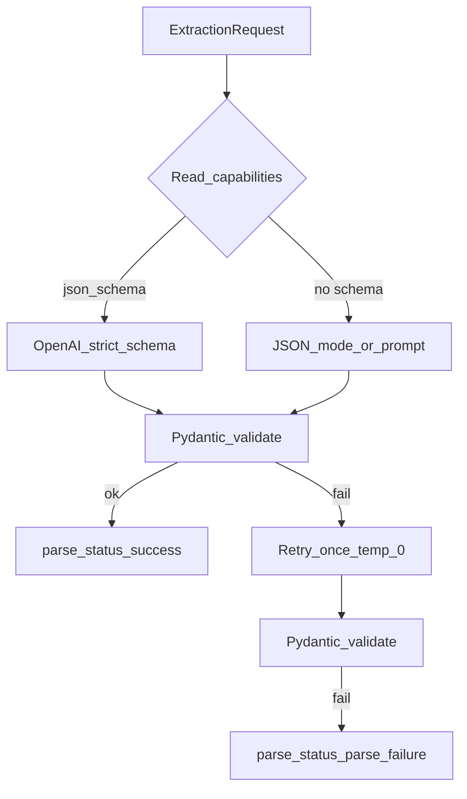

# Structured Outputs (Cross-Provider)

> Week 2 Theory · Day 4 · [← README](../README.md) · [Week 1 Structured Output](../../week-01/theory/structured-output.md)

Week 1 introduced the **JSON reliability ladder** for GPT-4o Mini. Week 2 extends it across **OpenAI, Anthropic, and Ollama** with a provider capability matrix and unified `parse_status` handling.

---

## Concepts

### What problem are we solving?

Week 1's JSON ladder worked for GPT-4o Mini. Week 2 adds **Anthropic** and **Ollama** — each supports different levels of schema enforcement. Your extraction service must branch on `capabilities` in the registry, not assume one API shape.

### Same extraction, three providers (example)

**Task:** Extract `{name, email}` from *"Contact Jane at jane@acme.com"*

| Provider | Best ladder step | Typical outcome |
|----------|------------------|-----------------|
| GPT-4o Mini | `json_schema` strict | `parse_status: success` |
| Claude Haiku | Tool-use or prompt JSON | `success` or `repaired` |
| Llama 8B local | Prompt + Pydantic validate | Higher `parse_failure` rate — log it |

**Fair benchmark:** Same prompt, temp=0, record `parse_status` and `schema_ladder_step` per model — not just "it returned JSON once."

### Capability matrix (Week 2)

| Provider | Strict JSON Schema | JSON mode | Prompt-only JSON |
|----------|-------------------|-----------|------------------|
| OpenAI GPT-4o Mini | ✓ `json_schema` strict | ✓ | fallback |
| Anthropic Haiku | Via tool / prompt | Partial | fallback |
| Ollama Llama 3.1 8B | ✗ | Varies | primary |

Always read `capabilities` from [models.yaml](../labs/lab-02-model-registry.md) before choosing a ladder step.

### Unified response contract

Extend Week 1's envelope — same fields for every provider:

```json
{
  "parse_status": "success",
  "parsed_json": { },
  "json_validation_error": null,
  "schema_ladder_step": "openai_json_schema",
  "model_id": "gpt-4o-mini",
  "provider_id": "openai"
}
```

`schema_ladder_step` tells you which step succeeded — critical for benchmark comparisons.

### AI engineer takeaway

Structured output is a **cross-provider policy** implemented once in `ExtractionService`, not copy-pasted per route. Benchmarks report parse success rate per model — that is a hiring signal.

---

## Architecture



---

## Provider adapters

### OpenAI

```python
response_format={
    "type": "json_schema",
    "json_schema": {
        "name": schema_name,
        "strict": True,
        "schema": pydantic_model.model_json_schema(),
    },
}
```

### Anthropic

Options (pick one for Week 2):

1. **Tool use** — define a single tool matching your schema; model returns `tool_use` input object.
2. **Prompt contract** — "Return only JSON matching: ..." + Pydantic validation (weaker).

Document which you chose in `benchmark_summary.md`.

### Ollama

Prompt + `format: json` if supported by model; else prompt-only + repair ladder.

---

## Benchmarking structured output

For each model × extraction prompt, record:

| Field | Purpose |
|-------|---------|
| `parse_status` | success / repaired / parse_failure |
| `schema_ladder_step` | Which step worked |
| `latency_ms` | Speed |
| `output_tokens` | Cost |

Compare **success rate**, not just latency.

---

## Tradeoffs

| Strict schema | Loose JSON prompt |
|---------------|-------------------|
| Highest reliability | Works everywhere |
| OpenAI-centric | More post-processing |
| May fail on edge schemas | Higher hallucination risk |

---

## Best Practices

- One Pydantic model per extraction type in `schemas/`.
- Never crash compare/benchmark on parse failure — record and continue.
- Log raw model text on failure (redact PII) for debugging.
- Version your JSON schemas in git.

---

## Common Mistakes

- Benchmarking JSON tasks on models without schema support, then blaming "bad models."
- Different schemas per provider (invalid comparison).
- Skipping Pydantic validation when provider claims "strict."
- No `parse_status` in API responses (Week 1 regression).

---

## Checkpoint

1. What does `schema_ladder_step` capture?
2. How do you handle extraction on Ollama vs OpenAI?
3. Why compare parse success rates in benchmarks?
4. Link back to Week 1: name the five ladder steps.

---

## Go Deeper

| Resource | Why |
|----------|-----|
| [Week 1 structured output](../../week-01/theory/structured-output.md) | Original ladder |
| [OpenAI structured outputs](https://platform.openai.com/docs/guides/structured-outputs) | Strict mode |
| [Pydantic JSON schema](https://docs.pydantic.dev/latest/concepts/json_schema/) | Schema generation |

---

## Next

[Day 5 playbook](../daily/day-05.md) → [context-management.md](context-management.md)
