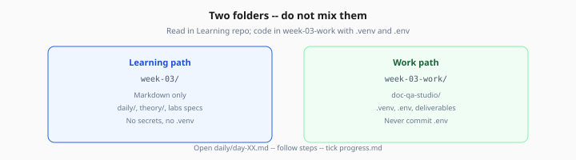

# Week 3 — Start Here

> One-time orientation · then live in [daily/day-01.md](daily/day-01.md)

**Prerequisite:** Complete [Week 2 exit criteria](../week-02/checkpoints/exit-criteria.md) before starting.

---

## 1. Setup (once)

```bash
cd Learning/week-03
chmod +x scripts/setup-work.sh
./scripts/setup-work.sh
```

Add to `.env` in your work dir:

- `OPENAI_API_KEY` (embeddings + chat)
- Optional: `COHERE_API_KEY` (hosted reranker in Lab 4)

Never commit `.env`.

Optional: copy Week 2 provider code as a head start (see [README](README.md#migrate-from-week-2-recommended)).

Place 5–10 PDFs or Markdown files in `~/ai-learning/week-03-work/data/documents/` for indexing.

---

## 2. Your two folders

| | Where | What you do |
|---|--------|-------------|
| **Learning path** | `Learning/week-03/` | Read playbooks, theory, lab specs |
| **Work path** | `week-03-work/` or `~/ai-learning/week-03-work/` | Python, deliverables, `doc-qa-studio/` |



*Figure: Read curriculum in `week-03/`; code and secrets live in `week-03-work/` only.*

---

## 3. Every study session

```
Open daily/day-XX.md  →  follow steps 1…N  →  tick progress.md  →  Tomorrow link
```

Do **not** read all 10 theory files before Day 1. The daily playbook links only what you need that day.

---

## 4. First step

**→ [Day 1 playbook](daily/day-01.md)**
