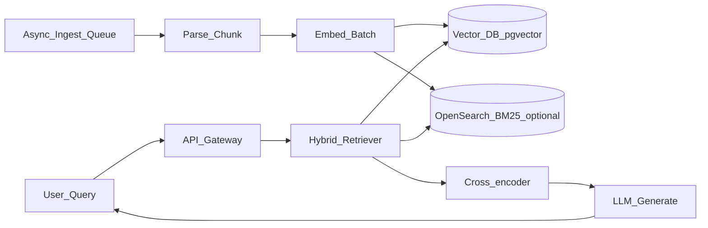

# Week 3 Interview — System Design

> Week 3 · [← Concepts](concepts.md) · [Coding](coding.md)

## Question 1: Design a document Q&A system for 10M pages

**Clarifying questions**

- Update frequency? Access control per tenant?
- Latency target? Answer must cite sources?
- Languages? Scanned PDFs?

**High-level architecture**

**Deep dives interviewer expects**

| Topic | Strong answer |
|-------|---------------|
| Chunking | 512 tokens default; structure-aware for HTML; parent-child for long policies |
| Index | pgvector HNSW; separate BM25 index (OpenSearch or Postgres tsvector) |
| Hybrid | RRF fusion; retrieve 50+50, rerank to 5 |
| Context | 2K tokens retrieval budget; dedupe overlapping chunks |
| Eval | Golden set per domain; RAGAS faithfulness in CI |
| Updates | Event-driven re-index on doc change; version indexes |
| Failure | Low score threshold → refuse; log chunks for support |

**Scale knobs**

- Shard vector index by tenant_id
- Embed batch jobs on queue (SQS + workers)
- Cache frequent query embeddings (Week 5 semantic cache)
- Async ingest vs sync chat path separation

---

## Question 2: HR policy bot — compliance requirements

**Requirements:** Answers must cite policy section; no answer if not in corpus; audit trail.

**Design points**

1. **Refusal policy** — rerank score floor + explicit system prompt
2. **Citations** — chunk metadata with section IDs; structured JSON citations
3. **Audit** — log query, chunk_ids used, model version, timestamp (no PII in logs)
4. **Access** — row-level security on chunks by employee region/role
5. **Eval** — golden set signed off by HR; block deploy if faithfulness drops

---

## Question 3: RAG vs long-context model (128K)

| | RAG | Long context |
|---|-----|--------------|
| Cost per query | Embed + small context | Full doc tokens every call |
| Freshness | Re-index docs | Re-upload / cache invalidation |
| Citations | Natural from chunks | Harder to attribute |
| Best for | Large corpus, changing docs | Single doc, few queries |

Strong answer: *"Use RAG for corpus search; long context for one-shot doc analysis. Hybrid: retrieve top chunks then fill remaining window."*

---

## Question 4: Retrieval returns wrong chunks — what do you do?

1. Pull logged bm25 vs dense lists
2. Check chunk boundaries on ground-truth source
3. Try hybrid if dense-only
4. Add reranker if recall OK but precision weak
5. Expand golden set with failing query
6. Do NOT only tweak temperature

---

## Rubric (self-score)

| Level | You can… |
|-------|----------|
| 1 | Name RAG components |
| 2 | Draw ingest → retrieve → generate |
| 3 | Justify hybrid + rerank + eval |
| 4 | Discuss multi-tenant, scale, compliance |
| 5 | Trade off RAG vs fine-tune vs long context with numbers |

## Next

[Coding](coding.md) · [Cheat Sheet](cheat-sheet.md)
