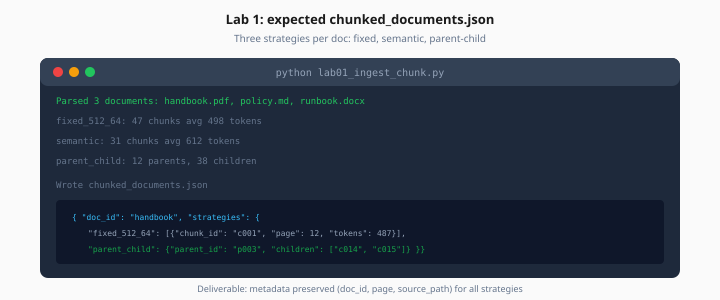

# Lab 1: Document Ingestion & Chunking

> Week 3 Labs · [← README](README.md) · [Document Ingestion Theory](../theory/document-ingestion.md)

> **Learning path:** This file — specs only.  
> **Work dir:** `~/ai-learning/week-03-work/`

## Setup

```bash
cd ~/ai-learning/week-03-work
source .venv/bin/activate
mkdir -p data/documents
```

**Estimated cost:** $0

**Goal:** Parse 3+ documents and compare fixed, semantic, and parent-child chunking.

When it works: `chunked_documents.json` shows three strategy blocks per doc with token stats and sample chunks.



*Figure: Each document produces fixed, semantic, and parent-child chunk blocks with metadata preserved.*

---

## Task

Create `lab01_ingest_chunk.py` that:

1. Scans `data/documents/` for `.pdf`, `.md`, `.docx`
2. Extracts text + metadata (`doc_id`, `source_path`, `page`, `title`)
3. Produces chunks for each strategy:
   - **fixed:** 512 tokens, 64 overlap (`tiktoken cl100k_base`)
   - **semantic:** split when consecutive paragraph embedding similarity < 0.5
   - **parent-child:** parent 1500 tokens, children 300 tokens with `parent_id` link
4. Writes `chunked_documents.json`

### Expected output shape

```json
{
  "run_at": "2026-07-25T10:00:00Z",
  "documents": [
    {
      "doc_id": "handbook-2026",
      "source_path": "data/documents/handbook.pdf",
      "page_count": 40,
      "strategies": {
        "fixed_512_64": {"chunk_count": 87, "avg_tokens": 498, "sample_chunk_id": "handbook-2026_f_12"},
        "semantic": {"chunk_count": 52, "avg_tokens": 612, "sample_chunk_id": "handbook-2026_s_7"},
        "parent_child": {"parent_count": 18, "child_count": 64, "sample_child_id": "handbook-2026_c_22"}
      }
    }
  ],
  "chunks": {
    "fixed_512_64": [{"chunk_id": "...", "text": "...", "metadata": {"page": 12}}],
    "semantic": [],
    "parent_child": {"parents": [], "children": []}
  }
}
```

---

## Implementation hints

### PDF parse

```python
from pypdf import PdfReader

def parse_pdf(path: str) -> list[dict]:
    reader = PdfReader(path)
    pages = []
    for i, page in enumerate(reader.pages, start=1):
        text = page.extract_text() or ""
        pages.append({"page": i, "text": text.strip()})
    return pages
```

### Fixed splitter

Use LangChain `RecursiveCharacterTextSplitter(chunk_size=512, chunk_overlap=64)` or equivalent with tiktoken counting.

### Semantic split (simplified)

Embed each paragraph with `text-embedding-3-small`; when `cosine_sim(p_i, p_{i+1}) < 0.5`, start new chunk. Budget ~$0.10 for semantic pass on 5 docs.

---

## Acceptance

- [ ] ≥3 documents parsed without silent empty docs
- [ ] All three strategies present in JSON
- [ ] Each chunk has `chunk_id`, `text`, `metadata` with `doc_id`
- [ ] Manual note: which strategy best preserved one multi-sentence policy fact

---

## Next

Mark [Day 1](../daily/day-01.md) done → [Day 2](../daily/day-02.md) → [Lab 2](lab-02-embeddings-chroma.md)
