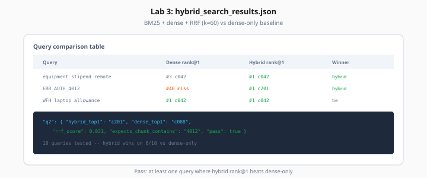

# Lab 3: Hybrid Search with RRF

> Week 3 Labs · [← README](README.md) · [Hybrid Search Theory](../theory/hybrid-search-rrf.md)

> **Work dir:** `~/ai-learning/week-03-work/`

**Estimated cost:** $0 (queries use existing index; negligible embed cost for test queries)

**Goal:** Implement BM25 + dense retrieval fused with Reciprocal Rank Fusion (k=60).

When it works: `hybrid_search_results.json` shows queries where hybrid rank@1 beats dense-only.



*Figure: Hybrid wins on exact tokens (ERR_AUTH) and paraphrases (WFH allowance) that dense-only misses.*

---

## Task

Create `lab03_hybrid_search.py`:

1. Load all chunk texts + IDs from Chroma (or `chunked_documents.json` cache)
2. Build BM25 index (`rank_bm25.BM25Okapi` on tokenized chunks)
3. For each query in `config/test_queries.yaml`:
   - Dense top-50 from Chroma
   - BM25 top-50
   - RRF merge → top-10
4. Write `hybrid_search_results.json`

### test_queries.yaml (create 10 queries)

```yaml
queries:
  - id: q1
    text: "remote work equipment stipend"
    expects_chunk_contains: "500"
  - id: q2
    text: "ERR_AUTH_4012"
    expects_chunk_contains: "ERR_AUTH_4012"
  - id: q3
    text: "how many PTO days for new hires"
    expects_chunk_contains: "15"
```

Include at least 2 exact-keyword queries and 2 paraphrase queries.

### RRF implementation

```python
def rrf_merge(rank_lists: list[list[str]], k: int = 60) -> list[tuple[str, float]]:
    scores: dict[str, float] = {}
    for ranked in rank_lists:
        for rank, doc_id in enumerate(ranked, start=1):
            scores[doc_id] = scores.get(doc_id, 0.0) + 1.0 / (k + rank)
    return sorted(scores.items(), key=lambda x: x[1], reverse=True)
```

---

## Expected output shape

```json
{
  "k": 60,
  "queries": [
    {
      "id": "q2",
      "text": "ERR_AUTH_4012",
      "bm25_top_5": ["chunk-a", "chunk-b"],
      "dense_top_5": ["chunk-x", "chunk-y"],
      "rrf_top_5": ["chunk-a", "chunk-x"],
      "dense_rank1_correct": false,
      "hybrid_rank1_correct": true
    }
  ],
  "summary": {"hybrid_wins": 3, "dense_wins": 2, "ties": 5}
}
```

---

## Acceptance

- [ ] RRF with k=60 implemented
- [ ] 10 queries evaluated
- [ ] ≥2 queries where hybrid rank@1 correct and dense rank@1 wrong (or lower)
- [ ] Both rank lists logged per query for debug

---

## Next

[Day 3](../daily/day-03.md) → [Lab 4](lab-04-reranking.md)
