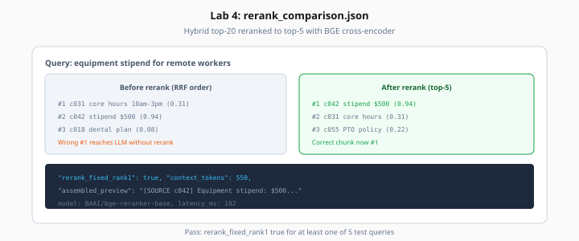

# Lab 4: Cross-Encoder Reranking

> Week 3 Labs · [← README](README.md) · [Reranking Theory](../theory/reranking.md)

> **Work dir:** `~/ai-learning/week-03-work/`

**Estimated cost:** $0 local reranker; ~$0.05–0.20 if using Cohere Rerank API

**Goal:** Rerank hybrid top-20 → top-5; assemble citation-ready context.

When it works: `rerank_comparison.json` shows at least one query where rerank fixes rank@1.



*Figure: Stipend chunk moves from RRF #2 to rerank #1 — wrong context no longer reaches the LLM.*

---

## Task

Create `lab04_rerank.py`:

1. For 5 queries from Lab 3, get hybrid top-20
2. Score each (query, chunk) pair with cross-encoder
3. Select top-5; run `assemble_context(max_tokens=2000)`
4. Optional: one GPT-4o Mini call with assembled context to sanity-check answer
5. Write `rerank_comparison.json`

### Local reranker (default)

```python
from sentence_transformers import CrossEncoder

model = CrossEncoder("BAAI/bge-reranker-base")
scores = model.predict([(query, chunk_text) for chunk_text in candidates])
```

First run downloads ~400MB model.

### Cohere alternative

```python
import cohere
r = cohere.Client(os.environ["COHERE_API_KEY"]).rerank(
    model="rerank-english-v3.0", query=query, documents=docs, top_n=5
)
```

---

## Expected output shape

```json
{
  "reranker": "BAAI/bge-reranker-base",
  "queries": [
    {
      "text": "remote work equipment stipend",
      "rrf_rank1_chunk_id": "chunk-wrong",
      "rerank_rank1_chunk_id": "chunk-correct",
      "rerank_fixed_rank1": true,
      "assembled_tokens": 842,
      "top_5_scores": [0.94, 0.31, 0.28, 0.12, 0.08]
    }
  ]
}
```

---

## Context assembler

```python
def assemble_context(chunks: list[dict], max_tokens: int = 2000) -> str:
    parts, used = [], 0
    for c in chunks:
        block = f"[SOURCE {c['chunk_id']} | {c['metadata'].get('source_path')} p.{c['metadata'].get('page')}]\n{c['text']}\n"
        n = count_tokens(block)
        if used + n > max_tokens:
            break
        parts.append(block)
        used += n
    return "\n".join(parts)
```

---

## Acceptance

- [ ] Top-20 → top-5 rerank on 5 queries
- [ ] ≥1 query where rerank rank@1 ≠ RRF rank@1 and rerank is correct
- [ ] Assembled context ≤ 2000 tokens
- [ ] SOURCE labels present in assembled string

---

## Next

[Day 4](../daily/day-04.md) → [Lab 5](lab-05-ragas-eval.md)
