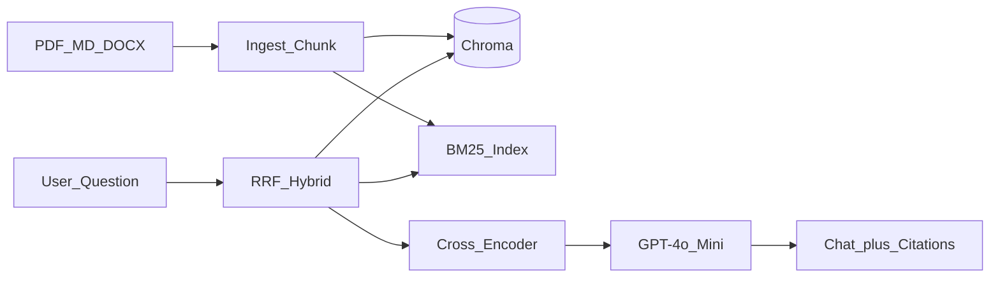

# Week 3 Showcase — Doc Q&A Studio

> Week 3 Portfolio · [← README](../README.md)

Use this page as your portfolio README for the Week 3 capstone.

## Elevator pitch

**Doc Q&A Studio** lets you upload internal documents and ask questions in natural language. Answers cite the exact source page — backed by hybrid retrieval, cross-encoder reranking, and a RAGAS eval report proving faithfulness on 50+ test questions.

## Architecture snapshot



Full spec: [project/architecture.md](../project/architecture.md)

## Demo checklist

Capture these for GitHub README or Loom:

- [ ] Upload 3 documents → index status shows chunk count
- [ ] Ask semantic question → correct cited answer
- [ ] Ask keyword/error-code question → hybrid beats dense-only (optional side-by-side)
- [ ] Ask unanswerable question → polite refusal
- [ ] Show `rag_eval_report.json` summary metrics

## Key artifacts (work dir)

| File | Purpose |
|------|---------|
| `rag_eval_report.json` | RAGAS metrics, faithfulness gate |
| `eval/golden_dataset.json` | 50+ labeled Q&A pairs |
| `hybrid_search_results.json` | Hybrid vs dense comparison |
| `index_manifest.json` | Index version + embed model |

**Do not commit** private corporate docs or `.env` to public repos.

## Metrics table (fill from your eval)

| Metric | Your value | Target |
|--------|------------|--------|
| Golden pairs | | ≥ 50 |
| Faithfulness | | ≥ 0.75 |
| Context recall | | report |
| Documents indexed | | ≥ 3 |
| Total chunks | | — |
| Hybrid win rate (keyword queries) | | ≥ 2 improved |

## Technical highlights for interviews

1. **Why hybrid?** — Show one query where BM25 rank@1 correct, dense rank@1 wrong.
2. **Why rerank?** — Show rerank moving correct chunk from #4 to #1.
3. **Why RAGAS?** — Show one sample where faithfulness flagged an unsupported claim.
4. **Production path** — Mention pgvector for ACLs (Lab 6) even if capstone used Chroma.

## Curriculum path

| Week | Project | Connection |
|------|---------|------------|
| 1 | Prompt Playground Lite | Tokens, embeddings intuition |
| 2 | Model Benchmark Studio | Providers, SSE, Postgres |
| **3** | **Doc Q&A Studio** | **RAG pipeline** |
| 4 | Research agent | Agentic RAG, LangGraph |

## Repo structure suggestion

```
doc-qa-studio/
├── README.md              ← copy showcase summary
├── docs/architecture.md   ← link to curriculum spec
├── backend/
├── frontend/
└── eval/
    └── sample_golden_public.json   ← synthetic public sample only
```

## Next steps after Week 3

- Week 4: Agentic retrieval loops with LangGraph
- Week 5: Semantic caching for repeated queries
- Week 6: DeepEval CI on golden set

Proceed when [exit criteria](../checkpoints/exit-criteria.md) pass.
