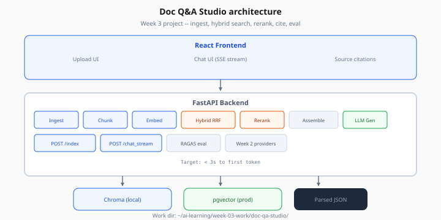
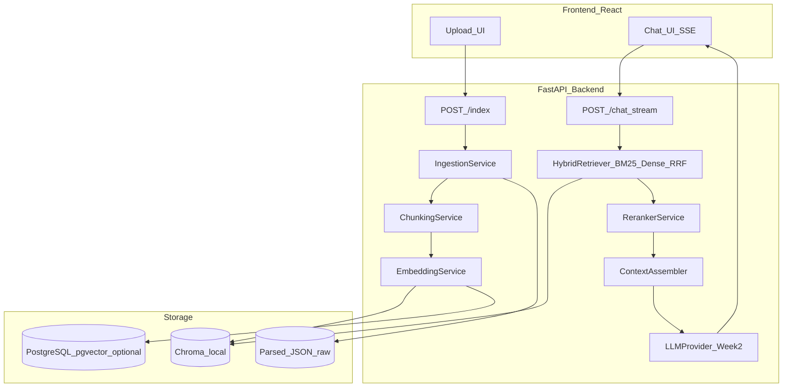

# Doc Q&A Studio — Architecture

> Week 3 Project · [← Overview](overview.md) · [Backend](backend.md)

## System diagram



*Figure: Index path (ingest → chunk → embed) and chat path (hybrid → rerank → assemble → LLM stream).*



## Request flow: chat

| Step | Component | Latency budget |
|------|-----------|----------------|
| 1 | Embed query | ~50 ms |
| 2 | BM25 + dense + RRF | ~40 ms |
| 3 | Cross-encoder rerank top-20 → 5 | ~150 ms |
| 4 | Assemble context (≤2000 tokens) | ~5 ms |
| 5 | LLM stream answer | ~800–2000 ms |

Total target: **< 3s to first token** on local reranker + cloud LLM.

## Folder structure

```
doc-qa-studio/
├── docker-compose.yml          # Postgres + pgvector (optional)
├── backend/
│   ├── app/
│   │   ├── main.py
│   │   ├── routers/
│   │   │   ├── index.py
│   │   │   └── chat.py
│   │   ├── services/
│   │   │   ├── ingestion.py
│   │   │   ├── chunking.py
│   │   │   ├── embedding.py
│   │   │   ├── hybrid_retriever.py
│   │   │   ├── reranker.py
│   │   │   ├── context_assembler.py
│   │   │   └── rag_chain.py
│   │   ├── providers/          # Reuse Week 2 BaseLLMProvider
│   │   └── schemas/
│   ├── alembic/                  # pgvector migrations (Lab 6)
│   └── scripts/
│       └── run_ragas_eval.py
└── frontend/
    └── src/
        ├── App.tsx
        ├── components/
        │   ├── ChatPanel.tsx
        │   ├── CitationChip.tsx
        │   └── UploadPanel.tsx
        └── hooks/useSSEChat.ts
```

## Design decisions

| Decision | Choice | Rationale |
|----------|--------|-----------|
| Vector store (dev) | Chroma persistent | Fast iteration |
| Vector store (prod path) | pgvector | ACLs + SQL filters |
| Hybrid fusion | RRF k=60 | No score tuning |
| Reranker | BGE local default | $0, good precision |
| Orchestration | LangChain or plain Python | Pick one; avoid dual abstractions |
| Embed model | text-embedding-3-small | Cost/quality balance |

## Index versioning

Each index job writes metadata:

```json
{
  "index_version": "v1_2026-07-25",
  "embedding_model": "text-embedding-3-small",
  "chunk_strategy": "fixed_512_64",
  "chunk_count": 247
}
```

Stored in Chroma collection metadata and `index_manifest.json` on disk.

## Security notes (local dev)

- No auth required for Week 3 local capstone
- Week 5 adds API keys, rate limits, tenant isolation patterns
- Never log full document text in production — log chunk IDs only

## Next

[backend.md](backend.md) · [indexing-spec.md](indexing-spec.md)
