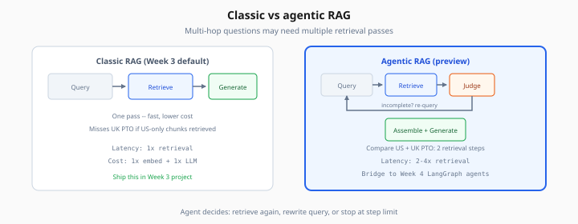
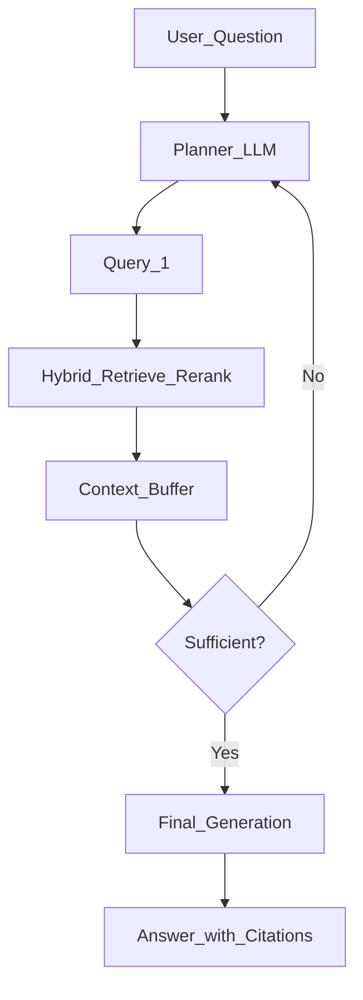

# Agentic RAG Preview

> Week 3 Theory · Day 6 · [← README](../README.md) · Prev: [rag-failure-modes](rag-failure-modes.md) · Next: [project/architecture](../project/architecture.md)

**Classic RAG** retrieves once, generates once. **Agentic RAG** lets an LLM **decide** to retrieve again, rewrite the query, or call tools when the first pass fails — a bridge to Week 4 agents and LangGraph.

---

## Concepts

### What problem are we solving?

Some questions need **multiple retrieval steps**:

- Multi-hop: *"Which team owns the service mentioned in the security policy for API keys?"*
- Clarification: ambiguous acronyms across docs
- Self-correction: first chunks irrelevant → re-query

Single-shot RAG returns weak context; agentic RAG loops until context is good enough or a step limit hits.



*Figure: Agentic RAG loops retrieve and judge — higher latency, bridge to Week 4 LangGraph agents.*

### A concrete example

Query: *"Compare PTO policy between US and UK handbooks."*

| Step | Agent action | Result |
|------|--------------|--------|
| 1 | Retrieve "PTO policy US handbook" | 3 chunks — US only |
| 2 | Judge: incomplete | Plan second search |
| 3 | Retrieve "PTO policy UK handbook" | 2 chunks — UK |
| 4 | Assemble both + generate | Comparative answer with citations |

Without iteration, step 1 alone might miss UK entirely.

### Classic vs agentic RAG

| | Classic RAG (Week 3 default) | Agentic RAG (preview) |
|---|------------------------------|------------------------|
| Flow | Query → retrieve → generate | Query → loop(retrieve, assess, maybe re-query) |
| Latency | Lower | Higher (2–4× retrievals) |
| Cost | Lower | Higher |
| Best for | FAQ, single-doc Q&A | Multi-hop, research |
| Framework | LangChain retriever chain | Week 4 LangGraph |

### Minimal agentic loop (pseudocode)

```python
MAX_STEPS = 3
context = []
for step in range(MAX_STEPS):
    query_variant = planner.next_query(user_question, context)
    chunks = hybrid_retrieve(query_variant)
    context.extend(chunks)
    if grader.sufficient(user_question, context):
        break
return generate(user_question, context)
```

**Grader** can be:

- Heuristic (rerank top score > 0.5)
- Small LLM call: *"Can you answer yes/no with this context?"*
- RAGAS-style faithfulness pre-check (expensive)

### When NOT to use agentic RAG

- Low-latency chat (< 2s target)
- Small corpus (< 50 chunks) — just retrieve more K
- Strict cost caps
- Week 3 capstone — **classic pipeline required**; agentic is optional stretch

### Preview architecture



Week 4 replaces the ad-hoc loop with **LangGraph** state, checkpoints, and tool nodes.

### AI engineer takeaway

Interview framing: *"Start with single-shot hybrid RAG + eval. Add agentic retrieval only when golden set shows multi-hop failures and latency budget allows."* Shows production judgment, not hype.

---

## Tradeoffs

| | Single-shot | Agentic |
|---|-------------|---------|
| Debug complexity | Low | High (trace each step) |
| Failure modes | Missed retrieval | Infinite loops, cost blowout |
| Mitigation | Hybrid + rerank | Step limits, budgets, HITL (Week 4) |

---

## Best Practices

1. **Hard cap** steps (3) and retrieval cost per request.
2. Log every sub-query for eval replay.
3. Prove single-shot fails on golden set before adding agentic complexity.
4. Reuse same hybrid+rereank stack inside the loop — don't fork pipelines.

---

## Common Mistakes

| Mistake | Symptom | Fix |
|---------|---------|-----|
| Agentic by default | 8s latency, $0.05/query | Single-shot first |
| No grader | Retrieve forever | Explicit stop condition |
| Different retriever per step | Inconsistent results | One configured pipeline |
| Skip eval | Cannot prove improvement | A/B on multi-hop subset |

---

## Checkpoint

1. Name a query type that benefits from multiple retrieval steps.
2. Why is agentic RAG optional for Week 3 capstone?
3. What Week 4 framework replaces ad-hoc loops?

---

## Go Deeper

| Resource | Why |
|----------|-----|
| [LangGraph docs](https://langchain-ai.github.io/langgraph/) | Week 4 primary |
| [Self-RAG paper](https://arxiv.org/abs/2310.11511) | Retrieve/on-demand generation |
| [prompt.md Week 4](../../prompt.md) | Full agents curriculum |

---

## Next

**→ [project/architecture.md](../project/architecture.md)** · [Day 7 playbook](../daily/day-07.md) · Lab: [Lab 6](../labs/lab-06-pgvector.md) *(optional)*
