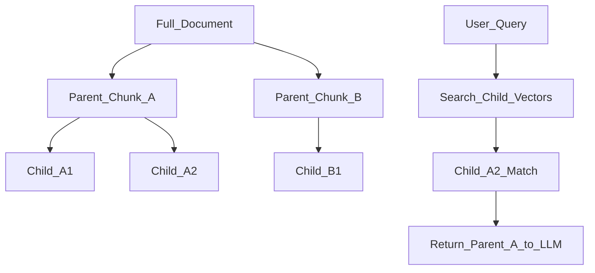

# Chunking Strategies

> Week 3 Theory · Day 1 · [← README](../README.md) · Prev: [document-ingestion](document-ingestion.md) · Next: [embeddings-retrieval](embeddings-retrieval.md)

**Chunking** splits long documents into pieces small enough to embed and fit in the LLM context window — but large enough to carry a complete thought. Wrong chunk size is the #1 silent killer of RAG quality.

---

## Concepts

### What problem are we solving?

A 50-page PDF might be 30,000 tokens. You cannot embed it as one blob (blurry average vector) or paste it all into GPT-4o Mini (context overflow). Chunking decides **what text becomes one retrieval unit**.

### A concrete example

Policy doc section (800 tokens):

> **Remote Work Policy** — Employees may work remotely up to 3 days per week. Manager approval required. Core hours 10am–3pm local time. Equipment stipend: $500 annually.

| Strategy | Chunk boundary | Query: "remote work stipend" |
|----------|----------------|------------------------------|
| **Fixed 256 tokens** | May split stipend from "Remote Work" heading | Might miss stipend if in next chunk |
| **Fixed 512 + overlap 64** | Overlap preserves heading context | Better recall |
| **Semantic** | Split when embedding similarity drops | Keeps policy paragraph intact |
| **Parent-child** | Small child chunks for search; parent for LLM context | Best of both |

### Fixed-size chunking

Split every N tokens (or characters) with optional **overlap** so sentences at boundaries appear in two chunks.

```
[---- chunk 1 ----][overlap][---- chunk 2 ----]
```

| Parameter | Typical range | Tradeoff |
|-----------|---------------|----------|
| Chunk size | 256–512 tokens | Smaller = precise, more chunks = cost |
| Overlap | 10–20% of size | Reduces boundary cuts |

**Week 3 default:** 512 tokens, 64-token overlap — tune with eval (Day 5).

### Semantic chunking

Embed sentences or paragraphs; when cosine similarity between consecutive blocks **drops below a threshold**, start a new chunk. Keeps topical paragraphs together.

Example: similarity 0.92 → 0.91 → **0.61** → new chunk (topic shift detected).

Cost: extra embedding calls at index time. Benefit: fewer "half-answer" chunks.

### Parent-child (hierarchical) chunking

| Level | Size | Purpose |
|-------|------|---------|
| **Parent** | 1500–2000 tokens | Fed to LLM for full context |
| **Child** | 256–400 tokens | Embedded and searched |

Retrieve on **child** vectors; return **parent** text to the generator. User gets precise search + rich context.



### Structure-aware chunking

Use Markdown `#` headings or PDF outline:

- Never split mid-heading unless size forces it
- Attach `heading_path: "Benefits > PTO"` to metadata

Works well for internal wikis and exported Confluence pages.

### AI engineer takeaway

There is no universal chunk size — **measure with a golden dataset**. Start fixed 512/64, then try parent-child if context precision (RAGAS) is low on Day 5.

---

## Tradeoffs

| Strategy | Index cost | Retrieval quality | Complexity |
|----------|------------|-------------------|------------|
| Fixed | Low | Good baseline | Low |
| Semantic | Medium (extra embeds) | Better topic boundaries | Medium |
| Parent-child | Medium (2× storage) | Strong for long docs | High |
| Structure-aware | Low–medium | Best for well-formatted docs | Medium |

---

## Best Practices

1. **Match chunk language to query language** — if users ask in English, don't chunk mixed EN/ZH without testing.
2. **Include title in every chunk** — prepend `Document: Employee Handbook\n` before embed.
3. **Log chunk stats** — count, avg tokens, max tokens per doc.
4. **Re-chunk = re-embed** — changing strategy invalidates the vector index.

---

## Common Mistakes

| Mistake | Symptom | Fix |
|---------|---------|-----|
| Chunks too large | Retrieval returns whole chapter; LLM ignores middle | Shrink to 512 or use parent-child |
| Zero overlap | Answers split across boundary | Add 64–128 token overlap |
| Chunking before metadata | Citations say "unknown source" | Parse metadata first |
| Same size for code and prose | Code blocks cut mid-function | Structure-aware or language-specific splitters |

---

## Checkpoint

1. Why embed child chunks but send parent text to the LLM?
2. What happens to your vector index if you change chunk size from 256 to 512?
3. When would semantic chunking outperform fixed 512-token splits?

---

## Go Deeper

| Resource | Why |
|----------|-----|
| [LangChain text splitters](https://python.langchain.com/docs/how_to/recursive_text_splitter/) | RecursiveCharacterTextSplitter patterns |
| [LlamaIndex node parsers](https://docs.llamaindex.ai/en/stable/module_guides/loading/node_parsers/) | Hierarchical parsers |
| [Lab 1](../labs/lab-01-document-ingestion-chunking.md) | Compare three strategies on same doc |

---

## Next

**→ [Day 2 playbook](../daily/day-02.md)** · [embeddings-retrieval.md](embeddings-retrieval.md) · Lab: [Lab 1](../labs/lab-01-document-ingestion-chunking.md)
