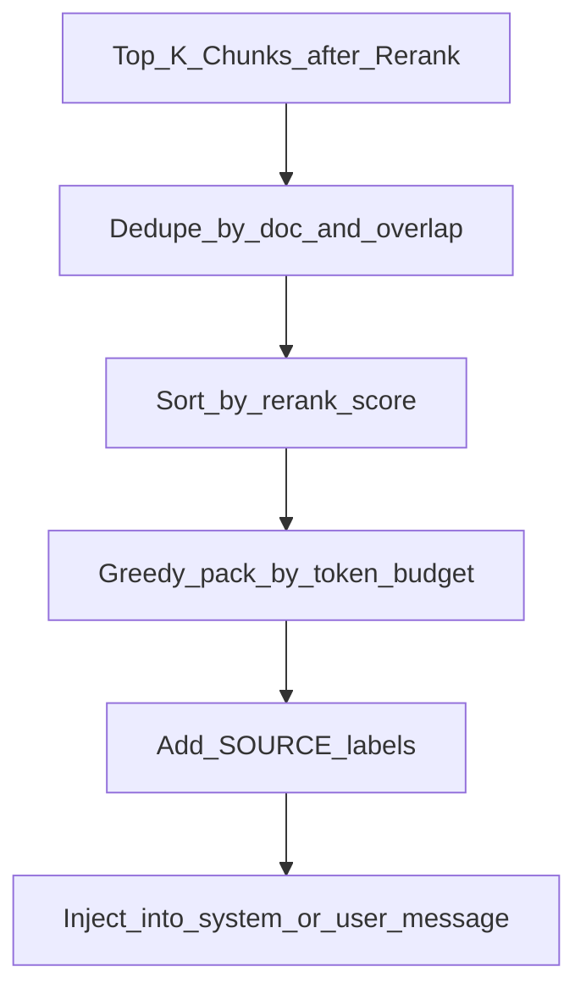

# Context Assembly and Citations

> Week 3 Theory · Day 4 · [← README](../README.md) · Prev: [reranking](reranking.md) · Next: [rag-evaluation-ragas](rag-evaluation-ragas.md)

After retrieval, you must **assemble** the top chunks into a prompt the LLM can use — without blowing the context budget from [Week 2](../week-02/theory/context-management.md). **Citations** tie each claim back to a source chunk so users can verify answers.

---

## Concepts

### What problem are we solving?

Retrieval gives you 5 chunk objects. The generator needs one coherent **context block** plus instructions: answer from context only, cite sources, admit when context is insufficient.

Bad assembly → truncated mid-sentence chunks, duplicate paragraphs, or 8K tokens of noise → hallucinations.

### A concrete example

Retrieved chunks (after rerank):

| ID | Source | Tokens |
|----|--------|--------|
| c1 | handbook.pdf p.12 | 180 |
| c2 | handbook.pdf p.13 | 220 |
| c3 | benefits.docx §PTO | 150 |

Context budget: **2000 tokens** for retrieved context (rest for system + question + answer).

Assembly:

```
[SOURCE c1 | handbook.pdf p.12]
Remote employees may work up to 3 days per week...

[SOURCE c2 | handbook.pdf p.13]
Equipment stipend: $500 annually...

[SOURCE c3 | benefits.docx §PTO]
New hires accrue 15 PTO days in year one...
```

Total ~550 tokens — fits budget with room for answer.

User-facing citation: *"Remote staff receive a $500 equipment stipend [handbook.pdf, p.13]."*

### Assembly algorithm



1. **Dedupe** — drop chunks with >80% text overlap
2. **Sort** — rerank score descending
3. **Pack** — add chunks until token budget full (use `tiktoken` from Week 1)
4. **Format** — stable `[SOURCE id | metadata]` headers for citation parsing

### Prompt pattern (Week 3)

System message excerpt:

```
You answer questions using ONLY the provided sources.
If the answer is not in the sources, say "I don't have that information in the indexed documents."
Cite sources inline as [doc_name, page/section].
```

User message:

```
Sources:
{assembled_context}

Question: {user_query}
```

Reuse Week 2 structured output if you want JSON citations:

```json
{
  "answer": "Remote staff receive a $500 equipment stipend annually.",
  "citations": [{"chunk_id": "c2", "label": "handbook.pdf p.13"}]
}
```

### Streaming + citations

Stream answer text first; emit citation metadata in a final SSE event (Week 2 SSE pattern):

```
event: token\ndata: {"text": "The stipend is "}\n\n
event: citations\ndata: {"citations": [{"chunk_id": "c2"}]}\n\n
```

### AI engineer takeaway

Context assembly is where **RAG meets context management** — log `context_tokens`, `chunks_used`, and `chunks_dropped_budget` on every request. Interviewers probe this boundary when users paste huge doc sets.

---

## Tradeoffs

| Strategy | Pros | Cons |
|----------|------|------|
| Greedy pack by score | Simple | May omit diverse sources |
| MMR diversity | Reduces redundancy | More complex |
| Parent-child return | Richer context | Higher token use |
| JSON citations | Parseable UI | Extra LLM compliance |

---

## Best Practices

1. Reserve **20%** of context window for generation, not just retrieval.
2. Include `doc_title` in every SOURCE header — models cite better.
3. Refuse gracefully when top scores are below a threshold (e.g. rerank < 0.3).
4. Store assembled context in logs (redacted) for debugging failed answers.

---

## Common Mistakes

| Mistake | Symptom | Fix |
|---------|---------|-----|
| No SOURCE labels | Fabricated citations | Label every chunk |
| Ignore token budget | API 400 context exceeded | Pack with tiktoken |
| Duplicate chunks in prompt | Repetitive answers | Dedupe |
| Citations afterthought | UI cannot link sources | Structured citation schema |

---

## Checkpoint

1. Why label chunks `[SOURCE c2 | handbook.pdf p.13]` before sending to the LLM?
2. What happens when assembled context exceeds the model limit?
3. How does Week 2 context budgeting apply here?

---

## Go Deeper

| Resource | Why |
|----------|-----|
| [Week 2 context-management](../../week-02/theory/context-management.md) | Token budgets |
| [Week 1 structured-output](../../week-01/theory/structured-output.md) | JSON citation schema |
| [project/api.md](../project/api.md) | Doc Q&A Studio citation response shape |

---

## Next

**→ [Day 5 playbook](../daily/day-05.md)** · [rag-evaluation-ragas.md](rag-evaluation-ragas.md)
