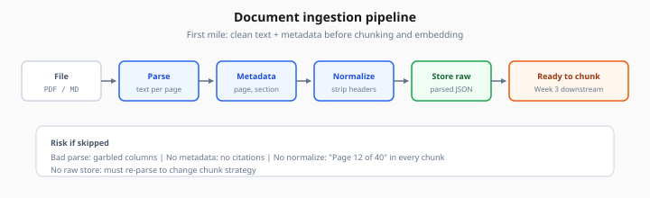
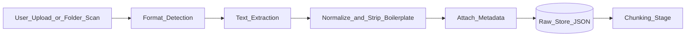

# Document Ingestion

> Week 3 Theory · Day 1 · [← README](../README.md) · Next: [chunking-strategies](chunking-strategies.md)

Before you can answer questions about **your** PDFs, policies, or runbooks, you must turn files into clean text the pipeline can chunk and embed. **Document ingestion** is that first mile — parsing, extracting text, and attaching metadata so retrieval knows *where* an answer came from.

---

## Concepts

### What problem are we solving?

LLMs do not magically read your Google Drive. RAG systems need a repeatable pipeline: **file → text → chunks → vectors → searchable index**. If ingestion drops tables, scrambles page order, or loses filenames, every downstream step — chunking, embedding, citations — suffers.



*Figure: Five stages before chunking — metadata and raw store enable citations and re-index without re-parsing.*

### A concrete example

A 40-page employee handbook PDF arrives:

| Stage | What happens | Risk if skipped |
|-------|--------------|-----------------|
| Parse | Extract text per page; detect headings | Garbled columns → nonsense chunks |
| Metadata | `source=file.pdf`, `page=12`, `section=PTO Policy` | Answers without citations |
| Normalize | Fix hyphenation, strip headers/footers | "Page 12 of 40" pollutes every chunk |
| Store raw | Keep original + parsed JSON for re-index | Cannot re-chunk without re-parsing |

User asks: *"How many PTO days do new hires get?"*  
Good ingestion ensures page 12's PTO section is retrievable and citable. Bad ingestion might merge PTO with the dental plan on page 13.

### Supported formats (Week 3 scope)

| Format | Parser approach | Notes |
|--------|-----------------|-------|
| **PDF** | `pypdf` or `unstructured` | Watch scanned PDFs — need OCR (optional) |
| **Markdown** | Native read | Preserve heading hierarchy as metadata |
| **DOCX** | `python-docx` | Good for internal wikis exported from Word |
| **Plain text** | Direct read | Baseline for tests |

### Metadata schema (minimum)

Every ingested document should produce records like:

```json
{
  "doc_id": "handbook-2026",
  "source_path": "data/documents/handbook.pdf",
  "mime_type": "application/pdf",
  "title": "Employee Handbook 2026",
  "page_count": 40,
  "ingested_at": "2026-07-25T10:00:00Z",
  "checksum_sha256": "abc123..."
}
```

Per-chunk metadata (added after chunking): `chunk_id`, `page`, `heading`, `char_start`, `char_end`.

### Ingestion pipeline



Lab 1 walks this through on 3–5 sample files in your work dir.

### AI engineer takeaway

Treat ingestion as a **versioned ETL job**: log parser version, file checksum, and timestamp. When retrieval quality drops, you can re-index from raw store without guessing what changed.

---

## Tradeoffs

| Approach | Pros | Cons |
|----------|------|------|
| Simple `pypdf` | Fast, few deps | Weak on complex layouts |
| `unstructured` | Better layout detection | Heavier install |
| OCR for scans | Handles scanned PDFs | Slow, error-prone |
| Parse-on-upload vs batch | Upload = immediate index | Batch = easier to retry failures |

---

## Best Practices

1. **Idempotent ingestion** — same file + checksum → skip or update, never duplicate silently.
2. **Preserve structure** — headings become chunk metadata and citation labels.
3. **Fail visibly** — if a page fails extraction, log `page=7 error=empty` instead of empty string chunks.
4. **Separate raw from index** — keep parsed JSON on disk or S3; vectors are rebuildable.

---

## Common Mistakes

| Mistake | Symptom | Fix |
|---------|---------|-----|
| Embedding before cleaning | "Page 3 of 50" in every answer | Strip repeating headers/footers |
| No checksum | Re-upload duplicates pollute index | Dedupe on SHA256 |
| Ignoring encoding | Mojibake in Markdown imports | Force UTF-8, validate |
| One parser for all PDFs | Tables become word soup | Route scanned vs digital PDFs |

---

## Checkpoint

1. Why store raw parsed JSON separately from the vector index?
2. What metadata do you need for a citation like `[handbook.pdf, p.12]`?
3. Name two failure modes when parsing a scanned PDF without OCR.

---

## Go Deeper

| Resource | Why |
|----------|-----|
| [Unstructured docs](https://docs.unstructured.io/) | Production-grade partitioners |
| [LangChain document loaders](https://python.langchain.com/docs/concepts/document_loaders/) | Loader patterns |
| [Week 1 embeddings](../../week-01/theory/embeddings.md) | Why clean text matters before vectors |

---

## Next

**→ [chunking-strategies.md](chunking-strategies.md)** · Lab: [Lab 1](../labs/lab-01-document-ingestion-chunking.md) · Tomorrow: [Day 2 playbook](../daily/day-02.md)
