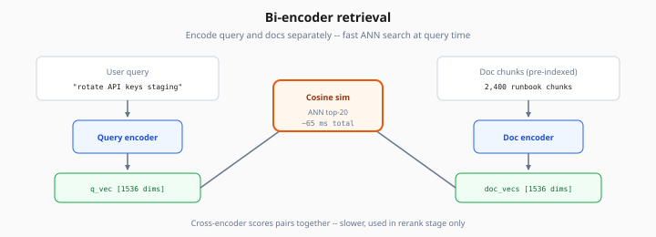
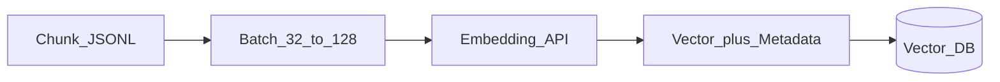

# Embeddings for Retrieval

> Week 3 Theory · Day 2 · [← README](../README.md) · Prev: [chunking-strategies](chunking-strategies.md) · Next: [vector-databases](vector-databases.md)

RAG retrieval depends on **embedding models** (bi-encoders) that map queries and document chunks into the same vector space. Week 1 introduced the idea; Week 3 applies it at scale with production rules around model choice and re-indexing.

---

## Concepts

### What problem are we solving?

You need a fast way to find the top-K chunks related to a user question among thousands of vectors. **Bi-encoder embeddings** encode query and document **independently**, then rank by cosine similarity — fast enough for real-time search.

*Figure: Query and docs encoded separately — ANN search in ~65 ms; cross-encoder reranking comes later.*

### A concrete example

Index: 2,400 chunks from 12 internal runbooks.  
Query: *"How do I rotate API keys in staging?"*

| Step | Action | Latency (illustrative) |
|------|--------|------------------------|
| 1 | Embed query → 1536-dim vector | ~50 ms |
| 2 | ANN search top-20 in Chroma | ~15 ms |
| 3 | Return chunk IDs + scores | — |

Top hit: `runbook-deploy.md` chunk with score 0.84 — mentions "API key rotation in staging environment."

### Bi-encoder vs cross-encoder

| | Bi-encoder (retrieval) | Cross-encoder (rerank) |
|---|------------------------|------------------------|
| **Input** | Query alone, doc alone | Query + doc **together** |
| **Speed** | Fast — pre-compute doc vectors | Slow — score each pair |
| **Quality** | Good recall | Better precision |
| **Week 3 role** | Stage 1: retrieve top-20 | Stage 2: rerank to top-5 |

Do not skip bi-encoder retrieval and embed everything with a cross-encoder — that does not scale.

### Query/document parity

Use the **same embedding model** for indexing and querying. If index used `text-embedding-3-small` but queries use `text-embedding-3-large`, similarity scores are meaningless until you re-embed all chunks.

Some models expect prefixes:

| Model family | Document prefix | Query prefix |
|--------------|-----------------|--------------|
| OpenAI `text-embedding-3-*` | None required | None |
| E5 / BGE (local) | `"passage: "` | `"query: "` |

Check model card — wrong prefix drops recall 10–30%.

### Model choices (Week 3)

| Model | Dims | Cost | When |
|-------|------|------|------|
| `text-embedding-3-small` | 1536 | ~$0.02 / 1M tokens | Default cloud |
| `text-embedding-3-large` | 3072 | Higher | Hard retrieval benchmarks |
| `nomic-embed-text` (Ollama) | 768 | Free local | Offline dev |

**Dimensions matter:** pgvector column type must match (`vector(1536)`).

### Embedding batch pipeline

Batch for throughput; respect rate limits. Log `embedding_model` and `embedding_version` on every index job.

### AI engineer takeaway

**Never swap embedding models without a full re-index.** Version your index: `index_v3_small_2026-07-25`. Interviewers ask this because teams break prod retrieval silently every month.

---

## Tradeoffs

| Choice | Upside | Downside |
|--------|--------|----------|
| Cloud embeddings | No GPU ops | Cost scales with corpus |
| Local embeddings | Privacy, $0 | Ops + slower on CPU |
| Smaller dims (384) | Less storage | Lower recall on niche terms |
| Matryoshka / truncated dims | Cheaper storage | Needs model support |

---

## Best Practices

1. Prepend document title to chunk text before embedding.
2. Normalize vectors if your DB expects it (many APIs return unit vectors already).
3. Store raw chunk text in DB — never rely on reconstructing from vectors.
4. Monitor embed latency and $/1M tokens in observability (Week 2 pattern).

---

## Common Mistakes

| Mistake | Symptom | Fix |
|---------|---------|-----|
| Chat model for embeddings | Weird similarity scores | Use dedicated embed model |
| Embed HTML tags | Noise in vectors | Strip markup at ingestion |
| No batching | Index job takes hours | Batch 64–128 chunks |
| Mixed languages one index | Cross-lingual misses | Language-specific indexes or multilingual model |

---

## Checkpoint

1. Why is bi-encoder retrieval fast enough for 100K chunks?
2. What breaks if you query with a different embedding model than you indexed with?
3. Where does the cross-encoder fit relative to bi-encoder search?

---

## Go Deeper

| Resource | Why |
|----------|-----|
| [OpenAI embeddings guide](https://platform.openai.com/docs/guides/embeddings) | API + dimensions |
| [Week 1 embeddings](../../week-01/theory/embeddings.md) | Cosine similarity intuition |
| [MTEB leaderboard](https://huggingface.co/spaces/mteb/leaderboard) | Model comparison |

---

## Next

**→ [vector-databases.md](vector-databases.md)** · Lab: [Lab 2](../labs/lab-02-embeddings-chroma.md)
